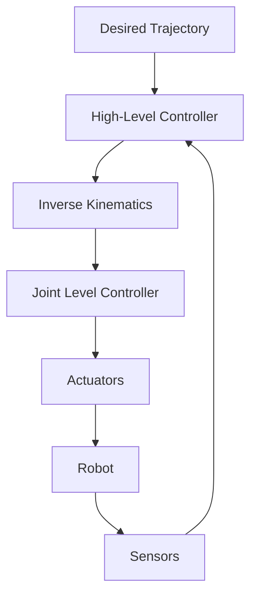
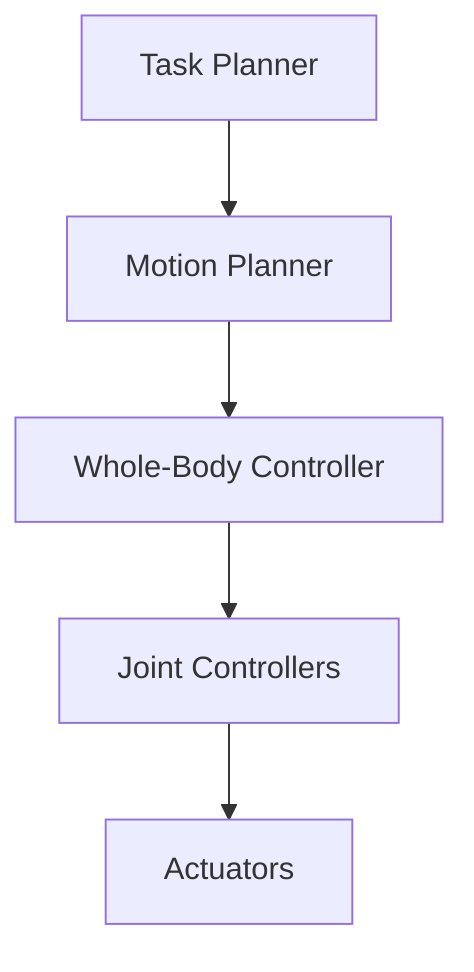

# Foundations: Sensors, Actuators, and the Humanoid Landscape

## Introduction to Physical AI Foundations

Physical AI represents a convergence of several key technologies that enable machines to interact intelligently with the physical world. At its core, Physical AI involves:

- **Perception**: Gathering information from the environment using sensors
- **Cognition**: Processing sensory information to understand the world and make decisions
- **Action**: Executing physical tasks through actuators and control systems
- **Learning**: Adapting behavior based on experience and environmental feedback

This chapter establishes the foundational concepts you'll need to understand throughout your journey with humanoid robotics.

## Key Components of Physical AI Systems

### Sensors

Sensors form the foundation of a robot's perception system, providing essential data about the environment and internal state:

```python
# Example sensor data structure in ROS2
from std_msgs.msg import Float32MultiArray
from sensor_msgs.msg import LaserScan, Image, Imu

# Common sensor types in humanoid robotics:
# - LIDAR (Light Detection and Ranging)
# - RGB-D cameras
# - Inertial Measurement Units (IMU)
# - Force/Torque sensors
# - Joint encoders
# - Tactile sensors
```

#### Types of Sensors:
1. **Proprioceptive Sensors**: Measure internal state (joint angles, motor currents, IMU)
2. **Exteroceptive Sensors**: Measure external environment (cameras, range finders)
3. **Tactile Sensors**: Measure contact forces and surface properties

### Actuators

Actuators convert control signals into physical motion. In humanoid robots, these include:
- **Servo Motors**: For precise joint control
- **Hydraulic/Pneumatic Systems**: For high-force applications
- **Series Elastic Actuators**: For compliant control
- **Shape Memory Alloys**: For biomimetic actuators (emerging technology)

### Control Systems

Humanoid robots require sophisticated control systems to coordinate multiple degrees of freedom:



## The Humanoid Robotics Landscape

### Historical Context

Humanoid robotics has evolved significantly since the early 20th century:

- **1928**: Westinghouse's Televox and Rastus - early humanoid robots
- **1970s**: WABOT-1 at Waseda University - first full-scale humanoid
- **1990s**: Honda's P Series (P1, P2, P3) - advanced walking capabilities
- **2000s**: ASIMO by Honda - refined mobility and interaction
- **2010s**: ATLAS by Boston Dynamics - dynamic locomotion
- **2020s**: Tesla Optimus, Figure AI, Agility Robotics - commercial applications

### Current Platforms

Today's humanoid robots span various capabilities and applications:

| Platform | Developer | Key Features | Application |
|----------|-----------|--------------|-------------|
| Tesla Optimus | Tesla | Vision-based control | Industrial tasks |
| Figure AI | Figure Robotics | General-purpose manipulation | Service tasks |
| Atlas | Boston Dynamics | Dynamic locomotion | Research, hazardous environments |
| Digit | Agility Robotics | Humanoid form factor | Logistics |
| HRP-5P | AIST | Construction tasks | Industrial assembly |

### Technical Challenges

Humanoid robotics faces several fundamental challenges:

#### Balance and Locomotion
- Maintaining stability with a narrow support base
- Dynamic walking with variable terrain
- Responding to external disturbances
- Efficient energy consumption during locomotion

#### Manipulation
- Dexterity comparable to human hands
- Force control for safe interaction
- Tool use with human-compatible interfaces
- Grasp planning in unstructured environments

#### Perception
- Real-time processing of multimodal sensor data
- Robust object recognition in cluttered environments
- Spatial mapping and navigation
- Human activity recognition and intent prediction

#### Human-Robot Interaction
- Natural language understanding and generation
- Social cues recognition and response
- Trust establishment and safety
- Contextual awareness in shared environments

## Sensor Technologies in Depth

### Vision Systems

Vision is crucial for humanoid robots operating in human environments:

```python
# ROS2 example: Processing RGB-D data
import rclpy
from rclpy.node import Node
from sensor_msgs.msg import Image, CameraInfo
from cv_bridge import CvBridge
import cv2
import numpy as np

class VisionProcessor(Node):
    def __init__(self):
        super().__init__('vision_processor')
        self.subscription = self.create_subscription(
            Image,
            '/camera/rgb/image_raw',
            self.image_callback,
            10)
        self.bridge = CvBridge()
        
    def image_callback(self, msg):
        cv_image = self.bridge.imgmsg_to_cv2(msg, "bgr8")
        # Process image for object detection, tracking, etc.
        processed_image = self.process_image(cv_image)
        
    def process_image(self, image):
        # Implement computer vision algorithms
        return image
```

Modern humanoid robots typically use:
- **RGB cameras** for color perception
- **Depth sensors** (LiDAR, stereo, ToF) for 3D perception
- **Thermal cameras** for environmental awareness
- **Event cameras** for high-speed motion detection

### Tactile Sensing

Tactile sensing is essential for safe and effective manipulation:

- **GelSight sensors**: High-resolution surface geometry
- **Force/Torque sensors**: Measurement of interaction forces
- **Tactile arrays**: Distributed pressure sensing
- **Temperature sensors**: Environmental and safety monitoring

## Actuator Technologies

### Servo Actuators

Most humanoid robots use servo actuators with position, velocity, or torque control:

```xml
<!-- URDF example: Joint definition -->
<joint name="hip_pitch_joint" type="revolute">
  <parent link="torso"/>
  <child link="thigh"/>
  <origin xyz="0 0 -0.1" rpy="0 0 0"/>
  <axis xyz="1 0 0"/>
  <limit lower="-1.57" upper="1.57" effort="100" velocity="5"/>
  <dynamics damping="1.0" friction="0.1"/>
</joint>
```

### Series Elastic Actuators (SEA)

SEAs provide compliant control crucial for safe human-robot interaction:

```
Motor -> Gearbox -> Spring -> Output
         ^                    ^
         |                    |
     Encoder            Output Encoder
```

Advantages of SEAs:
- Inherent safety through mechanical compliance
- Accurate force control
- Back-drivability
- Energy efficiency through spring energy storage

## Software Architecture

### Robot Operating System (ROS2)

ROS2 provides the middleware infrastructure for humanoid robotics:

```python
# Example ROS2 node for humanoid control
import rclpy
from rclpy.node import Node
from sensor_msgs.msg import JointState
from trajectory_msgs.msg import JointTrajectory

class HumanoidController(Node):
    def __init__(self):
        super().__init__('humanoid_controller')
        
        # Publishers and subscribers
        self.joint_pub = self.create_publisher(JointState, '/joint_states', 10)
        self.trajectory_sub = self.create_subscription(
            JointTrajectory, 
            '/joint_trajectory', 
            self.trajectory_callback, 
            10)
        
    def trajectory_callback(self, msg):
        # Process trajectory and generate control commands
        pass
```

### Control Architecture

Humanoid robots typically implement multiple control layers:



1. **Task Planner**: High-level goal management
2. **Motion Planner**: Path planning and obstacle avoidance
3. **Whole-Body Controller**: Balance and coordination
4. **Joint Controllers**: Individual joint control

## Looking Forward

As we continue through this textbook, you'll learn to implement these foundational concepts with real code examples. Each module builds upon these fundamentals:

- In **Module 1**, you'll learn to program humanoid robots using ROS2
- In **Module 2**, you'll simulate these robots in digital twin environments
- In **Module 3**, you'll implement advanced control with NVIDIA Isaac
- In **Module 4**, you'll create AI systems that integrate perception, reasoning, and action

Understanding these foundations will enable you to tackle the complex challenges of humanoid robotics with confidence. The next chapter will focus on hardware considerations and guide you through setting up your development environment.

If you're already familiar with some concepts, you can use the "Personalize this chapter" button to adjust the content complexity based on your experience level.