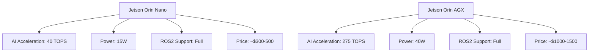
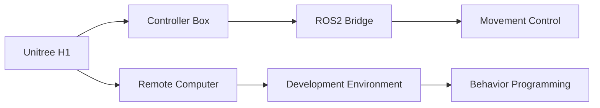

# Hardware Guide: Platforms, Components, and Development Setup

## Overview of Humanoid Robotics Hardware

Humanoid robotics development requires careful consideration of hardware platforms, from simulation-focused systems to full-scale physical robots. This guide covers the spectrum of hardware options available for different needs and budgets, from entry-level development to research-grade platforms.

## Hardware Categories

### Entry-Level Development

#### Jetson Platform
NVIDIA's Jetson series offers an excellent entry point for AI-powered robotics development:



| Model | Compute | Power | Use Case | Price Range |
|-------|---------|-------|----------|-------------|
| Jetson Orin Nano | 40 TOPS | 15W | Educational/Demo | $300-500 |
| Jetson Orin NX | 100 TOPS | 15W | Prototyping | $500-700 |
| Jetson Orin AGX | 275 TOPS | 40W | Research/Development | $1000-1500 |
| Jetson Orin Ultra | 1000 TOPS | 75W | Advanced Development | $2000-3000 |

**Advantages:**
- Native AI acceleration optimized for robotics
- ROS2 support with Jetson Inference
- Compact and power-efficient
- Strong community and documentation

**Disadvantages:**
- Limited I/O options compared to full computers
- Requires custom carrier boards for robotics applications

### Mid-Range Platforms

#### Desktop/GPU Systems
For developers not constrained by weight/power requirements:

| Configuration | GPU | CPU | RAM | Price Range |
|---------------|-----|-----|-----|-------------|
| Entry GPU Workstation | RTX 4070 | i5/AMD R5 | 32GB | $2000-2500 |
| Mid GPU Workstation | RTX 4080/4090 | i7/AMD R7 | 64GB | $3000-5000 |
| High-End Development | RTX 6000 Ada | i9/Threadripper | 128GB+ | $6000+ |

**Considerations for GPU selection:**
- For simulation: Higher CUDA core count and VRAM
- For inference: Tensor cores and INT8 performance
- For development: RTX series for consumer, RTX ADA for workstation

### Full-Scale Platforms

#### Research-Grade Humanoids

| Platform | Height | Weight | DOF | Price Range | Availability |
|----------|--------|--------|-----|-------------|--------------|
| Unitree H1 | 1.3m | 47kg | 22 | $300,000+ | Limited |
| Agility Robotics Digit | 1.7m | 75kg | 20+ | $250,000+ | Research Institutions |
| Tesla Optimus | 1.7m | 56kg | 28+ | Unknown | Development |

## Cloud vs. On-Premise Development

### Cloud-Based Development

**Advantages:**
- Access to high-end GPUs without upfront hardware costs
- Scalable compute resources
- Collaborative development environment
- No hardware maintenance

**Disadvantages:**
- Ongoing subscription costs
- Limited control over hardware configuration
- Network latency for interactive development
- Data privacy considerations

**Recommended Cloud Platforms:**
1. **AWS RoboMaker**: ROS/ROS2 integration, simulation environment
2. **Google Cloud Platform**: AI Platform with pre-installed robotics frameworks
3. **Azure Percept**: AI vision development for robotics
4. **NVIDIA LaunchPad**: GPU-accelerated development with Isaac ecosystem

### On-Premise Development

**Advantages:**
- Full control over development environment
- No recurring costs after initial purchase
- Consistent performance
- Secure handling of sensitive data

**Disadvantages:**
- High initial capital expenditure
- Requires technical expertise for setup and maintenance
- Potential hardware obsolescence
- Power and cooling considerations

## Cloud Development Setup

### Virtual Machines Configuration

```bash
# Example: AWS EC2 instance setup for robotics development
# Recommended instance types:
# - g5.2xlarge: 1 GPU, 8 vCPUs, 32GB RAM
# - g5.12xlarge: 4 GPUs, 48 vCPUs, 192GB RAM
# - p4d.24xlarge: 8 A100 GPUs, 96 vCPUs, 1152GB RAM

# Install ROS2 and dependencies
sudo apt update && sudo apt upgrade -y
sudo apt install software-properties-common
sudo add-apt-repository universe

# Add ROS2 repository
sudo apt update && sudo apt install curl gnupg lsb-release
curl -sSL https://raw.githubusercontent.com/ros/rosdistro/master/ros.key | sudo gpg --dearmor -o /usr/share/keyrings/ros-archive-keyring.gpg

echo "deb [arch=$(dpkg --print-architecture) signed-by=/usr/share/keyrings/ros-archive-keyring.gpg] http://packages.ros.org/ros2/ubuntu $(lsb_release -cs) main" | sudo tee /etc/apt/sources.list.d/ros2.list > /dev/null

sudo apt update
sudo apt install ros-humble-desktop
sudo apt install python3-rosdep python3-rosinstall python3-rosinstall-generator python3-wstool build-essential

# Initialize rosdep
sudo rosdep init
rosdep update

# Source ROS2 environment
echo "source /opt/ros/humble/setup.bash" >> ~/.bashrc
source ~/.bashrc
```

### Simulation-Only Development

For pure simulation development without physical hardware:

- **Minimum Requirements**: 
  - CPU: 4+ cores (Intel i5 or AMD Ryzen 5)
  - RAM: 16GB
  - GPU: Integrated graphics or basic discrete GPU
  - SSD: 50GB

- **Recommended Requirements**:
  - CPU: 8+ cores (Intel i7 or AMD Ryzen 7)
  - RAM: 32GB+
  - GPU: RTX 3060 or equivalent for accelerated simulation
  - SSD: 100GB+

## Development Environment Setup

### Prerequisites

```bash
# System updates and basic tools
sudo apt update
sudo apt install build-essential cmake git python3-pip python3-dev

# Install essential libraries
sudo apt install libeigen3-dev libassimp-dev libtinyxml2-dev libopencv-dev

# Install Docker for containerized development
sudo apt install docker.io
sudo usermod -aG docker $USER
```

### ROS2 Installation

```bash
# Install ROS2 Humble Hawksbill (LTS)
sudo apt update
sudo apt install ros-humble-desktop
sudo apt install python3-rosdep python3-rosinstall python3-rosinstall-generator python3-wstool build-essential

# Initialize rosdep
sudo rosdep init
rosdep update

# Source ROS2 environment
source /opt/ros/humble/setup.bash

# Create a workspace
mkdir -p ~/ros2_ws/src
cd ~/ros2_ws
colcon build
source install/setup.bash
```

### Simulation Environment Setup

For Gazebo simulation:

```bash
# Install Gazebo Garden
sudo apt install ignition-garden

# Alternative: Install Gazebo Harmonic (recent version)
sudo apt install ros-humble-gazebo-*
```

## Jetson Development Setup

### Hardware Requirements

- Jetson Orin (Nano, NX, AGX, or Ultra)
- Power adapter appropriate for your Jetson model
- MicroSD card (64GB+ recommended)
- USB-C cable for console access
- Optional: Carrier board with robotics interfaces

### Software Setup

```bash
# Flash Jetson with SDK Manager or Jetson Flash
# Install essential packages
sudo apt update
sudo apt install build-essential cmake git python3-pip python3-dev

# Install ROS2
sudo apt install ros-humble-ros-base
sudo apt install python3-rosdep python3-rosinstall

# Install NVIDIA packages
sudo apt install nvidia-jetpack

# Install Isaac ROS packages
sudo apt install ros-humble-isaac-*
```

## Unitree Robotics Platforms

### Unitree H1 Setup



**Hardware:**
- Unitree H1 humanoid robot
- Control computer with RTX GPU (if available)
- Network switch for robot connectivity
- Safety equipment (safety cage, emergency stop)

**Software:**
- Ubuntu 20.04 LTS
- ROS Noetic (for H1 compatibility)
- Unitree SDK
- Unitree ROS Package

### Setup Process
1. Mount H1 on development stand or in safety cage
2. Connect control box to robot via ethernet
3. Install Unitree SDK on development computer
4. Configure network settings for robot communication
5. Install and configure ROS packages

```bash
# Unitree ROS package setup (example)
git clone https://github.com/unitreerobotics/unitree_ros.git
cd unitree_ros
git checkout humble-devel  # or appropriate branch

# Build with colcon
cd ~/ros2_ws/src
ln -s /path/to/unitree_ros .
cd ~/ros2_ws
rosdep install --from-paths src --ignore-src -r -y
colcon build
source install/setup.bash
```

## Development Tools and IDEs

### Recommended Development Environment

1. **ROS Development Studio (RDS)**: Cloud-based ROS development
2. **VS Code with ROS extension**: Local development with IntelliSense
3. **PyCharm Professional**: For Python-focused robotics development
4. **CLion**: For C++ robotics development
5. **Docker**: For consistent development environments

### Hardware-in-the-Loop Testing

For testing code on real hardware safely:

```yaml
# Example: Docker Compose for hardware-in-the-loop
version: '3.8'
services:
  robot_controller:
    build: .
    devices:
      - /dev/ttyUSB0:/dev/ttyUSB0  # Robot communication
      - /dev/video0:/dev/video0    # Camera access
    network_mode: host
    environment:
      - ROS_DOMAIN_ID=1
    volumes:
      - ./src:/workspace/src
```

## Budget Considerations

### Entry-Level ($1,000-$5,000)
- Jetson development kit
- Small robotic arms or mobile platforms
- Basic sensors (camera, IMU)
- Cloud-based simulation

### Mid-Range ($5,000-$25,000)
- High-end GPU workstation
- Small humanoid platform (Poppy, NAO, etc.)
- Development robotics kit
- Additional sensors (LiDAR, force sensors)

### Research-Grade ($25,000+)
- Full humanoid platform access (via research institution)
- Multiple high-end GPUs
- Professional simulation software
- Complete sensor suite
- Safety equipment

## Next Steps

With your hardware platform selected and development environment set up, you're ready to begin programming with ROS2 in Module 1. The choice of hardware will influence your development experience:

- **Jetson users**: You'll have native GPU acceleration for AI tasks
- **Cloud users**: You'll have access to powerful GPUs without hardware constraints
- **Full-scale platform users**: You'll be able to test on real hardware but need to consider safety protocols

The next chapter will guide you through setting up your ROS2 development environment, with specific instructions tailored to your hardware choice. Use the personalization button at the top to adjust content complexity based on your hardware configuration and experience level.