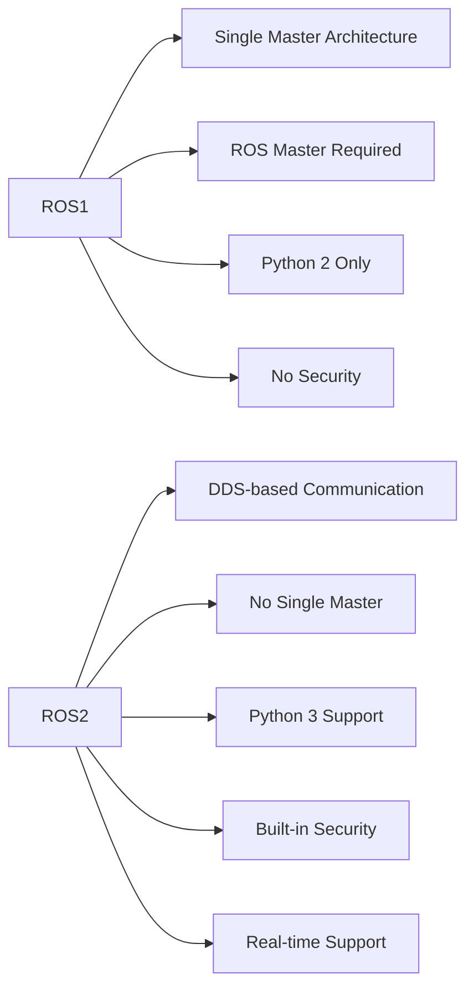

# Module 1: ROS2 Overview - Foundations of Robot Operating System

## Introduction to ROS2

The Robot Operating System 2 (ROS2) is the next generation of the popular robotics middleware framework. Unlike its predecessor, ROS2 is designed with production robotics in mind, addressing critical requirements like real-time performance, security, and multi-robot systems.

### Key Improvements in ROS2

ROS2 addresses several limitations of ROS1:

1. **Middleware Agnostic**: Uses DDS (Data Distribution Service) for communication, allowing interchangeability
2. **Real-time Support**: Architecture designed for real-time applications
3. **Security**: Built-in security features including authentication, encryption, and access control
4. **Multi-robot Systems**: Robust support for communication between multiple robots
5. **Official Windows and macOS Support**: No longer Linux-only
6. **Python 3 Support**: Modern Python version compatibility



## ROS2 Architecture

### Communication Primitives

ROS2 provides several communication patterns:

#### Topics (Publish/Subscribe)
Topics enable asynchronous communication between nodes:

```python
# Publisher example
import rclpy
from rclpy.node import Node
from std_msgs.msg import String

class MinimalPublisher(Node):
    def __init__(self):
        super().__init__('minimal_publisher')
        self.publisher_ = self.create_publisher(String, 'topic', 10)
        timer_period = 0.5  # seconds
        self.timer = self.create_timer(timer_period, self.timer_callback)
        self.i = 0

    def timer_callback(self):
        msg = String()
        msg.data = 'Hello World: %d' % self.i
        self.publisher_.publish(msg)
        self.get_logger().info('Publishing: "%s"' % msg.data)
        self.i += 1
```

```python
# Subscriber example
import rclpy
from rclpy.node import Node
from std_msgs.msg import String

class MinimalSubscriber(Node):
    def __init__(self):
        super().__init__('minimal_subscriber')
        self.subscription = self.create_subscription(
            String,
            'topic',
            self.listener_callback,
            10)
        self.subscription  # prevent unused variable warning

    def listener_callback(self, msg):
        self.get_logger().info('I heard: "%s"' % msg.data)
```

#### Services (Request/Response)
Services enable synchronous communication:

```python
# Service server
from example_interfaces.srv import AddTwoInts
import rclpy
from rclpy.node import Node

class MinimalService(Node):
    def __init__(self):
        super().__init__('minimal_service')
        self.srv = self.create_service(AddTwoInts, 'add_two_ints', self.add_two_ints_callback)

    def add_two_ints_callback(self, request, response):
        response.sum = request.a + request.b
        self.get_logger().info('Incoming request\na: %d b: %d' % (request.a, request.b))
        return response
```

```python
# Service client
from example_interfaces.srv import AddTwoInts
import rclpy
from rclpy.node import Node

class MinimalClientAsync(Node):
    def __init__(self):
        super().__init__('minimal_client_async')
        self.cli = self.create_client(AddTwoInts, 'add_two_ints')
        while not self.cli.wait_for_service(timeout_sec=1.0):
            self.get_logger().info('service not available, waiting again...')
        self.req = AddTwoInts.Request()

    def send_request(self, a, b):
        self.req.a = a
        self.req.b = b
        self.future = self.cli.call_async(self.req)
        rclpy.spin_until_future_complete(self, self.future)
        return self.future.result()
```

#### Actions
Actions handle long-running tasks with feedback:

```python
# Action server
from rclpy.action import ActionServer
from rclpy.node import Node
from example_interfaces.action import Fibonacci

class FibonacciActionServer(Node):
    def __init__(self):
        super().__init__('fibonacci_action_server')
        self._action_server = ActionServer(
            self,
            Fibonacci,
            'fibonacci',
            self.execute_callback)

    def execute_callback(self, goal_handle):
        self.get_logger().info('Executing goal...')
        
        feedback_msg = Fibonacci.Feedback()
        feedback_msg.sequence = [0, 1]
        
        for i in range(1, goal_handle.request.order):
            if goal_handle.is_cancel_requested:
                goal_handle.canceled()
                self.get_logger().info('Goal canceled')
                return Fibonacci.Result()
            
            feedback_msg.sequence.append(
                feedback_msg.sequence[i] + feedback_msg.sequence[i-1])
            goal_handle.publish_feedback(feedback_msg)
        
        goal_handle.succeed()
        result = Fibonacci.Result()
        result.sequence = feedback_msg.sequence
        return result
```

## ROS2 Concepts

### Nodes
Nodes are the fundamental execution units in ROS2:

```python
# Basic node structure
import rclpy
from rclpy.node import Node

class MyRobotNode(Node):
    def __init__(self):
        super().__init__('my_robot_node')
        
        # Initialize publishers, subscribers, services, etc.
        self.publisher = self.create_publisher(String, 'robot_status', 10)
        
        # Create a timer to run periodic tasks
        self.timer = self.create_timer(0.1, self.timer_callback)
        
        self.get_logger().info('MyRobotNode initialized')

    def timer_callback(self):
        # Perform periodic tasks
        self.get_logger().debug('Timer callback executed')

def main(args=None):
    rclpy.init(args=args)
    node = MyRobotNode()
    rclpy.spin(node)
    node.destroy_node()
    rclpy.shutdown()

if __name__ == '__main__':
    main()
```

### Parameters
Parameters allow runtime configuration of nodes:

```python
class ParameterExampleNode(Node):
    def __init__(self):
        super().__init__('parameter_example_node')
        
        # Declare parameters with default values
        self.declare_parameter('robot_name', 'default_robot')
        self.declare_parameter('max_velocity', 1.0)
        self.declare_parameter('safety_enabled', True)
        
        # Get parameter values
        self.robot_name = self.get_parameter('robot_name').value
        self.max_velocity = self.get_parameter('max_velocity').value
        self.safety_enabled = self.get_parameter('safety_enabled').value
        
        # Set callback for parameter changes
        self.add_on_set_parameters_callback(self.parameter_callback)
    
    def parameter_callback(self, params):
        for param in params:
            if param.name == 'max_velocity' and param.type_ == Parameter.Type.PARAMETER_DOUBLE:
                if param.value > 5.0:
                    return SetParametersResult(successful=False, reason='Max velocity too high')
        
        return SetParametersResult(successful=True)
```

## DDS Implementation

ROS2 uses DDS (Data Distribution Service) as its communication layer. Different DDS implementations provide different features:

| DDS Implementation | Use Case | Performance | Features |
|--------------------|----------|-------------|----------|
| Fast DDS | General Purpose | High Performance | Real-time, low latency |
| Cyclone DDS | Lightweight | Efficient | Memory efficient |
| RTI Connext DDS | Enterprise | Robust | Commercial support |
| OpenSplice DDS | Academic | Stable | Academic licensing |

### Quality of Service (QoS) Settings

QoS settings control how messages are handled in ROS2:

```python
from rclpy.qos import QoSProfile, ReliabilityPolicy, DurabilityPolicy

# Configure QoS for real-time control
control_qos = QoSProfile(
    depth=1,
    reliability=ReliabilityPolicy.RELIABLE,
    durability=DurabilityPolicy.VOLATILE,
)

# Configure QoS for logging
logging_qos = QoSProfile(
    depth=1000,
    reliability=ReliabilityPolicy.BEST_EFFORT,
    durability=DurabilityPolicy.VOLATILE,
)

# Use in publisher/subscriber
publisher = self.create_publisher(String, 'control_cmd', control_qos)
subscriber = self.create_subscription(String, 'sensor_data', callback, logging_qos)
```

## ROS2 for Humanoid Robots

### Joint Control Architecture

Humanoid robots require precise joint control with real-time capabilities:

```python
# Joint state publisher for humanoid robot
from sensor_msgs.msg import JointState
from builtin_interfaces.msg import Time
import numpy as np

class JointStatePublisher(Node):
    def __init__(self):
        super().__init__('joint_state_publisher')
        
        # Joint names for a 22-DOF humanoid
        self.joint_names = [
            'left_hip_yaw', 'left_hip_roll', 'left_hip_pitch',
            'left_knee', 'left_ankle_pitch', 'left_ankle_roll',
            'right_hip_yaw', 'right_hip_roll', 'right_hip_pitch',
            'right_knee', 'right_ankle_pitch', 'right_ankle_roll',
            'torso_yaw', 'torso_pitch', 'torso_roll',
            'left_shoulder_pitch', 'left_shoulder_roll', 'left_shoulder_yaw',
            'left_elbow', 'right_shoulder_pitch', 'right_shoulder_roll', 'right_elbow'
        ]
        
        self.publisher = self.create_publisher(JointState, 'joint_states', 10)
        self.timer = self.create_timer(0.01, self.publish_joint_states)  # 100Hz
        
    def publish_joint_states(self):
        msg = JointState()
        msg.name = self.joint_names
        msg.position = self.get_current_joint_positions()
        msg.velocity = self.get_current_joint_velocities()
        msg.effort = self.get_current_joint_efforts()
        
        # Set timestamp
        stamp = self.get_clock().now().to_msg()
        msg.header.stamp = stamp
        msg.header.frame_id = 'base_link'
        
        self.publisher.publish(msg)
```

### URDF Integration

URDF (Unified Robot Description Format) defines robot structure:

```xml
<?xml version="1.0"?>
<robot name="humanoid_robot">
  <!-- Base link -->
  <link name="base_link">
    <visual>
      <geometry>
        <box size="0.1 0.1 0.1"/>
      </geometry>
    </visual>
  </link>
  
  <!-- Torso -->
  <link name="torso">
    <visual>
      <geometry>
        <box size="0.2 0.1 0.4"/>
      </geometry>
    </visual>
  </link>
  
  <joint name="base_to_torso" type="fixed">
    <parent link="base_link"/>
    <child link="torso"/>
    <origin xyz="0 0 0.3" rpy="0 0 0"/>
  </joint>
  
  <!-- Left leg (simplified) -->
  <link name="left_hip">
    <visual>
      <geometry>
        <cylinder radius="0.05" length="0.1"/>
      </geometry>
    </visual>
  </link>
  
  <joint name="left_hip_joint" type="revolute">
    <parent link="torso"/>
    <child link="left_hip"/>
    <origin xyz="0 -0.1 -0.1" rpy="0 0 0"/>
    <axis xyz="1 0 0"/>
    <limit lower="-1.57" upper="1.57" effort="100" velocity="5"/>
  </joint>
</robot>
```

## Building ROS2 Packages

### Package Structure

```
my_robot_package/
├── CMakeLists.txt
├── package.xml
├── src/
│   ├── main.cpp
│   └── robot_controller.cpp
├── include/
│   └── robot_controller.hpp
├── launch/
│   └── robot.launch.py
├── config/
│   └── params.yaml
├── urdf/
│   └── robot.urdf
└── test/
    └── test_robot.cpp
```

### Creating a New Package

```bash
# Create a new ROS2 package
ros2 pkg create --build-type ament_cmake my_robot_controller --dependencies rclcpp rclpy sensor_msgs geometry_msgs

# Or with Python dependencies
ros2 pkg create --build-type ament_python py_robot_controller --dependencies rclpy sensor_msgs
```

### CMakeLists.txt for C++ Packages

```cmake
cmake_minimum_required(VERSION 3.8)
project(my_robot_controller)

if(CMAKE_COMPILER_IS_GNUCXX OR CMAKE_CXX_COMPILER_ID MATCHES "Clang")
  add_compile_options(-Wall -Wextra -Wpedantic)
endif()

# find dependencies
find_package(ament_cmake REQUIRED)
find_package(rclcpp REQUIRED)
find_package(sensor_msgs REQUIRED)
find_package(geometry_msgs REQUIRED)

# executable
add_executable(robot_controller src/robot_controller.cpp)
ament_target_dependencies(robot_controller rclcpp sensor_msgs geometry_msgs)

install(TARGETS
  robot_controller
  DESTINATION lib/${PROJECT_NAME})

if(BUILD_TESTING)
  find_package(ament_lint_auto REQUIRED)
  ament_lint_auto_find_test_dependencies()
endif()

ament_package()
```

## Development Workflow

### Workspace Management

```bash
# Create a ROS2 workspace
mkdir -p ~/ros2_ws/src
cd ~/ros2_ws

# Build the workspace
colcon build --packages-select my_robot_package

# Source the workspace
source install/setup.bash

# Run a node
ros2 run my_robot_package robot_controller

# List available nodes
ros2 node list

# Visualize the computation graph
rqt_graph
```

### Launch Files

Launch files allow coordinated startup of multiple nodes:

```python
# launch/robot.launch.py
from launch import LaunchDescription
from launch_ros.actions import Node
from ament_index_python.packages import get_package_share_directory
import os

def generate_launch_description():
    config = os.path.join(
        get_package_share_directory('my_robot_package'),
        'config',
        'params.yaml'
    )
    
    return LaunchDescription([
        Node(
            package='my_robot_package',
            executable='robot_controller',
            name='robot_controller',
            parameters=[config],
            output='screen'
        ),
        Node(
            package='robot_state_publisher',
            executable='robot_state_publisher',
            name='robot_state_publisher',
            parameters=[{'robot_description': open(os.path.join(
                get_package_share_directory('my_robot_package'),
                'urdf',
                'robot.urdf'
            )).read()}]
        )
    ])
```

## Best Practices for Humanoid Robotics

### Real-time Considerations
1. Use real-time capable DDS implementations (FastDDS)
2. Configure appropriate QoS settings for control loops
3. Separate control, perception, and planning into different processes
4. Use dedicated threads for time-critical operations

### Safety Practices
1. Implement emergency stop functionality
2. Use joint limits and velocity limits
3. Implement force/torque limits for safe interaction
4. Include watchdog timers for critical functions

### Performance Optimization
1. Use message filters to reduce processing overhead
2. Implement data buffering for sensor streams
3. Use efficient data structures (avoid unnecessary copies)
4. Profile code to identify bottlenecks

## Next Steps

With this foundation in ROS2 concepts and architecture, you're ready to dive deeper into specific ROS2 components in the next chapters. The following sections will cover:

- Nodes, topics, services, and actions in detail
- ROS2 Python and C++ programming techniques
- Robot control with ROS2
- Integration with simulation environments

If you're already familiar with ROS concepts, use the personalization button to adjust content complexity. If you're working with a specific hardware platform, the subsequent chapters will include platform-specific examples and optimizations.