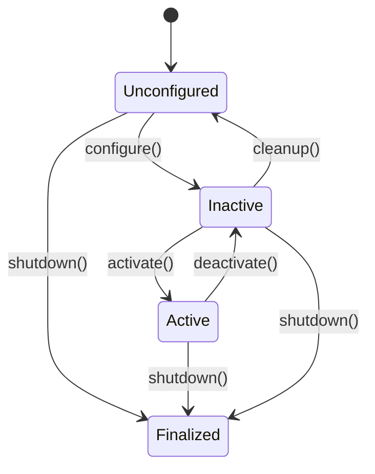

# Nodes, Topics, Services, and Actions in ROS2

## Understanding ROS2 Communication Patterns

ROS2 provides four primary communication patterns that enable different types of interaction between robotic components: nodes, topics, services, and actions. Each pattern serves a specific purpose and understanding when to use each is crucial for effective robotic system design.

## Nodes: The Fundamental Execution Unit

Nodes are the basic building blocks of a ROS2 system. Each node is an independent process that performs specific tasks within the robotic system.

### Node Lifecycle



ROS2 nodes follow a lifecycle state machine that allows for:
- **Unconfigured**: Node created but not yet configured
- **Inactive**: Node configured but not active
- **Active**: Node actively processing
- **Finalized**: Node destroyed

### Lifecycle Node Example

```python
from lifecycle_msgs.msg import Transition
from lifecycle_msgs.srv import ChangeState, GetState
from rclpy.lifecycle import LifecycleNode, LifecycleState, TransitionCallbackReturn
from rclpy.qos import QoSProfile

class LifecyclePublisher(LifecycleNode):
    def __init__(self, node_name):
        super().__init__(node_name)
        self.pub = None
        self.timer = None

    def on_configure(self, state: LifecycleState) -> TransitionCallbackReturn:
        self.pub = self.create_lifecycle_publisher(String, 'lifecycle_chatter', 10)
        self.get_logger().info(f'Configured {self.get_name()}')
        return TransitionCallbackReturn.SUCCESS

    def on_activate(self, state: LifecycleState) -> TransitionCallbackReturn:
        self.timer = self.create_timer(1.0, self.timer_callback)
        self.get_logger().info(f'Activated {self.get_name()}')
        return super().on_activate(state)

    def on_deactivate(self, state: LifecycleState) -> TransitionCallbackReturn:
        self.destroy_timer(self.timer)
        self.timer = None
        self.get_logger().info(f'Deactivated {self.get_name()}')
        return super().on_deactivate(state)

    def on_cleanup(self, state: LifecycleState) -> TransitionCallbackReturn:
        self.destroy_publisher(self.pub)
        self.pub = None
        self.get_logger().info(f'Cleaned up {self.get_name()}')
        return TransitionCallbackReturn.SUCCESS

    def timer_callback(self):
        msg = String()
        msg.data = 'Lifecycle msg'
        self.pub.publish(msg)
```

## Topics: Publish/Subscribe Pattern

Topics implement an asynchronous, many-to-many communication pattern ideal for sensor data, system status, and other continuously streaming information.

### Message Types

ROS2 provides standard message types in packages like `std_msgs`, `sensor_msgs`, and `geometry_msgs`:

```python
# Common message types for humanoid robotics
from std_msgs.msg import String, Int32, Float64
from sensor_msgs.msg import JointState, Imu, LaserScan
from geometry_msgs.msg import Twist, Pose, Point
from nav_msgs.msg import Odometry
```

### Advanced Topic Usage

#### Latched Topics (Transient Local QoS)

For data that should persist for late-joining subscribers:

```python
from rclpy.qos import QoSProfile, DurabilityPolicy

latched_qos = QoSProfile(
    depth=1,
    durability=DurabilityPolicy.TRANSIENT_LOCAL
)

# Example: Robot description (only send once, but available to all subscribers)
robot_description_pub = self.create_publisher(String, 'robot_description', latched_qos)
```

#### Publisher with Callbacks

```python
from rclpy.publisher import Publisher

class PublisherWithCallbacks(Node):
    def __init__(self):
        super().__init__('publisher_with_callbacks')
        self.publisher = self.create_publisher(String, 'topic_with_callbacks', 10)
        
        # Register callbacks
        self.publisher.add_wait_set_ready_callback(self.publisher_callback)
        
    def publisher_callback(self):
        self.get_logger().info('Publisher callback triggered')
```

### Topic Monitoring and Debugging

```python
# Diagnostic tools for topic monitoring
class TopicDiagnostics(Node):
    def __init__(self):
        super().__init__('topic_diagnostics')
        
        # Subscribe with statistics
        self.sub = self.create_subscription(
            String, 
            'monitored_topic', 
            self.diagnostics_callback, 
            10,
            callback_group=rclpy.callback_groups.ReentrantCallbackGroup()
        )
        
        # Track message statistics
        self.message_count = 0
        self.message_frequency_timer = self.create_timer(1.0, self.log_frequency)
        
    def diagnostics_callback(self, msg):
        self.message_count += 1
        
    def log_frequency(self):
        self.get_logger().info(f'Messages received: {self.message_count}/s')
        self.message_count = 0
```

## Services: Request/Response Pattern

Services provide synchronous communication for operations that require a response or have a specific completion.

### Service Definition

Create a service definition file (`srv/AddTwoInts.srv`):

```
int64 a
int64 b
---
int64 sum
```

### Service Implementation

```python
# Service server
from example_interfaces.srv import AddTwoInts
import rclpy
from rclpy.node import Node

class CalculatorService(Node):
    def __init__(self):
        super().__init__('calculator_service')
        self.srv = self.create_service(
            AddTwoInts, 
            'calculate_sum', 
            self.calculate_sum_callback
        )
        self.get_logger().info('Calculator service started')

    def calculate_sum_callback(self, request, response):
        response.sum = request.a + request.b
        self.get_logger().info(f'Calculated: {request.a} + {request.b} = {response.sum}')
        return response

# Service client
class CalculatorClient(Node):
    def __init__(self):
        super().__init__('calculator_client')
        self.cli = self.create_client(AddTwoInts, 'calculate_sum')
        
        while not self.cli.wait_for_service(timeout_sec=1.0):
            self.get_logger().info('Service not available, waiting again...')
            
        self.req = AddTwoInts.Request()

    def send_request(self, a, b):
        self.req.a = a
        self.req.b = b
        future = self.cli.call_async(self.req)
        return future

# Usage example
def main():
    rclpy.init()
    
    calculator_client = CalculatorClient()
    
    # Send request asynchronously
    future = calculator_client.send_request(42, 24)
    
    # Wait for response
    rclpy.spin_until_future_complete(calculator_client, future)
    
    response = future.result()
    print(f'Response: {response.sum}')
    
    calculator_client.destroy_node()
    rclpy.shutdown()
```

### Service with Advanced Features

```python
from rclpy.qos import qos_profile_services_default
from rclpy.callback_groups import MutuallyExclusiveCallbackGroup
import threading

class AdvancedCalculatorService(Node):
    def __init__(self):
        super().__init__('advanced_calculator_service')
        
        # Use a separate callback group to run service in separate thread
        calc_callback_group = MutuallyExclusiveCallbackGroup()
        
        self.srv = self.create_service(
            AddTwoInts,
            'advanced_calculate',
            self.advanced_calculate_callback,
            callback_group=calc_callback_group,
            qos_profile=qos_profile_services_default
        )
        
        # Thread pool for complex calculations
        self.calculation_threads = []
        
    def advanced_calculate_callback(self, request, response):
        # For complex calculations, handle asynchronously
        thread = threading.Thread(
            target=self.perform_complex_calculation,
            args=(request, response)
        )
        thread.start()
        self.calculation_threads.append(thread)
        
        return response  # Return immediately, update in thread
    
    def perform_complex_calculation(self, request, response):
        # Simulate complex calculation
        import time
        time.sleep(2)  # Simulate CPU-intensive operation
        response.sum = request.a * request.b  # Different operation
```

## Actions: Goal-Fedback-Result Pattern

Actions handle long-running tasks that require feedback and the ability to cancel.

### Action Definition

Create an action definition (`action/Fibonacci.action`):

```
# Goal: Order of the Fibonacci sequence to generate
int32 order
---
# Result: Generated Fibonacci sequence
int32[] sequence
---
# Feedback: Current sequence as it's being generated
int32[] sequence
```

### Action Server Implementation

```python
from rclpy.action import ActionServer, CancelResponse, GoalResponse
from rclpy.node import Node
from example_interfaces.action import Fibonacci

class FibonacciActionServer(Node):
    def __init__(self):
        super().__init__('fibonacci_action_server')
        self._action_server = ActionServer(
            self,
            Fibonacci,
            'fibonacci',
            execute_callback=self.execute_callback,
            callback_group=rclpy.callback_groups.ReentrantCallbackGroup(),
            goal_callback=self.goal_callback,
            cancel_callback=self.cancel_callback
        )
        self.get_logger().info('Fibonacci action server started')

    def goal_callback(self, goal_request):
        """Accept or reject a client request to begin an action."""
        self.get_logger().info('Received goal request')
        return GoalResponse.ACCEPT

    def cancel_callback(self, goal_handle):
        """Accept or reject a client request to cancel an action."""
        self.get_logger().info('Received cancel request')
        return CancelResponse.ACCEPT

    async def execute_callback(self, goal_handle):
        """Execute the goal."""
        self.get_logger().info('Executing goal...')
        
        # Get request from goal
        order = goal_handle.request.order
        
        # Create feedback message
        feedback_msg = Fibonacci.Feedback()
        feedback_msg.sequence = [0, 1]
        
        # Start executing the action
        for i in range(1, order):
            # Check if the goal has been canceled
            if goal_handle.is_cancel_requested:
                goal_handle.canceled()
                self.get_logger().info('Goal canceled')
                return Fibonacci.Result()
            
            # Update feedback
            feedback_msg.sequence.append(
                feedback_msg.sequence[i] + feedback_msg.sequence[i-1])
            
            # Publish feedback
            goal_handle.publish_feedback(feedback_msg)
            
            # Sleep to simulate work
            await asyncio.sleep(0.1)

        # Check if the goal was canceled before completing
        if goal_handle.is_cancel_requested:
            goal_handle.canceled()
            self.get_logger().info('Goal canceled')
            return Fibonacci.Result()

        # Succeed the goal
        goal_handle.succeed()
        
        # Return the result
        result = Fibonacci.Result()
        result.sequence = feedback_msg.sequence
        self.get_logger().info('Goal succeeded')
        return result
```

### Action Client Implementation

```python
import rclpy
from rclpy.action import ActionClient
from rclpy.node import Node
from example_interfaces.action import Fibonacci

class FibonacciActionClient(Node):
    def __init__(self):
        super().__init__('fibonacci_action_client')
        self._action_client = ActionClient(
            self,
            Fibonacci,
            'fibonacci'
        )

    def send_goal(self, order):
        # Wait for the action server to be available
        self._action_client.wait_for_server()

        # Create a goal message
        goal_msg = Fibonacci.Goal()
        goal_msg.order = order

        # Send the goal
        self._send_goal_future = self._action_client.send_goal_async(
            goal_msg,
            feedback_callback=self.feedback_callback
        )

        self._send_goal_future.add_done_callback(self.goal_response_callback)

    def goal_response_callback(self, future):
        goal_handle = future.result()
        if not goal_handle.accepted:
            self.get_logger().info('Goal rejected')
            return

        self.get_logger().info('Goal accepted')

        self._get_result_future = goal_handle.get_result_async()
        self._get_result_future.add_done_callback(self.get_result_callback)

    def feedback_callback(self, feedback_msg):
        self.get_logger().info(f'Received feedback: {feedback_msg.feedback.sequence}')

    def get_result_callback(self, future):
        result = future.result().result
        self.get_logger().info(f'Result: {result.sequence}')
        rclpy.shutdown()
```

## Communication Patterns in Humanoid Robotics

### Sensor Data Pipeline

Humanoid robots typically handle multiple sensor streams simultaneously:

```python
class SensorFusionNode(Node):
    def __init__(self):
        super().__init__('sensor_fusion_node')
        
        # Multiple sensor subscriptions with appropriate QoS
        self.imu_sub = self.create_subscription(
            Imu, 
            '/imu/data', 
            self.imu_callback, 
            10,
            callback_group=rclpy.callback_groups.ReentrantCallbackGroup()
        )
        
        self.joint_state_sub = self.create_subscription(
            JointState, 
            '/joint_states', 
            self.joint_state_callback, 
            10
        )
        
        self.laser_sub = self.create_subscription(
            LaserScan, 
            '/laser_scan', 
            self.laser_callback, 
            10
        )
        
        # Publisher for fused sensor data
        self.sensed_data_pub = self.create_publisher(
            SensedData,  # Custom message type
            '/sensed_data', 
            10
        )
        
        # Timer for fusion update
        self.fusion_timer = self.create_timer(0.01, self.fusion_callback)  # 100Hz
        
    def fusion_callback(self):
        # Combine sensor data into a unified representation
        fused_data = self.perform_sensor_fusion()
        self.sensed_data_pub.publish(fused_data)
```

### Control Architecture

Humanoid robots require precise, real-time control:

```python
class ControlNode(Node):
    def __init__(self):
        super().__init__('control_node')
        
        # Service for high-level commands
        self.command_srv = self.create_service(
            RobotCommand, 
            'robot_command', 
            self.command_callback
        )
        
        # Publishers for joint commands
        self.joint_cmd_pub = self.create_publisher(
            JointTrajectory, 
            '/joint_group_position_controller/commands', 
            10
        )
        
        # Real-time control loop
        self.control_timer = self.create_timer(
            0.001,  # 1kHz control loop
            self.control_loop,
            callback_group=rclpy.callback_groups.MutuallyExclusiveCallbackGroup()
        )
        
        self.last_command = None
        
    def command_callback(self, request, response):
        self.last_command = request
        response.success = True
        return response
    
    def control_loop(self):
        if self.last_command is not None:
            # Generate control commands based on the last high-level command
            control_cmd = self.generate_control_commands(self.last_command)
            self.joint_cmd_pub.publish(control_cmd)
```

## Performance Considerations

### Memory Management

```python
# Efficient message handling to avoid memory allocation in loops
class EfficientNode(Node):
    def __init__(self):
        super().__init__('efficient_node')
        
        # Pre-allocate messages to avoid allocation in callbacks
        self.msg_pool = []
        for i in range(10):
            msg = JointState()
            msg.name = ['joint1', 'joint2', 'joint3']  # Pre-allocate names
            msg.position = [0.0, 0.0, 0.0]  # Pre-allocate positions
            self.msg_pool.append(msg)
        
        # Use a pool index to cycle through pre-allocated messages
        self.pool_index = 0
        
        self.publisher = self.create_publisher(JointState, 'efficient_topic', 10)
        self.timer = self.create_timer(0.01, self.efficient_publish)
    
    def efficient_publish(self):
        msg = self.msg_pool[self.pool_index]
        self.pool_index = (self.pool_index + 1) % len(self.msg_pool)
        
        # Update only the values, not the message structure
        msg.header.stamp = self.get_clock().now().to_msg()
        msg.position[0] += 0.01  # Example: increment position
        
        self.publisher.publish(msg)
```

### Threading and Concurrency

```python
from rclpy.callback_groups import MutuallyExclusiveCallbackGroup, ReentrantCallbackGroup
from rclpy.executors import MultiThreadedExecutor
import threading

class ConcurrentNode(Node):
    def __init__(self):
        super().__init__('concurrent_node')
        
        # Create separate callback groups for different types of work
        self.sensor_callback_group = ReentrantCallbackGroup()
        self.planning_callback_group = MutuallyExclusiveCallbackGroup()
        self.control_callback_group = MutuallyExclusiveCallbackGroup()
        
        # Subscriptions with different callback groups
        self.sensor_sub = self.create_subscription(
            JointState,
            'joint_states',
            self.sensor_callback,
            10,
            callback_group=self.sensor_callback_group
        )
        
        # Service with dedicated callback group for blocking operations
        self.planning_srv = self.create_service(
            PlanPath,
            'plan_path',
            self.planning_callback,
            callback_group=self.planning_callback_group
        )
    
    def sensor_callback(self, msg):
        # Non-blocking sensor processing
        self.process_sensor_data(msg)
    
    def planning_callback(self, request, response):
        # Potentially blocking planning operation in dedicated thread
        plan = self.compute_plan(request.start, request.goal)
        response.path = plan
        return response

# Using multi-threaded executor
def main():
    rclpy.init()
    node = ConcurrentNode()
    
    executor = MultiThreadedExecutor(num_threads=4)
    executor.add_node(node)
    
    try:
        executor.spin()
    finally:
        executor.shutdown()
        node.destroy_node()
        rclpy.shutdown()
```

## Best Practices

### 1. Choose the Right Communication Pattern

| Pattern | Use Case | Example |
|---------|----------|---------|
| Topic | Continuous data streams | Sensor data, system status |
| Service | Request-response operations | Calibration, configuration |
| Action | Long-running operations | Navigation, manipulation |

### 2. Use Appropriate QoS Settings

```python
# For real-time control
CONTROL_QOS = QoSProfile(
    depth=1,
    reliability=ReliabilityPolicy.RELIABLE,
    durability=DurabilityPolicy.VOLATILE,
    history=HistoryPolicy.KEEP_LAST
)

# For logging
LOGGING_QOS = QoSProfile(
    depth=1000,
    reliability=ReliabilityPolicy.BEST_EFFORT,
    durability=DurabilityPolicy.VOLATILE
)

# For robot description (transient)
DESCRIPTION_QOS = QoSProfile(
    depth=1,
    reliability=ReliabilityPolicy.RELIABLE,
    durability=DurabilityPolicy.TRANSIENT_LOCAL
)
```

### 3. Handle Errors Gracefully

```python
class RobustNode(Node):
    def sensor_callback(self, msg):
        try:
            # Process sensor data
            processed_data = self.process_sensor_data(msg)
            self.publish_processed_data(processed_data)
        except Exception as e:
            self.get_logger().error(f'Sensor processing failed: {e}')
            # Publish default/safe values to maintain system stability
            self.publish_safe_values()
```

## Next Steps

Now that you understand the core communication patterns in ROS2, the next chapter will dive into the Python and C++ APIs for implementing these patterns efficiently in humanoid robotics applications. We'll explore specific use cases, performance optimizations, and debugging techniques.

Use the personalization button to adapt content complexity to your current skill level, or the translation button to read this in Urdu.