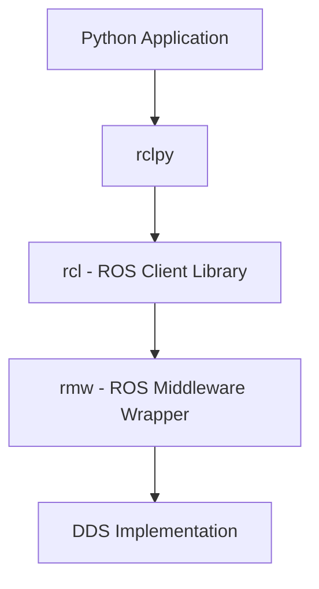

# rclpy: Python Bridge for ROS2 - Advanced Techniques

## Introduction to rclpy

rclpy is the official Python client library for ROS2, providing a Pythonic interface to the ROS2 middleware. It enables Python developers to create nodes, publish/subscribe to topics, provide/use services, and interact with actions within the ROS2 ecosystem.

## Core Concepts and Architecture

### Client Library vs. Middleware

rclpy serves as a Python binding for the ROS Client Library (rcl), which itself is built on top of DDS (Data Distribution Service):



This architecture allows Python applications to seamlessly interact with other ROS2 nodes written in C++, Rust, or other supported languages.

### Installation and Setup

```bash
# Install rclpy via pip
pip install rclpy

# Or via system package manager
sudo apt install python3-rclpy
```

### Basic Node Structure

```python
import rclpy
from rclpy.node import Node
from std_msgs.msg import String

class MinimalPublisher(Node):
    def __init__(self):
        # Initialize the parent Node class
        super().__init__('minimal_publisher')
        
        # Create a publisher
        self.publisher_ = self.create_publisher(String, 'topic', 10)
        
        # Create a timer
        timer_period = 0.5  # seconds
        self.timer = self.create_timer(timer_period, self.timer_callback)
        
        # Initialize counter
        self.i = 0

    def timer_callback(self):
        msg = String()
        msg.data = 'Hello World: %d' % self.i
        self.publisher_.publish(msg)
        self.get_logger().info('Publishing: "%s"' % msg.data)
        self.i += 1

def main(args=None):
    # Initialize the ROS2 client library
    rclpy.init(args=args)
    
    # Create an instance of the node
    minimal_publisher = MinimalPublisher()
    
    try:
        # Run the node's event loop
        rclpy.spin(minimal_publisher)
    except KeyboardInterrupt:
        pass
    finally:
        # Clean up
        minimal_publisher.destroy_node()
        rclpy.shutdown()

if __name__ == '__main__':
    main()
```

## Advanced Node Features

### Node Parameters

Parameters allow runtime configuration of nodes:

```python
import rclpy
from rclpy.node import Node
from rclpy.parameter import Parameter
from rcl_interfaces.msg import ParameterDescriptor, IntegerParameterLimits

class ParameterizedNode(Node):
    def __init__(self):
        super().__init__('parameterized_node')
        
        # Declare parameters with default values and descriptors
        self.declare_parameter(
            'robot_name', 
            'default_robot',
            descriptor=ParameterDescriptor(
                description='Name of the robot'
            )
        )
        
        self.declare_parameter(
            'max_velocity',
            1.0,
            descriptor=ParameterDescriptor(
                description='Maximum velocity for the robot',
                integer_range=[IntegerParameterLimits(from_value=0.1, to_value=10.0, step=0.1)]
            )
        )
        
        # Get parameter values
        self.robot_name = self.get_parameter('robot_name').value
        self.max_velocity = self.get_parameter('max_velocity').value
        
        # Subscribe to parameter updates
        self.add_on_set_parameters_callback(self.parameter_callback)
        
        self.get_logger().info(f'Node initialized with robot_name: {self.robot_name}, max_velocity: {self.max_velocity}')

    def parameter_callback(self, params):
        """Callback for parameter changes"""
        successful = True
        reason = ''
        
        for param in params:
            if param.name == 'max_velocity' and param.type_ == Parameter.Type.PARAMETER_DOUBLE:
                if param.value <= 0 or param.value > 10.0:
                    successful = False
                    reason = 'max_velocity must be between 0.1 and 10.0'
                    break
            elif param.name == 'robot_name':
                if len(param.value) < 3:
                    successful = False
                    reason = 'robot_name must be at least 3 characters'
                    break
        
        return SetParametersResult(successful=successful, reason=reason)

def main():
    rclpy.init()
    node = ParameterizedNode()
    
    # Change parameter programmatically
    timer = node.create_timer(5.0, lambda: node.set_parameters([Parameter('max_velocity', Parameter.Type.PARAMETER_DOUBLE, 2.0)]))
    
    try:
        rclpy.spin(node)
    except KeyboardInterrupt:
        pass
    finally:
        node.destroy_node()
        rclpy.shutdown()

if __name__ == '__main__':
    main()
```

### Lifecycle Nodes

Lifecycle nodes provide better control over node state:

```python
import rclpy
from rclpy.node import Node
from rclpy.lifecycle import LifecycleNode, LifecycleState, TransitionCallbackReturn
from rclpy.lifecycle import Publisher
from std_msgs.msg import String

class LifecyclePublisherNode(LifecycleNode):
    def __init__(self, node_name='lifecycle_publisher'):
        super().__init__(node_name)
        self.pub = None
        self.timer = None

    def on_configure(self, state: LifecycleState) -> TransitionCallbackReturn:
        """Called when the node is configured"""
        self.pub = self.create_publisher(String, 'lifecycle_chatter', 10)
        self.get_logger().info(f'Configured {self.get_name()}')
        return TransitionCallbackReturn.SUCCESS

    def on_activate(self, state: LifecycleState) -> TransitionCallbackReturn:
        """Called when the node is activated"""
        self.timer = self.create_timer(1.0, self.timer_callback)
        self.get_logger().info(f'Activated {self.get_name()}')
        return super().on_activate(state)

    def on_deactivate(self, state: LifecycleState) -> TransitionCallbackReturn:
        """Called when the node is deactivated"""
        self.destroy_timer(self.timer)
        self.timer = None
        self.get_logger().info(f'Deactivated {self.get_name()}')
        return super().on_deactivate(state)

    def on_cleanup(self, state: LifecycleState) -> TransitionCallbackReturn:
        """Called when the node is cleaned up"""
        self.destroy_publisher(self.pub)
        self.pub = None
        self.get_logger().info(f'Cleaned up {self.get_name()}')
        return TransitionCallbackReturn.SUCCESS

    def timer_callback(self):
        """Timer callback for publishing messages"""
        msg = String()
        msg.data = 'Lifecycle msg'
        self.pub.publish(msg)

def main():
    rclpy.init()
    node = LifecyclePublisherNode()
    
    # Transition through lifecycle states
    node.trigger_configure()
    node.trigger_activate()
    
    # Run for 10 seconds
    import time
    start_time = time.time()
    while time.time() - start_time < 10:
        rclpy.spin_once(node, timeout_sec=0.1)
    
    # Cleanup
    node.trigger_deactivate()
    node.trigger_cleanup()
    node.destroy_node()
    rclpy.shutdown()

if __name__ == '__main__':
    main()
```

## Advanced Communication Patterns

### Custom Message Types

Creating and using custom message types with rclpy:

```python
# Custom message definition would be in msg/RobotStatus.msg:
# string robot_name
# float64 battery_level
# bool is_charging
# float64[] joint_positions

# Publisher with custom message
import rclpy
from rclpy.node import Node
from std_msgs.msg import Header
# Assuming custom message is built and available as a module
# from my_robot_msgs.msg import RobotStatus

class RobotStatusPublisher(Node):
    def __init__(self):
        super().__init__('robot_status_publisher')
        
        # Publisher for custom message
        self.publisher_ = self.create_publisher(RobotStatus, 'robot_status', 10)
        
        # Timer to periodically publish robot status
        self.timer = self.create_timer(1.0, self.publish_status)
        
        # Simulate robot joint positions
        self.joint_positions = [0.0] * 22  # 22 DOF humanoid
        
    def publish_status(self):
        msg = RobotStatus()
        msg.header.stamp = self.get_clock().now().to_msg()
        msg.header.frame_id = 'base_link'
        msg.robot_name = 'humanoid_robot_01'
        msg.battery_level = 85.3
        msg.is_charging = False
        msg.joint_positions = self.joint_positions
        
        self.publisher_.publish(msg)
        self.get_logger().info(f'Published robot status: {msg.robot_name}, battery: {msg.battery_level}%')

# Subscriber for custom message
class RobotStatusSubscriber(Node):
    def __init__(self):
        super().__init__('robot_status_subscriber')
        
        # Subscriber for custom message
        self.subscription = self.create_subscription(
            RobotStatus,
            'robot_status',
            self.status_callback,
            10
        )
        
    def status_callback(self, msg):
        self.get_logger().info(
            f'Received status for {msg.robot_name}: '
            f'Battery: {msg.battery_level}%, '
            f'Charging: {msg.is_charging}, '
            f'Joints: {len(msg.joint_positions)}'
        )
```

### Quality of Service (QoS) in rclpy

```python
from rclpy.qos import QoSProfile, ReliabilityPolicy, DurabilityPolicy, HistoryPolicy, LivelinessPolicy

class QoSDemoNode(Node):
    def __init__(self):
        super().__init__('qos_demo_node')
        
        # Different QoS profiles for different use cases
        self.control_qos = QoSProfile(
            depth=1,  # Only keep the latest message
            reliability=ReliabilityPolicy.RELIABLE,  # Ensure delivery
            durability=DurabilityPolicy.VOLATILE,  # Don't keep messages for late joiners
            history=HistoryPolicy.KEEP_LAST
        )
        
        self.logging_qos = QoSProfile(
            depth=1000,  # Keep many messages
            reliability=ReliabilityPolicy.BEST_EFFORT,  # Don't require delivery
            durability=DurabilityPolicy.VOLATILE,
            history=HistoryPolicy.KEEP_LAST
        )
        
        self.description_qos = QoSProfile(
            depth=1,
            reliability=ReliabilityPolicy.RELIABLE,
            durability=DurabilityPolicy.TRANSIENT_LOCAL,  # Keep for late joiners
            history=HistoryPolicy.KEEP_LAST
        )
        
        # Publishers with different QoS
        self.control_pub = self.create_publisher(JointState, 'control_commands', self.control_qos)
        self.log_pub = self.create_publisher(String, 'log_messages', self.logging_qos)
        self.description_pub = self.create_publisher(String, 'robot_description', self.description_qos)

def main():
    rclpy.init()
    node = QoSDemoNode()
    
    try:
        rclpy.spin(node)
    except KeyboardInterrupt:
        pass
    finally:
        node.destroy_node()
        rclpy.shutdown()
```

### Async/Await Support in rclpy

rclpy supports Python's async/await syntax for non-blocking operations:

```python
import asyncio
import rclpy
from rclpy.node import Node
from example_interfaces.srv import AddTwoInts

class AsyncServiceClient(Node):
    def __init__(self):
        super().__init__('async_service_client')
        self.cli = self.create_client(AddTwoInts, 'add_two_ints')
        
        while not self.cli.wait_for_service(timeout_sec=1.0):
            self.get_logger().info('Service not available, waiting again...')
    
    async def send_request_async(self, a, b):
        """Send request asynchronously"""
        request = AddTwoInts.Request()
        request.a = a
        request.b = b
        
        future = self.cli.call_async(request)
        
        # Wait for response (non-blocking)
        await future
        return future.result()

class AsyncNode(Node):
    def __init__(self):
        super().__init__('async_node')
        
        # Initialize async client
        self.client = AsyncServiceClient()
        
        # Create timer to demonstrate async operations
        self.timer = self.create_timer(2.0, self.async_timer_callback)
        
    def async_timer_callback(self):
        """Timer callback that handles async operations"""
        # Run async function in executor
        future = asyncio.run_coroutine_threadsafe(
            self.client.send_request_async(10, 20),
            asyncio.get_event_loop()
        )
        
        # Add callback for when the async operation completes
        future.add_done_callback(self.request_completed_callback)
    
    def request_completed_callback(self, future):
        """Callback when async request completes"""
        result = future.result()
        self.get_logger().info(f'Async result: {result.sum}')

def main():
    rclpy.init()
    node = AsyncNode()
    
    try:
        rclpy.spin(node)
    except KeyboardInterrupt:
        pass
    finally:
        node.destroy_node()
        rclpy.shutdown()
```

## Callback Groups and Threading

### Using Callback Groups for Concurrency

```python
import rclpy
from rclpy.node import Node
from rclpy.callback_groups import MutuallyExclusiveCallbackGroup, ReentrantCallbackGroup
from std_msgs.msg import String
from example_interfaces.srv import AddTwoInts

class ConcurrentNode(Node):
    def __init__(self):
        super().__init__('concurrent_node')
        
        # Create different callback groups
        self.sensor_group = ReentrantCallbackGroup()  # Can run concurrently
        self.control_group = MutuallyExclusiveCallbackGroup()  # Exclusive execution
        self.service_group = MutuallyExclusiveCallbackGroup()  # Exclusive execution
        
        # Subscribers with different callback groups
        self.sensor_sub1 = self.create_subscription(
            String,
            'sensor_data_1',
            self.sensor_callback_1,
            10,
            callback_group=self.sensor_group
        )
        
        self.sensor_sub2 = self.create_subscription(
            String,
            'sensor_data_2',
            self.sensor_callback_2,
            10,
            callback_group=self.sensor_group
        )
        
        # Service with dedicated callback group
        self.calc_srv = self.create_service(
            AddTwoInts,
            'calculate',
            self.calculate_callback,
            callback_group=self.service_group
        )
        
        self.get_logger().info('Concurrent node initialized')

    def sensor_callback_1(self, msg):
        self.get_logger().info(f'Sensor 1: {msg.data}')
        # Simulate some processing time
        import time
        time.sleep(0.1)

    def sensor_callback_2(self, msg):
        self.get_logger().info(f'Sensor 2: {msg.data}')
        # Simulate some processing time
        import time
        time.sleep(0.1)

    def calculate_callback(self, request, response):
        self.get_logger().info(f'Calculating {request.a} + {request.b}')
        # Simulate a longer calculation
        import time
        time.sleep(1.0)
        response.sum = request.a + request.b
        return response

def main():
    rclpy.init()
    
    # Use multi-threaded executor for concurrent execution
    executor = rclpy.executors.MultiThreadedExecutor(num_threads=4)
    
    node = ConcurrentNode()
    executor.add_node(node)
    
    try:
        executor.spin()
    except KeyboardInterrupt:
        pass
    finally:
        node.destroy_node()
        rclpy.shutdown()
        executor.shutdown()
```

## Memory Management and Performance

### Efficient Message Handling

```python
import rclpy
from rclpy.node import Node
from sensor_msgs.msg import JointState
import time

class EfficientNode(Node):
    def __init__(self):
        super().__init__('efficient_node')
        
        # Pre-allocate messages to minimize memory allocation in callback
        self.msg_pool = []
        for i in range(10):
            msg = JointState()
            msg.name = ['joint1', 'joint2', 'joint3', 'joint4', 'joint5']  # Fixed joint names
            msg.position = [0.0] * 5  # Pre-allocate position array
            msg.velocity = [0.0] * 5
            msg.effort = [0.0] * 5
            self.msg_pool.append(msg)
        
        self.pool_idx = 0
        self.publisher = self.create_publisher(JointState, 'efficient_joint_states', 10)
        self.timer = self.create_timer(0.01, self.publish_efficiently)  # 100 Hz
        
        # Performance tracking
        self.last_time = self.get_clock().now()
        
    def publish_efficiently(self):
        # Reuse pre-allocated message
        msg = self.msg_pool[self.pool_idx]
        self.pool_idx = (self.pool_idx + 1) % len(self.msg_pool)
        
        # Update only necessary values, not the entire structure
        current_time = self.get_clock().now()
        msg.header.stamp = current_time.to_msg()
        msg.header.frame_id = 'base_link'
        
        # Update position values for simulation
        for i in range(len(msg.position)):
            msg.position[i] = 0.1 * self.pool_idx * (i + 1)
        
        self.publisher.publish(msg)
        
        # Log performance metrics
        now = self.get_clock().now()
        dt = (now.nanoseconds - self.last_time.nanoseconds) / 1e9
        if dt > 1.0:  # Log every second
            self.get_logger().info(f'Publishing rate: {1.0/dt:.2f} Hz')
            self.last_time = now

def main():
    rclpy.init()
    node = EfficientNode()
    
    try:
        rclpy.spin(node)
    except KeyboardInterrupt:
        pass
    finally:
        node.destroy_node()
        rclpy.shutdown()
```

## Advanced Node Patterns for Humanoid Robotics

### State Machine Node

```python
from enum import Enum
import rclpy
from rclpy.node import Node
from std_msgs.msg import String
from geometry_msgs.msg import Twist

class RobotState(Enum):
    IDLE = 1
    MOVING = 2
    MANIPULATING = 3
    STANDBY = 4

class StateMachineNode(Node):
    def __init__(self):
        super().__init__('state_machine_node')
        
        self.current_state = RobotState.IDLE
        self.state_publisher = self.create_publisher(String, 'robot_state', 10)
        self.cmd_publisher = self.create_publisher(Twist, 'cmd_vel', 10)
        
        # Command subscriber
        self.cmd_sub = self.create_subscription(String, 'command', self.command_callback, 10)
        
        # State timer
        self.state_timer = self.create_timer(0.1, self.state_machine_update)
        
        self.get_logger().info(f'Starting in state: {self.current_state}')
        self.publish_state()

    def command_callback(self, msg):
        """Handle incoming commands"""
        command = msg.data.lower()
        
        if command == 'move' and self.current_state == RobotState.IDLE:
            self.current_state = RobotState.MOVING
            self.get_logger().info('Transitioning to MOVING state')
        elif command == 'stop' and self.current_state == RobotState.MOVING:
            self.current_state = RobotState.IDLE
            self.get_logger().info('Transitioning to IDLE state')
        elif command == 'standby':
            self.current_state = RobotState.STANDBY
            self.get_logger().info('Transitioning to STANDBY state')
        elif command == 'wake':
            if self.current_state == RobotState.STANDBY:
                self.current_state = RobotState.IDLE
                self.get_logger().info('Transitioning from STANDBY to IDLE')
        
        self.publish_state()

    def state_machine_update(self):
        """Update based on current state"""
        if self.current_state == RobotState.MOVING:
            # Publish movement command
            cmd = Twist()
            cmd.linear.x = 0.5  # Move forward
            self.cmd_publisher.publish(cmd)
        elif self.current_state == RobotState.IDLE:
            # Publish zero velocity to stop
            cmd = Twist()
            self.cmd_publisher.publish(cmd)
        elif self.current_state == RobotState.STANDBY:
            # In standby, just monitor
            pass

    def publish_state(self):
        """Publish current state"""
        state_msg = String()
        state_msg.data = self.current_state.name.lower()
        self.state_publisher.publish(state_msg)

def main():
    rclpy.init()
    node = StateMachineNode()
    
    try:
        rclpy.spin(node)
    except KeyboardInterrupt:
        pass
    finally:
        node.destroy_node()
        rclpy.shutdown()
```

### Multi-threaded Node with Threading Module

```python
import rclpy
from rclpy.node import Node
from std_msgs.msg import String
import threading
import time

class MultiThreadedNode(Node):
    def __init__(self):
        super().__init__('multi_threaded_node')
        
        self.publisher = self.create_publisher(String, 'threaded_topic', 10)
        
        # Shared data between threads
        self.shared_counter = 0
        self.lock = threading.Lock()
        
        # Start background thread
        self.background_thread = threading.Thread(target=self.background_work)
        self.background_thread.daemon = True
        self.background_thread.start()
        
        # Timer for main thread work
        self.timer = self.create_timer(0.5, self.timer_callback)
        
        self.get_logger().info('Multi-threaded node started')

    def background_work(self):
        """Background thread function"""
        while rclpy.ok():
            with self.lock:
                self.shared_counter += 1
                
            # Publish from background thread
            msg = String()
            msg.data = f'Background thread message #{self.shared_counter}'
            self.publisher.publish(msg)
            
            time.sleep(1.0)  # Sleep in background thread

    def timer_callback(self):
        """Timer callback in main thread"""
        with self.lock:
            counter_value = self.shared_counter
            
        self.get_logger().info(f'Main thread: counter = {counter_value}')

def main():
    rclpy.init()
    node = MultiThreadedNode()
    
    try:
        rclpy.spin(node)
    except KeyboardInterrupt:
        pass
    finally:
        node.destroy_node()
        rclpy.shutdown()
```

## Performance Monitoring and Profiling

### Adding Performance Metrics to Nodes

```python
import rclpy
from rclpy.node import Node
from std_msgs.msg import String
import time
from collections import deque

class MonitoredNode(Node):
    def __init__(self):
        super().__init__('monitored_node')
        
        self.publisher = self.create_publisher(String, 'monitored_topic', 10)
        self.timer = self.create_timer(0.1, self.publish_with_metrics)
        
        # Performance metrics
        self.processing_times = deque(maxlen=100)  # Keep last 100 measurements
        self.message_count = 0
        
        self.get_logger().info('Monitored node started')

    def publish_with_metrics(self):
        start_time = time.perf_counter()
        
        # Simulate work
        msg = String()
        msg.data = f'Message #{self.message_count}'
        self.publisher.publish(msg)
        
        end_time = time.perf_counter()
        processing_time = (end_time - start_time) * 1000  # in milliseconds
        
        # Store metrics
        self.processing_times.append(processing_time)
        self.message_count += 1
        
        # Log metrics periodically
        if self.message_count % 50 == 0:
            avg_time = sum(self.processing_times) / len(self.processing_times)
            self.get_logger().info(
                f'Performance: avg={avg_time:.2f}ms, '
                f'min={min(self.processing_times):.2f}ms, '
                f'max={max(self.processing_times):.2f}ms, '
                f'count={self.message_count}'
            )

def main():
    rclpy.init()
    node = MonitoredNode()
    
    try:
        rclpy.spin(node)
    except KeyboardInterrupt:
        pass
    finally:
        node.destroy_node()
        rclpy.shutdown()
```

## Best Practices and Tips

### 1. Error Handling

```python
class RobustNode(Node):
    def sensor_callback(self, msg):
        try:
            # Process sensor data
            processed_data = self.process_sensor_data(msg)
            self.publish_processed_data(processed_data)
        except ValueError as e:
            self.get_logger().error(f'Invalid sensor data: {e}')
        except Exception as e:
            self.get_logger().error(f'Sensor processing failed: {e}')
            # Publish safe values to maintain system stability
            self.publish_safe_values()
```

### 2. Resource Management

```python
class ResourceManagedNode(Node):
    def __init__(self):
        super().__init__('resource_managed_node')
        
        # Track resources
        self.resources = {
            'publishers': [],
            'subscribers': [],
            'timers': [],
            'services': [],
            'clients': []
        }
        
        # Create resources
        pub = self.create_publisher(String, 'topic', 10)
        self.resources['publishers'].append(pub)
        
    def destroy_node(self):
        """Custom cleanup"""
        self.get_logger().info('Cleaning up resources...')
        
        # Clean up resources in reverse order
        for resource_list in reversed(list(self.resources.values())):
            for resource in resource_list:
                if hasattr(resource, 'destroy'):
                    resource.destroy()
        
        super().destroy_node()
```

### 3. Memory Efficiency

```python
# Use generators for large datasets
def generate_large_dataset():
    for i in range(1000000):  # Large dataset
        yield f'data_point_{i}'

# Instead of creating all at once
def process_large_dataset(self):
    for data_point in generate_large_dataset():
        # Process one at a time
        self.process_single_datapoint(data_point)
```

## Next Steps

With this comprehensive overview of rclpy, you're now equipped to build sophisticated Python-based ROS2 nodes for humanoid robotics applications. The next chapter will focus specifically on URDF (Unified Robot Description Format) and how to model humanoid robots for simulation and control.

Use the personalization button to adjust this content based on your experience level, or the translation button to read in Urdu.