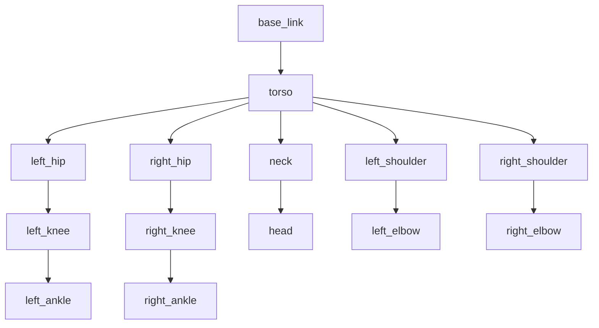

# URDF for Humanoids: Modeling Complex Bipedal Robots

## Introduction to URDF for Humanoid Robotics

Unified Robot Description Format (URDF) is an XML-based format that describes robots in ROS. For humanoid robots, URDF becomes particularly complex due to the many degrees of freedom, intricate kinematic chains, and the need for accurate physical properties. This chapter explores advanced URDF techniques specifically for modeling bipedal humanoid robots.

## URDF Fundamentals for Humanoids

### Basic Structure

A humanoid robot URDF typically includes:
- Multiple kinematic chains (legs, arms, torso, head)
- Accurate physical properties for each link
- Proper joint definitions with limits and dynamics
- Visual and collision models
- Transmission definitions for actuator control

```xml
<?xml version="1.0"?>
<robot name="humanoid_robot" xmlns:xacro="http://www.ros.org/wiki/xacro">
  <!-- Robot base link -->
  <link name="base_link">
    <inertial>
      <origin xyz="0 0 0" rpy="0 0 0"/>
      <mass value="1.0"/>
      <inertia ixx="0.01" ixy="0" ixz="0" iyy="0.01" iyz="0" izz="0.01"/>
    </inertial>
    
    <visual>
      <origin xyz="0 0 0" rpy="0 0 0"/>
      <geometry>
        <box size="0.1 0.1 0.1"/>
      </geometry>
      <material name="gray">
        <color rgba="0.5 0.5 0.5 1.0"/>
      </material>
    </visual>
    
    <collision>
      <origin xyz="0 0 0" rpy="0 0 0"/>
      <geometry>
        <box size="0.1 0.1 0.1"/>
      </geometry>
    </collision>
  </link>
</robot>
```

## Anatomy of a Humanoid Robot

### Link and Joint Hierarchy

Humanoid robots have a complex kinematic structure with multiple chains:



### Detailed Humanoid URDF Example

```xml
<?xml version="1.0"?>
<robot name="advanced_humanoid" xmlns:xacro="http://www.ros.org/wiki/xacro">
  
  <!-- Constants for the robot dimensions -->
  <xacro:property name="PI" value="3.1415926535897931"/>
  <xacro:property name="mass_torso" value="5.0"/>
  <xacro:property name="mass_leg" value="2.0"/>
  <xacro:property name="mass_arm" value="1.5"/>
  <xacro:property name="mass_foot" value="0.8"/>
  <xacro:property name="mass_hand" value="0.5"/>
  
  <!-- Base link -->
  <link name="base_link">
    <inertial>
      <origin xyz="0 0 0" rpy="0 0 0"/>
      <mass value="0.1"/>
      <inertia ixx="0.001" ixy="0" ixz="0" iyy="0.001" iyz="0" izz="0.001"/>
    </inertial>
  </link>
  
  <!-- Torso -->
  <link name="torso">
    <inertial>
      <origin xyz="0 0 0.2" rpy="0 0 0"/>
      <mass value="${mass_torso}"/>
      <inertia ixx="0.1" ixy="0" ixz="0" iyy="0.1" iyz="0" izz="0.1"/>
    </inertial>
    
    <visual>
      <origin xyz="0 0 0.2" rpy="0 0 0"/>
      <geometry>
        <box size="0.2 0.15 0.4"/>
      </geometry>
      <material name="light_gray">
        <color rgba="0.7 0.7 0.7 1.0"/>
      </material>
    </visual>
    
    <collision>
      <origin xyz="0 0 0.2" rpy="0 0 0"/>
      <geometry>
        <box size="0.2 0.15 0.4"/>
      </geometry>
    </collision>
  </link>
  
  <joint name="base_to_torso" type="fixed">
    <parent link="base_link"/>
    <child link="torso"/>
    <origin xyz="0 0 0" rpy="0 0 0"/>
  </joint>
  
  <!-- Head -->
  <link name="head">
    <inertial>
      <origin xyz="0 0 0" rpy="0 0 0"/>
      <mass value="1.0"/>
      <inertia ixx="0.01" ixy="0" ixz="0" iyy="0.01" iyz="0" izz="0.01"/>
    </inertial>
    
    <visual>
      <origin xyz="0 0 0" rpy="0 0 0"/>
      <geometry>
        <sphere radius="0.1"/>
      </geometry>
      <material name="white">
        <color rgba="1.0 1.0 1.0 1.0"/>
      </material>
    </visual>
    
    <collision>
      <origin xyz="0 0 0" rpy="0 0 0"/>
      <geometry>
        <sphere radius="0.1"/>
      </geometry>
    </collision>
  </link>
  
  <joint name="neck_joint" type="revolute">
    <parent link="torso"/>
    <child link="head"/>
    <origin xyz="0 0 0.35" rpy="0 0 0"/>
    <axis xyz="0 1 0"/>
    <limit lower="${-PI/3}" upper="${PI/3}" effort="10" velocity="${PI/2}"/>
    <dynamics damping="0.5" friction="0.1"/>
  </joint>
  
  <!-- Left Leg Chain -->
  <xacro:macro name="leg_chain" params="side reflect">
    <!-- Hip joint -->
    <link name="${side}_hip">
      <inertial>
        <origin xyz="0 0 -0.1" rpy="0 0 0"/>
        <mass value="${mass_leg}"/>
        <inertia ixx="0.01" ixy="0" ixz="0" iyy="0.01" iyz="0" izz="0.02"/>
      </inertial>
      
      <visual>
        <origin xyz="0 0 -0.1" rpy="0 0 0"/>
        <geometry>
          <cylinder radius="0.05" length="0.2"/>
        </geometry>
        <material name="dark_gray">
          <color rgba="0.3 0.3 0.3 1.0"/>
        </material>
      </visual>
      
      <collision>
        <origin xyz="0 0 -0.1" rpy="0 0 0"/>
        <geometry>
          <cylinder radius="0.05" length="0.2"/>
        </geometry>
      </collision>
    </link>
    
    <joint name="${side}_hip_yaw_joint" type="revolute">
      <parent link="torso"/>
      <child link="${side}_hip"/>
      <origin xyz="0 ${reflect * 0.075} -0.1" rpy="0 0 0"/>
      <axis xyz="0 0 1"/>
      <limit lower="${-PI/4}" upper="${PI/4}" effort="50" velocity="${PI}"/>
      <dynamics damping="1.0" friction="0.2"/>
    </joint>
    
    <joint name="${side}_hip_roll_joint" type="revolute">
      <parent link="${side}_hip"/>
      <child link="${side}_thigh"/>
      <origin xyz="0 0 -0.2" rpy="0 0 0"/>
      <axis xyz="1 0 0"/>
      <limit lower="${-PI/2}" upper="${PI/2}" effort="50" velocity="${PI}"/>
      <dynamics damping="1.0" friction="0.2"/>
    </joint>
    
    <!-- Thigh -->
    <link name="${side}_thigh">
      <inertial>
        <origin xyz="0 0 -0.15" rpy="0 0 0"/>
        <mass value="${mass_leg}"/>
        <inertia ixx="0.04" ixy="0" ixz="0" iyy="0.04" iyz="0" izz="0.01"/>
      </inertial>
      
      <visual>
        <origin xyz="0 0 -0.15" rpy="0 0 0"/>
        <geometry>
          <cylinder radius="0.04" length="0.3"/>
        </geometry>
        <material name="dark_gray">
          <color rgba="0.3 0.3 0.3 1.0"/>
        </material>
      </visual>
      
      <collision>
        <origin xyz="0 0 -0.15" rpy="0 0 0"/>
        <geometry>
          <cylinder radius="0.04" length="0.3"/>
        </geometry>
      </collision>
    </link>
    
    <joint name="${side}_hip_pitch_joint" type="revolute">
      <parent link="${side}_thigh"/>
      <child link="${side}_shin"/>
      <origin xyz="0 0 -0.3" rpy="0 0 0"/>
      <axis xyz="1 0 0"/>
      <limit lower="0" upper="${PI/2}" effort="50" velocity="${PI}"/>
      <dynamics damping="1.0" friction="0.2"/>
    </joint>
    
    <!-- Shin -->
    <link name="${side}_shin">
      <inertial>
        <origin xyz="0 0 -0.15" rpy="0 0 0"/>
        <mass value="${mass_leg}"/>
        <inertia ixx="0.04" ixy="0" ixz="0" iyy="0.04" iyz="0" izz="0.01"/>
      </inertial>
      
      <visual>
        <origin xyz="0 0 -0.15" rpy="0 0 0"/>
        <geometry>
          <cylinder radius="0.04" length="0.3"/>
        </geometry>
        <material name="dark_gray">
          <color rgba="0.3 0.3 0.3 1.0"/>
        </material>
      </visual>
      
      <collision>
        <origin xyz="0 0 -0.15" rpy="0 0 0"/>
        <geometry>
          <cylinder radius="0.04" length="0.3"/>
        </geometry>
      </collision>
    </link>
    
    <joint name="${side}_knee_joint" type="revolute">
      <parent link="${side}_shin"/>
      <child link="${side}_ankle"/>
      <origin xyz="0 0 -0.3" rpy="0 0 0"/>
      <axis xyz="1 0 0"/>
      <limit lower="${-PI/2}" upper="0" effort="50" velocity="${PI}"/>
      <dynamics damping="1.0" friction="0.2"/>
    </joint>
    
    <!-- Ankle -->
    <link name="${side}_ankle">
      <inertial>
        <origin xyz="0 0 -0.05" rpy="0 0 0"/>
        <mass value="0.5"/>
        <inertia ixx="0.001" ixy="0" ixz="0" iyy="0.001" iyz="0" izz="0.002"/>
      </inertial>
      
      <visual>
        <origin xyz="0 0 -0.05" rpy="0 0 0"/>
        <geometry>
          <cylinder radius="0.04" length="0.1"/>
        </geometry>
        <material name="dark_gray">
          <color rgba="0.3 0.3 0.3 1.0"/>
        </material>
      </visual>
      
      <collision>
        <origin xyz="0 0 -0.05" rpy="0 0 0"/>
        <geometry>
          <cylinder radius="0.04" length="0.1"/>
        </geometry>
      </collision>
    </link>
    
    <joint name="${side}_ankle_pitch_joint" type="revolute">
      <parent link="${side}_ankle"/>
      <child link="${side}_foot"/>
      <origin xyz="0 0 -0.1" rpy="0 0 0"/>
      <axis xyz="1 0 0"/>
      <limit lower="${-PI/4}" upper="${PI/4}" effort="30" velocity="${PI}"/>
      <dynamics damping="0.5" friction="0.1"/>
    </joint>
    
    <!-- Foot -->
    <link name="${side}_foot">
      <inertial>
        <origin xyz="0.05 0 -0.02" rpy="0 0 0"/>
        <mass value="${mass_foot}"/>
        <inertia ixx="0.005" ixy="0" ixz="0" iyy="0.01" iyz="0" izz="0.01"/>
      </inertial>
      
      <visual>
        <origin xyz="0.05 0 -0.02" rpy="0 0 0"/>
        <geometry>
          <box size="0.18 0.1 0.04"/>
        </geometry>
        <material name="black">
          <color rgba="0.1 0.1 0.1 1.0"/>
        </material>
      </visual>
      
      <collision>
        <origin xyz="0.05 0 -0.02" rpy="0 0 0"/>
        <geometry>
          <box size="0.18 0.1 0.04"/>
        </geometry>
      </collision>
    </link>
  </xacro:macro>
  
  <!-- Instantiate left and right leg chains -->
  <xacro:leg_chain side="left" reflect="1"/>
  <xacro:leg_chain side="right" reflect="-1"/>
  
  <!-- Left Arm Chain -->
  <xacro:macro name="arm_chain" params="side reflect">
    <!-- Shoulder -->
    <joint name="${side}_shoulder_yaw_joint" type="revolute">
      <parent link="torso"/>
      <child link="${side}_shoulder"/>
      <origin xyz="0 ${reflect * 0.1} 0.25" rpy="0 0 0"/>
      <axis xyz="0 0 1"/>
      <limit lower="${-PI/4}" upper="${PI/4}" effort="30" velocity="${PI}"/>
      <dynamics damping="0.5" friction="0.1"/>
    </joint>
    
    <link name="${side}_shoulder">
      <inertial>
        <origin xyz="0 ${reflect * 0.05} 0" rpy="0 0 0"/>
        <mass value="${mass_arm}"/>
        <inertia ixx="0.005" ixy="0" ixz="0" iyy="0.005" iyz="0" izz="0.001"/>
      </inertial>
      
      <visual>
        <origin xyz="0 ${reflect * 0.05} 0" rpy="0 0 0"/>
        <geometry>
          <cylinder radius="0.04" length="0.1"/>
        </geometry>
        <material name="light_gray">
          <color rgba="0.7 0.7 0.7 1.0"/>
        </material>
      </visual>
      
      <collision>
        <origin xyz="0 ${reflect * 0.05} 0" rpy="0 0 0"/>
        <geometry>
          <cylinder radius="0.04" length="0.1"/>
        </geometry>
      </collision>
    </link>
    
    <joint name="${side}_shoulder_pitch_joint" type="revolute">
      <parent link="${side}_shoulder"/>
      <child link="${side}_upper_arm"/>
      <origin xyz="0 ${reflect * 0.1} 0" rpy="0 0 0"/>
      <axis xyz="1 0 0"/>
      <limit lower="${-PI/2}" upper="${PI/2}" effort="30" velocity="${PI}"/>
      <dynamics damping="0.5" friction="0.1"/>
    </joint>
    
    <!-- Upper Arm -->
    <link name="${side}_upper_arm">
      <inertial>
        <origin xyz="0 0 -0.1" rpy="0 0 0"/>
        <mass value="${mass_arm}"/>
        <inertia ixx="0.01" ixy="0" ixz="0" iyy="0.01" iyz="0" izz="0.002"/>
      </inertial>
      
      <visual>
        <origin xyz="0 0 -0.1" rpy="0 0 0"/>
        <geometry>
          <cylinder radius="0.04" length="0.2"/>
        </geometry>
        <material name="light_gray">
          <color rgba="0.7 0.7 0.7 1.0"/>
        </material>
      </visual>
      
      <collision>
        <origin xyz="0 0 -0.1" rpy="0 0 0"/>
        <geometry>
          <cylinder radius="0.04" length="0.2"/>
        </geometry>
      </collision>
    </link>
    
    <joint name="${side}_shoulder_roll_joint" type="revolute">
      <parent link="${side}_upper_arm"/>
      <child link="${side}_forearm"/>
      <origin xyz="0 0 -0.2" rpy="0 0 0"/>
      <axis xyz="0 1 0"/>
      <limit lower="${-PI}" upper="${PI}" effort="20" velocity="${PI}"/>
      <dynamics damping="0.3" friction="0.1"/>
    </joint>
    
    <!-- Forearm -->
    <link name="${side}_forearm">
      <inertial>
        <origin xyz="0 0 -0.07" rpy="0 0 0"/>
        <mass value="0.8"/>
        <inertia ixx="0.005" ixy="0" ixz="0" iyy="0.005" iyz="0" izz="0.001"/>
      </inertial>
      
      <visual>
        <origin xyz="0 0 -0.07" rpy="0 0 0"/>
        <geometry>
          <cylinder radius="0.03" length="0.14"/>
        </geometry>
        <material name="light_gray">
          <color rgba="0.7 0.7 0.7 1.0"/>
        </material>
      </visual>
      
      <collision>
        <origin xyz="0 0 -0.07" rpy="0 0 0"/>
        <geometry>
          <cylinder radius="0.03" length="0.14"/>
        </geometry>
      </collision>
    </link>
    
    <joint name="${side}_elbow_joint" type="revolute">
      <parent link="${side}_forearm"/>
      <child link="${side}_hand"/>
      <origin xyz="0 0 -0.14" rpy="0 0 0"/>
      <axis xyz="1 0 0"/>
      <limit lower="${-PI/2}" upper="${PI/2}" effort="15" velocity="${PI}"/>
      <dynamics damping="0.2" friction="0.05"/>
    </joint>
    
    <!-- Hand -->
    <link name="${side}_hand">
      <inertial>
        <origin xyz="0.03 0 0" rpy="0 0 0"/>
        <mass value="${mass_hand}"/>
        <inertia ixx="0.001" ixy="0" ixz="0" iyy="0.001" iyz="0" izz="0.001"/>
      </inertial>
      
      <visual>
        <origin xyz="0.03 0 0" rpy="0 0 0"/>
        <geometry>
          <box size="0.08 0.06 0.05"/>
        </geometry>
        <material name="dark_gray">
          <color rgba="0.3 0.3 0.3 1.0"/>
        </material>
      </visual>
      
      <collision>
        <origin xyz="0.03 0 0" rpy="0 0 0"/>
        <geometry>
          <box size="0.08 0.06 0.05"/>
        </geometry>
      </collision>
    </link>
  </xacro:macro>
  
  <!-- Instantiate left and right arm chains -->
  <xacro:arm_chain side="left" reflect="1"/>
  <xacro:arm_chain side="right" reflect="-1"/>
  
</robot>
```

## Advanced URDF Concepts for Humanoids

### 1. Gazebo-Specific Tags

For simulation in Gazebo, additional tags are required:

```xml
<!-- Gazebo-specific configurations -->
<gazebo reference="torso">
  <material>Gazebo/White</material>
  <mu1>0.2</mu1>
  <mu2>0.2</mu2>
  <self_collide>true</self_collide>
</gazebo>

<gazebo reference="left_foot">
  <material>Gazebo/Black</material>
  <mu1>0.8</mu1>
  <mu2>0.8</mu2>
  <kp>1000000.0</kp>
  <kd>100.0</kd>
  <maxVel>1.0</maxVel>
  <minDepth>0.001</minDepth>
</gazebo>

<!-- Gazebo plugins -->
<gazebo>
  <plugin name="gazebo_ros_control" filename="libgazebo_ros_control.so">
    <robotNamespace>/humanoid_robot</robotNamespace>
  </plugin>
</gazebo>

<!-- Joint state publisher for Gazebo -->
<gazebo>
  <plugin name="joint_state_publisher" filename="libgazebo_ros_joint_state_publisher.so">
    <robotNamespace>/humanoid_robot</robotNamespace>
    <jointName>neck_joint, left_hip_yaw_joint, left_hip_roll_joint, left_hip_pitch_joint, left_knee_joint, left_ankle_pitch_joint</jointName>
  </plugin>
</gazebo>
```

### 2. Transmission Definitions

For controlling the robot's joints, transmission definitions are needed:

```xml
<!-- Transmission definitions for ROS control -->
<transmission name="tran1">
  <type>transmission_interface/SimpleTransmission</type>
  <joint name="neck_joint">
    <hardwareInterface>hardware_interface/PositionJointInterface</hardwareInterface>
  </joint>
  <actuator name="motor1">
    <hardwareInterface>hardware_interface/PositionJointInterface</hardwareInterface>
    <mechanicalReduction>1</mechanicalReduction>
  </actuator>
</transmission>

<!-- Example for multiple joints -->
<xacro:macro name="position_transmission" params="joint_name">
  <transmission name="${joint_name}_trans">
    <type>transmission_interface/SimpleTransmission</type>
    <joint name="${joint_name}">
      <hardwareInterface>hardware_interface/PositionJointInterface</hardwareInterface>
    </joint>
    <actuator name="${joint_name}_motor">
      <hardwareInterface>hardware_interface/PositionJointInterface</hardwareInterface>
      <mechanicalReduction>1</mechanicalReduction>
    </actuator>
  </transmission>
</xacro:macro>

<!-- Apply to all joints -->
<xacro:position_transmission joint_name="left_hip_yaw_joint"/>
<xacro:position_transmission joint_name="left_hip_roll_joint"/>
<xacro:position_transmission joint_name="left_hip_pitch_joint"/>
<!-- ... more joints ... -->
```

### 3. Safety Controllers

For humanoid robots, joint limits and safety controllers are crucial:

```xml
<!-- Safety controllers -->
<gazebo>
  <plugin name="gazebo_ros_control" filename="libgazebo_ros_control.so">
    <robotNamespace>/humanoid_robot</robotNamespace>
    <robotSimType>gazebo_ros_control/DefaultRobotHWSim</robotSimType>
    <legacyModeNS>true</legacyModeNS>
  </plugin>
</gazebo>

<!-- Joint limits enforcement -->
<xacro:macro name="safety_limits" params="joint_name pos min_vel max_vel">
  <gazebo reference="${joint_name}">
    <provideFeedback>true</provideFeedback>
    <implicitSpringDamper>1</implicitSpringDamper>
  </gazebo>
</xacro:macro>
```

## Xacro for Managing Complex Humanoid URDFs

### Parameterized Humanoid Macros

```xml
<?xml version="1.0"?>
<robot xmlns:xacro="http://www.ros.org/wiki/xacro" name="param_humanoid">
  
  <!-- Global properties -->
  <xacro:property name="M_PI" value="3.1415926535897931"/>
  
  <!-- Humanoid dimensions -->
  <xacro:property name="torso_height" value="0.4"/>
  <xacro:property name="torso_width" value="0.2"/>
  <xacro:property name="torso_depth" value="0.15"/>
  <xacro:property name="leg_length" value="0.6"/>
  <xacro:property name="arm_length" value="0.4"/>
  
  <!-- Material definitions -->
  <xacro:macro name="default_material" params="name color">
    <material name="${name}">
      <color rgba="${color} 1.0"/>
    </material>
  </xacro:macro>
  
  <!-- Link with standard inertial properties -->
  <xacro:macro name="standard_link" params="name mass ixx iyy izz *origin *geometry">
    <link name="${name}">
      <inertial>
        <xacro:insert_block name="origin"/>
        <mass value="${mass}"/>
        <inertia ixx="${ixx}" ixy="0" ixz="0" iyy="${iyy}" iyz="0" izz="${izz}"/>
      </inertial>
      
      <visual>
        <xacro:insert_block name="origin"/>
        <xacro:insert_block name="geometry"/>
        <material name="light_gray"/>
      </visual>
      
      <collision>
        <xacro:insert_block name="origin"/>
        <xacro:insert_block name="geometry"/>
      </collision>
    </link>
  </xacro:macro>
  
  <!-- Base link -->
  <link name="base_link">
    <inertial>
      <mass value="0.001"/>
      <inertia ixx="0.0001" ixy="0" ixz="0" iyy="0.0001" iyz="0" izz="0.0001"/>
    </inertial>
  </link>
  
  <!-- Torso using macro -->
  <xacro:standard_link name="torso" mass="5.0" ixx="0.1" iyy="0.1" izz="0.1">
    <origin xyz="0 0 ${torso_height/2}" rpy="0 0 0"/>
    <geometry>
      <box size="${torso_width} ${torso_depth} ${torso_height}"/>
    </geometry>
  </xacro:standard_link>
  
  <joint name="base_to_torso" type="fixed">
    <parent link="base_link"/>
    <child link="torso"/>
    <origin xyz="0 0 0" rpy="0 0 0"/>
  </joint>
  
  <!-- Define materials -->
  <xacro:default_material name="light_gray" color="0.7 0.7 0.7"/>
  <xacro:default_material name="dark_gray" color="0.3 0.3 0.3"/>
  <xacro:default_material name="black" color="0.1 0.1 0.1"/>
  <xacro:default_material name="white" color="1.0 1.0 1.0"/>
  
</robot>
```

## Humanoid-Specific Challenges

### 1. Balance and Stability Considerations

```xml
<!-- For balance, ensure the center of mass is properly calculated -->
<link name="torso_with_battery">
  <inertial>
    <!-- Battery adds weight lower in the torso for better stability -->
    <origin xyz="0 0 0.1" rpy="0 0 0"/>
    <mass value="6.0"/>  <!-- Added 1.0kg for battery -->
    <inertia ixx="0.15" ixy="0" ixz="0" iyy="0.15" iyz="0" izz="0.15"/>
  </inertial>
  
  <visual>
    <origin xyz="0 0 0.2" rpy="0 0 0"/>
    <geometry>
      <box size="0.2 0.15 0.4"/>
    </geometry>
    <material name="light_gray"/>
  </visual>
  
  <collision>
    <origin xyz="0 0 0.2" rpy="0 0 0"/>
    <geometry>
      <box size="0.2 0.15 0.4"/>
    </geometry>
  </collision>
</link>
```

### 2. Foot Modeling for Walking

```xml
<!-- Detailed foot model for walking stability -->
<link name="left_foot">
  <inertial>
    <origin xyz="0.05 0 -0.02" rpy="0 0 0"/>
    <mass value="0.8"/>
    <inertia ixx="0.005" ixy="0" ixz="0" iyy="0.01" iyz="0" izz="0.01"/>
  </inertial>
  
  <!-- Multiple collision elements for better contact with ground -->
  <collision name="left_foot_collision_front">
    <origin xyz="0.07 0 -0.02" rpy="0 0 0"/>
    <geometry>
      <box size="0.04 0.08 0.04"/>
    </geometry>
  </collision>
  
  <collision name="left_foot_collision_back">
    <origin xyz="-0.03 0 -0.02" rpy="0 0 0"/>
    <geometry>
      <box size="0.04 0.08 0.04"/>
    </geometry>
  </collision>
  
  <collision name="left_foot_collision_center">
    <origin xyz="0.03 0 -0.02" rpy="0 0 0"/>
    <geometry>
      <box size="0.08 0.1 0.04"/>
    </geometry>
  </collision>
  
  <visual>
    <origin xyz="0.05 0 -0.02" rpy="0 0 0"/>
    <geometry>
      <mesh filename="package://humanoid_description/meshes/left_foot.dae"/>
    </geometry>
    <material name="black"/>
  </visual>
</link>
```

## URDF Validation and Debugging

### 1. Checking URDF with check_urdf

```bash
# Install urdfdom tools
sudo apt install ros-humble-urdfdom-tools

# Check URDF validity
check_urdf path/to/your/robot.urdf

# Get information about the URDF
urdf_to_graphiz path/to/your/robot.urdf
```

### 2. Visualizing URDF in RViz

```xml
<!-- Add TF publisher to your launch file -->
<node pkg="robot_state_publisher" type="robot_state_publisher" name="robot_state_publisher">
  <param name="robot_description" textfile="$(find your_package)/urdf/your_robot.urdf"/>
</node>
```

### 3. Python Script for URDF Analysis

```python
#!/usr/bin/env python3
import xml.etree.ElementTree as ET
import math

def analyze_urdf(urdf_path):
    """Analyze URDF for humanoid robot properties"""
    tree = ET.parse(urdf_path)
    root = tree.getroot()
    
    print(f"Robot name: {root.attrib['name']}")
    
    # Count joints and links
    joints = root.findall('.//joint')
    links = root.findall('.//link')
    
    print(f"Number of joints: {len(joints)}")
    print(f"Number of links: {len(links)}")
    
    # Find joint types
    joint_types = {}
    for joint in joints:
        jtype = joint.attrib['type']
        if jtype in joint_types:
            joint_types[jtype] += 1
        else:
            joint_types[jtype] = 1
    
    print(f"Joint types: {joint_types}")
    
    # Check for humanoid specific joints
    humanoid_joints = {
        'left_leg': 0,
        'right_leg': 0,
        'left_arm': 0,
        'right_arm': 0,
        'torso': 0,
        'neck': 0,
        'head': 0
    }
    
    for joint in joints:
        name = joint.attrib['name']
        if 'left' in name and ('hip' in name or 'knee' in name or 'ankle' in name):
            humanoid_joints['left_leg'] += 1
        elif 'right' in name and ('hip' in name or 'knee' in name or 'ankle' in name):
            humanoid_joints['right_leg'] += 1
        elif 'left' in name and ('shoulder' in name or 'elbow' in name):
            humanoid_joints['left_arm'] += 1
        elif 'right' in name and ('shoulder' in name or 'elbow' in name):
            humanoid_joints['right_arm'] += 1
    
    print(f"Humanoid joint distribution: {humanoid_joints}")
    
    # Calculate total mass
    total_mass = 0
    for link in links:
        inertial = link.find('inertial')
        if inertial is not None:
            mass = inertial.find('mass')
            if mass is not None:
                total_mass += float(mass.attrib['value'])
    
    print(f"Total robot mass: {total_mass:.2f} kg")

if __name__ == '__main__':
    # Example usage
    analyze_urdf('path/to/your/humanoid.urdf')
```

## Best Practices for Humanoid URDF

### 1. Modeling Considerations

1. **Accuracy**: Ensure physical properties match the real robot as closely as possible
2. **Simplification**: Use simplified collision geometries for computational efficiency
3. **Realism**: Model the actual physical constraints and limitations of the real robot
4. **Symmetry**: Use macros to ensure left/right symmetry where applicable

### 2. Performance Guidelines

```xml
<!-- Use simplified geometries for collision detection -->
<collision>
  <!-- Instead of complex mesh, use primitive shapes -->
  <geometry>
    <cylinder radius="0.05" length="0.2"/>
  </geometry>
</collision>

<!-- Or use multiple simple shapes for complex objects -->
<collision name="arm_collision_1">
  <origin xyz="0 0 -0.05" rpy="0 0 0"/>
  <geometry>
    <cylinder radius="0.04" length="0.1"/>
  </geometry>
</collision>
<collision name="arm_collision_2">
  <origin xyz="0 0 -0.15" rpy="0 0 0"/>
  <geometry>
    <cylinder radius="0.04" length="0.1"/>
  </geometry>
</collision>
```

### 3. Maintainability

- Use Xacro macros extensively
- Organize URDF into multiple files (one per body part)
- Use consistent naming conventions
- Document joint limits and safety parameters
- Consider using URDF libraries like `urdf_parser_py` for programmatic generation

## Next Steps

With a comprehensive understanding of URDF for humanoid robots, you're now prepared to move to the project phase of this module. The next chapter will guide you through creating a complete humanoid robot model with custom meshes, advanced controllers, and integration with ROS2 control systems.

Use the personalization button to adjust content complexity based on your experience level, or use the translation button to read this in Urdu.