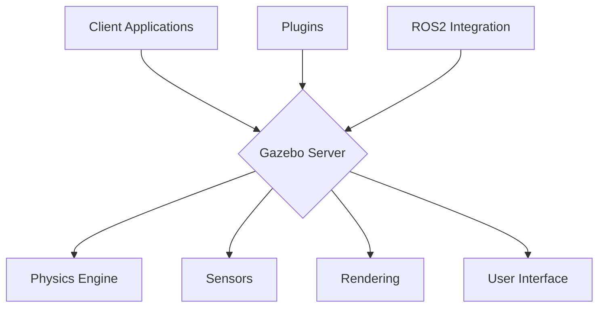

# Module 2: Gazebo Basics - Simulating Humanoid Robots

## Introduction to Gazebo for Humanoid Robotics

Gazebo is a powerful 3D simulation environment that plays a crucial role in humanoid robotics development. It allows researchers and engineers to test control algorithms, develop behaviors, and validate robot designs before deploying to physical hardware. For humanoid robots, Gazebo provides sophisticated physics simulation, sensor modeling, and realistic environment interaction.

### Why Gazebo for Humanoid Robotics?

1. **Safety**: Test complex behaviors without risking expensive hardware
2. **Cost-Effectiveness**: Simulate expensive sensors and environments
3. **Repeatability**: Consistent experimental conditions
4. **Speed**: Run simulations faster than real-time for rapid prototyping
5. **Risk-Free Testing**: Try dangerous or unstable control algorithms

## Gazebo Architecture and Components

### Core Components

Gazebo consists of several key components:



- **Server**: Core simulation engine handling physics, sensors, and rendering
- **Client**: Provides user interface and visualization
- **Physics Engine**: Handles collision detection and dynamics (ODE, Bullet, Simbody)
- **Sensors**: Simulates various sensor types (IMU, cameras, LiDAR, etc.)
- **Plugins**: Extend functionality for custom behaviors
- **ROS2 Interface**: Bridges simulation with ROS2 ecosystem

### Physics Engines

Gazebo supports multiple physics engines, each with different trade-offs:

| Engine | Strengths | Weaknesses | Best Use Case |
|--------|-----------|------------|---------------|
| ODE | Stable, mature | Can be slow for complex models | General simulation |
| Bullet | Fast, good for real-time | Less stable for complex contacts | Real-time applications |
| Simbody | Very accurate | Complex setup | High-fidelity simulation |

## Installing and Setting Up Gazebo

### Installation
```bash
# Install Gazebo Garden (or latest version)
sudo apt install ros-humble-gazebo-*

# Install Gazebo development libraries
sudo apt install libgazebo-dev

# Install ROS2 Gazebo packages
sudo apt install ros-humble-gazebo-ros-pkgs ros-humble-gazebo-ros-control
```

### Basic Gazebo Launch
```bash
# Launch Gazebo with default empty world
gazebo

# Launch with a specific world file
gazebo worlds/empty.world
```

## Basic Gazebo Usage for Humanoid Robots

### Starting Gazebo with Your Robot

Let's start by loading a simple humanoid model into Gazebo:

```xml
<!-- simple_humanoid.world -->
<?xml version="1.0" ?>
<sdf version="1.7">
  <world name="default">
    <include>
      <uri>model://ground_plane</uri>
    </include>
    
    <include>
      <uri>model://sun</uri>
    </include>
    
    <!-- Your humanoid robot -->
    <include>
      <name>simple_humanoid</name>
      <uri>model://simple_humanoid</uri>
    </include>
    
    <!-- Set initial pose -->
    <model name="simple_humanoid">
      <pose>0 0 1 0 0 0</pose>
    </model>
  </world>
</sdf>
```

### Command Line Options
```bash
# Launch with a specific world file
gazebo simple_humanoid.world

# Launch with GUI disabled (for faster simulation)
gzserver simple_humanoid.world

# Launch GUI only (connects to existing server)
gzclient

# Set real-time update rate (1000Hz)
gazebo --physics-update-rate=1000 simple_humanoid.world
```

## Configuring Gazebo for Humanoid Robotics

### Physics Configuration

For humanoid robots, physics configuration is critical for stable simulation:

```xml
<!-- physics_config.world -->
<?xml version="1.0" ?>
<sdf version="1.7">
  <world name="humanoid_world">
    <physics type="ode">
      <!-- Real-time update rate (Hz) -->
      <max_step_size>0.001</max_step_size>
      <!-- Time in seconds for real-time factor of 1.0 -->
      <real_time_update_rate>1000</real_time_update_rate>
      <!-- Error reduction parameter -->
      <ode>
        <solver>
          <type>quick</type>
          <iters>20</iters>
          <sor>1.0</sor>
        </solver>
        <!-- Constraint parameters -->
        <constraints>
          <cfm>0.000001</cfm>
          <erp>0.2</erp>
          <contact_max_correcting_vel>100.0</contact_max_correcting_vel>
          <contact_surface_layer>0.001</contact_surface_layer>
        </constraints>
      </ode>
    </physics>
    
    <!-- Rest of the world configuration -->
    <include>
      <uri>model://ground_plane</uri>
    </include>
    
    <include>
      <uri>model://sun</uri>
    </include>
  </world>
</sdf>
```

### Key Physics Parameters for Humanoid Robots

- `max_step_size`: Smaller steps provide more accurate simulation but require more computation
- `real_time_update_rate`: Higher rates provide better simulation fidelity
- `cfm` (Constraint Force Mixing): Affects constraint stability
- `erp` (Error Reduction Parameter): Controls how quickly constraint errors are corrected
- `contact_surface_layer`: Prevents objects from sinking into each other

## Controlling Robots in Gazebo

### Joint Control

For humanoid robots, precise joint control is essential:

```xml
<!-- Example: Adding ROS2 control interface to URDF -->
<ros2_control name="GazeboSystem" type="system">
  <hardware>
    <plugin>gazebo_ros2_control/GazeboSystem</plugin>
  </hardware>
  
  <joint name="left_hip_joint">
    <command_interface name="position">
      <param name="min">-1.57</param>
      <param name="max">1.57</param>
    </command_interface>
    <state_interface name="position"/>
    <state_interface name="velocity"/>
    <state_interface name="effort"/>
  </joint>
  
  <joint name="right_knee_joint">
    <command_interface name="position">
      <param name="min">-2.0</param>
      <param name="max">0.5</param>
    </command_interface>
    <state_interface name="position"/>
    <state_interface name="velocity"/>
    <state_interface name="effort"/>
  </joint>
  <!-- Add other joints as needed -->
</ros2_control>
```

### Gazebo Plugins for Humanoid Robots

Gazebo plugins extend the simulation with humanoid-specific capabilities:

```xml
<!-- Example: Gazebo plugins in URDF -->
<gazebo>
  <plugin name="gazebo_ros2_control" filename="libgazebo_ros2_control.so">
    <robot_namespace>/humanoid_robot</robot_namespace>
    <robot_param>robot_description</robot_param>
  </plugin>
</gazebo>

<!-- IMU sensor plugin -->
<gazebo reference="torso">
  <sensor name="imu_sensor" type="imu">
    <always_on>true</always_on>
    <update_rate>100</update_rate>
    <visualize>false</visualize>
    <imu>
      <angular_velocity>
        <x>
          <noise type="gaussian">
            <mean>0.0</mean>
            <stddev>2e-4</stddev>
          </noise>
        </x>
        <y>
          <noise type="gaussian">
            <mean>0.0</mean>
            <stddev>2e-4</stddev>
          </noise>
        </y>
        <z>
          <noise type="gaussian">
            <mean>0.0</mean>
            <stddev>2e-4</stddev>
          </noise>
        </z>
      </angular_velocity>
      <linear_acceleration>
        <x>
          <noise type="gaussian">
            <mean>0.0</mean>
            <stddev>1.7e-2</stddev>
          </noise>
        </x>
        <y>
          <noise type="gaussian">
            <mean>0.0</mean>
            <stddev>1.7e-2</stddev>
          </noise>
        </y>
        <z>
          <noise type="gaussian">
            <mean>0.0</mean>
            <stddev>1.7e-2</stddev>
          </noise>
        </z>
      </linear_acceleration>
    </imu>
  </sensor>
</gazebo>
```

## Humanoid-Specific Simulation Considerations

### Balance and Stability

Humanoid robots require special attention to balance and stability:

```xml
<!-- Stabilizing contact parameters for feet -->
<gazebo reference="left_foot">
  <collision>
    <surface>
      <friction>
        <ode>
          <mu>1.0</mu>
          <mu2>1.0</mu2>
          <fdir1>0 0 0</fdir1>
        </ode>
      </friction>
      <contact>
        <ode>
          <kp>1e6</kp>  <!-- Spring stiffness -->
          <kd>1e3</kd>  <!-- Damping coefficient -->
          <max_vel>100</max_vel>
          <min_depth>0.001</min_depth>
        </ode>
      </contact>
    </surface>
  </collision>
</gazebo>

<!-- Mass properties for stable simulation -->
<link name="torso">
  <inertial>
    <mass value="5.0"/>
    <origin xyz="0 0 0.15" rpy="0 0 0"/>
    <!-- Proper inertia values for stability -->
    <inertia ixx="0.1" ixy="0" ixz="0" 
             iyy="0.1" iyz="0" 
             izz="0.05"/>
  </inertial>
  
  <visual>
    <origin xyz="0 0 0.15" rpy="0 0 0"/>
    <geometry>
      <box size="0.2 0.15 0.3"/>
    </geometry>
    <material name="grey"/>
  </visual>
  
  <collision>
    <origin xyz="0 0 0.15" rpy="0 0 0"/>
    <geometry>
      <box size="0.2 0.15 0.3"/>
    </geometry>
  </collision>
</link>
```

### Sensor Configuration for Humanoids

Humanoid robots typically require multiple sensor types:

```xml
<!-- Camera for vision-based perception -->
<gazebo reference="head">
  <sensor name="head_camera" type="camera">
    <always_on>true</always_on>
    <visualize>true</visualize>
    <update_rate>30</update_rate>
    <camera>
      <horizontal_fov>1.047</horizontal_fov>
      <image>
        <width>640</width>
        <height>480</height>
        <format>R8G8B8</format>
      </image>
      <clip>
        <near>0.1</near>
        <far>10.0</far>
      </clip>
    </camera>
  </sensor>
</gazebo>

<!-- IMU for balance and orientation -->
<gazebo reference="torso">
  <sensor name="torso_imu" type="imu">
    <always_on>true</always_on>
    <update_rate>100</update_rate>
    <visualize>false</visualize>
  </sensor>
</gazebo>

<!-- Force/Torque sensors in feet for Zero Moment Point calculation -->
<gazebo reference="left_foot">
  <sensor name="left_foot_ft" type="force_torque">
    <always_on>true</always_on>
    <update_rate>500</update_rate>
  </sensor>
</gazebo>
```

## Simulation Environments for Humanoid Testing

### Creating Complex Environments

Humanoid robots need to be tested in various environments:

```xml
<!-- complex_room.world -->
<?xml version="1.0" ?>
<sdf version="1.7">
  <world name="complex_room">
    <physics type="ode">
      <max_step_size>0.001</max_step_size>
      <real_time_update_rate>1000</real_time_update_rate>
    </physics>
    
    <!-- Ground plane -->
    <include>
      <uri>model://ground_plane</uri>
    </include>
    
    <!-- Lighting -->
    <include>
      <uri>model://sun</uri>
    </include>
    
    <!-- Furniture for navigation challenges -->
    <model name="table">
      <pose>2 0 0 0 0 0</pose>
      <link name="table_top">
        <pose>0 0 0.8 0 0 0</pose>
        <collision name="collision">
          <geometry>
            <box>
              <size>1.0 0.8 0.05</size>
            </box>
          </geometry>
        </collision>
        <visual name="visual">
          <geometry>
            <box>
              <size>1.0 0.8 0.05</size>
            </box>
          </geometry>
          <material>
            <ambient>0.8 0.6 0.4 1.0</ambient>
            <diffuse>0.8 0.6 0.4 1.0</diffuse>
          </material>
        </visual>
      </link>
      <static>true</static>
    </model>
    
    <!-- Obstacle for walking challenges -->
    <model name="step">
      <pose>3 0 0 0 0 0</pose>
      <link name="step_link">
        <collision name="collision">
          <geometry>
            <box>
              <size>0.5 1.0 0.1</size>
            </box>
          </geometry>
        </collision>
        <visual name="visual">
          <geometry>
            <box>
              <size>0.5 1.0 0.1</size>
            </box>
          </geometry>
          <material>
            <ambient>0.5 0.5 0.5 1.0</ambient>
            <diffuse>0.5 0.5 0.5 1.0</diffuse>
          </material>
        </visual>
      </link>
      <static>true</static>
    </model>
  </world>
</sdf>
```

## Running Simulations with ROS2 Integration

### Launching Gazebo with ROS2

For humanoid robotics applications, integrating Gazebo with ROS2 is essential:

```python
# Launch file example: launch/humanoid_gazebo.launch.py
from launch import LaunchDescription
from launch.actions import IncludeLaunchDescription, ExecuteProcess
from launch.launch_description_sources import PythonLaunchDescriptionSource
from launch.substitutions import PathJoinSubstitution
from launch_ros.actions import Node
from launch_ros.substitutions import FindPackageShare

def generate_launch_description():
    return LaunchDescription([
        # Launch Gazebo with the humanoid world
        ExecuteProcess(
            cmd=['gazebo', 
                 PathJoinSubstitution([
                     FindPackageShare('humanoid_simulation'),
                     'worlds',
                     'humanoid_world.world'
                 ]), 
                 '-s', 'libgazebo_ros_factory.so',
                 '-s', 'libgazebo_ros_init.so'],
            output='screen'
        ),
        
        # Robot state publisher
        Node(
            package='robot_state_publisher',
            executable='robot_state_publisher',
            name='robot_state_publisher',
            output='screen',
            parameters=[
                {'use_sim_time': True},
                {'robot_description': 
                    PathJoinSubstitution([
                        FindPackageShare('humanoid_description'),
                        'urdf',
                        'humanoid.urdf.xacro'
                    ])
                }
            ]
        ),
        
        # Joint state publisher
        Node(
            package='joint_state_publisher',
            executable='joint_state_publisher',
            name='joint_state_publisher',
            output='screen',
            parameters=[{'use_sim_time': True}]
        )
    ])
```

### Running the Simulation

To run the complete simulation environment:

```bash
# Build your packages
cd ~/ros2_ws
colcon build
source install/setup.bash

# Launch Gazebo with your humanoid robot
ros2 launch humanoid_simulation humanoid_gazebo.launch.py
```

## Advanced Gazebo Features for Humanoids

### Multi-Robot Simulation

For testing interaction between multiple humanoid robots:

```xml
<!-- multi_humanoid.world -->
<?xml version="1.0" ?>
<sdf version="1.7">
  <world name="multi_humanoid">
    <include>
      <uri>model://ground_plane</uri>
    </include>
    <include>
      <uri>model://sun</uri>
    </include>
    
    <!-- First humanoid -->
    <include>
      <name>humanoid_01</name>
      <uri>model://simple_humanoid</uri>
      <pose>0 0 1 0 0 0</pose>
    </include>
    
    <!-- Second humanoid -->
    <include>
      <name>humanoid_02</name>
      <uri>model://simple_humanoid</uri>
      <pose>1 0 1 0 0 0</pose>
    </include>
    
    <!-- Third humanoid -->
    <include>
      <name>humanoid_03</name>
      <uri>model://simple_humanoid</uri>
      <pose>-1 0 1 0 0 0</pose>
    </include>
  </world>
</sdf>
```

### Custom Controllers with Plugins

For complex humanoid behaviors, custom Gazebo plugins can be developed:

```cpp
// Example: Simple walking controller plugin
#include <gazebo/gazebo.hh>
#include <gazebo/physics/physics.hh>
#include <gazebo/common/common.hh>
#include <ignition/math/Pose3.hh>

namespace gazebo
{
  class HumanoidWalkingPlugin : public ModelPlugin
  {
    public: void Load(physics::ModelPtr _model, sdf::ElementPtr _sdf)
    {
      this->model = _model;
      
      // Get joint handles
      this->leftHipJoint = _model->GetJoint("left_hip_joint");
      this->rightHipJoint = _model->GetJoint("right_hip_joint");
      
      // Listen to the update event
      this->updateConnection = event::Events::ConnectWorldUpdateBegin(
          std::bind(&HumanoidWalkingPlugin::OnUpdate, this));
    }

    public: void OnUpdate()
    {
      // Simple walking pattern
      static double angle = 0;
      angle += 0.01;
      
      // Apply sinusoidal motion to hip joints
      this->leftHipJoint->SetPosition(0, sin(angle) * 0.2);
      this->rightHipJoint->SetPosition(0, sin(angle + M_PI) * 0.2);
    }

    private: physics::ModelPtr model;
    private: physics::JointPtr leftHipJoint;
    private: physics::JointPtr rightHipJoint;
    private: event::ConnectionPtr updateConnection;
  };

  GZ_REGISTER_MODEL_PLUGIN(HumanoidWalkingPlugin)
}
```

## Performance Optimization for Humanoid Simulations

### Optimizing Physics Parameters

For humanoid robots, simulation performance is critical:

```xml
<!-- optimized_physics.world -->
<?xml version="1.0" ?>
<sdf version="1.7">
  <world name="optimized_world">
    <physics type="ode">
      <!-- Optimize for humanoid robot simulation -->
      <max_step_size>0.001</max_step_size>
      <real_time_update_rate>1000</real_time_update_rate>
      <ode>
        <solver>
          <type>quick</type>
          <iters>20</iters>  <!-- Balance accuracy/speed -->
          <sor>1.3</sor>     <!-- Over-relaxation parameter -->
        </solver>
        <constraints>
          <cfm>1e-5</cfm>        <!-- Constraint force mixing -->
          <erp>0.2</erp>         <!-- Error reduction parameter -->
          <contact_max_correcting_vel>100.0</contact_max_correcting_vel>
          <contact_surface_layer>0.001</contact_surface_layer>
        </constraints>
      </ode>
    </physics>
    
    <!-- Include optimized ground plane -->
    <include>
      <uri>model://ground_plane</uri>
    </include>
    
    <include>
      <uri>model://sun</uri>
    </include>
  </world>
</sdf>
```

### Efficient Collision Geometries

For better performance, use simplified collision geometries:

```xml
<!-- Efficient collision representation for humanoid -->
<link name="left_thigh">
  <inertial>
    <mass value="2.0"/>
    <origin xyz="0 0 -0.15" rpy="0 0 0"/>
    <inertia ixx="0.04" ixy="0" ixz="0" 
             iyy="0.04" iyz="0" 
             izz="0.01"/>
  </inertial>
  
  <visual>
    <origin xyz="0 0 -0.15" rpy="0 0 0"/>
    <geometry>
      <mesh filename="package://humanoid_description/meshes/complex_thigh.dae"/>
    </geometry>
    <material name="grey"/>
  </visual>
  
  <!-- Simplified collision geometry for performance -->
  <collision>
    <origin xyz="0 0 -0.15" rpy="0 0 0"/>
    <geometry>
      <!-- Instead of complex mesh, use simpler cylinder -->
      <cylinder>
        <radius>0.05</radius>
        <length>0.3</length>
      </cylinder>
    </geometry>
  </collision>
</link>
```

## Debugging and Visualization Tools

### Gazebo Built-in Tools

Gazebo provides several tools for debugging humanoid robot simulations:

```bash
# Check physics performance
gz stats

# Visualize contact forces
gz contact -m <model_name>

# Monitor joint states
ros2 topic echo /joint_states

# Visualize IMU data
ros2 run rviz2 rviz2
```

### Common Issues and Solutions

When simulating humanoid robots in Gazebo, several issues commonly arise:

1. **Model Instability**: Use proper mass distribution and damping parameters
2. **Joint Drift**: Ensure joint limits and efforts are properly configured
3. **Interpenetration**: Adjust contact parameters (kp, kd, min_depth)
4. **Simulation Slowdown**: Optimize physics parameters or reduce complexity

## Best Practices for Humanoid Robot Simulation

### 1. Gradual Complexity Increase

Start with simple models and gradually increase complexity:

```xml
<!-- Start with basic model -->
<link name="simple_torso">
  <inertial>
    <mass value="5.0"/>
    <inertia ixx="0.1" ixy="0" ixz="0" 
             iyy="0.1" iyz="0" 
             izz="0.1"/>
  </inertial>
  <visual>
    <geometry><box size="0.2 0.15 0.3"/></geometry>
  </visual>
  <collision>
    <geometry><box size="0.2 0.15 0.3"/></geometry>
  </collision>
</link>
```

### 2. Validation Against Real Robot

When possible, validate simulation parameters against real hardware:

- Joint limits
- Maximum velocities and efforts
- Sensor noise characteristics
- Physical dimensions and masses

### 3. Performance Monitoring

Monitor simulation performance:

```bash
# Check real-time factor
gz stats

# Log performance metrics
ros2 run robot_state_publisher robot_state_publisher --ros-args -p use_sim_time:=true -p publish_frequency:=100.0
```

## Next Steps

This chapter provided an introduction to Gazebo for humanoid robotics, covering basic concepts and setup. The next chapter will dive deeper into URDF-SDF integration, showing how to properly configure your humanoid robot model for simulation with detailed physical properties and sensor integration.

Use the personalization button to adjust content complexity based on your experience level, or use the translation button to read this in Urdu.