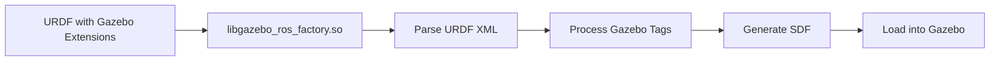

# URDF-SDF: Bridging Robot Description and Simulation

## Introduction to URDF and SDF

Unified Robot Description Format (URDF) and Simulation Description Format (SDF) are two essential XML-based formats in robotics. While URDF is primarily used for robot description in ROS, SDF is the native format for Gazebo simulation. Understanding how to bridge these formats is crucial for humanoid robotics simulation, as it allows you to take your robot model designed in URDF and successfully simulate it in Gazebo.

### URDF vs SDF Comparison

| Aspect | URDF | SDF |
|--------|------|-----|
| Primary Use | Robot description in ROS | Native Gazebo format |
| Scope | Robot kinematics and dynamics | Full simulation environment |
| Elements | Links, joints, materials | Worlds, models, physics |
| Integration | ROS ecosystem | Gazebo simulation |

## Understanding the URDF-SDF Bridge

### URDF Limitations in Simulation

URDF, while excellent for describing robot kinematics and dynamics, has limitations when it comes to simulation-specific features:

- No direct simulation physics parameters
- Limited sensor descriptions
- No plugin support
- Cannot describe simulation environments
- No multi-robot simulation support

### SDF Advantages for Simulation

SDF extends the capabilities needed for simulation:

- Physics engine configuration
- Sensor simulation
- Plugin integration
- Environment description (worlds)
- Multi-robot coordination

## Converting URDF to SDF for Simulation

### Using xacro for Complex URDF

First, let's examine the structure of a complex humanoid URDF using xacro macros:

```xml
<?xml version="1.0"?>
<robot xmlns:xacro="http://www.ros.org/wiki/xacro" name="humanoid_robot">
  
  <!-- Define properties -->
  <xacro:property name="M_PI" value="3.1415926535897931"/>
  <xacro:property name="torso_mass" value="5.0"/>
  <xacro:property name="limb_mass" value="2.0"/>
  
  <!-- Materials definition -->
  <material name="black">
    <color rgba="0.0 0.0 0.0 1.0"/>
  </material>
  <material name="grey">
    <color rgba="0.5 0.5 0.5 1.0"/>
  </material>
  
  <!-- Base link -->
  <link name="base_link">
    <inertial>
      <mass value="0.001"/>
      <origin xyz="0 0 0" rpy="0 0 0"/>
      <inertia ixx="0.0001" ixy="0" ixz="0" iyy="0.0001" iyz="0" izz="0.0001"/>
    </inertial>
  </link>

  <!-- Torso link -->
  <link name="torso">
    <inertial>
      <mass value="${torso_mass}"/>
      <origin xyz="0 0 0.15" rpy="0 0 0"/>
      <inertia ixx="0.1" ixy="0" ixz="0" iyy="0.1" iyz="0" izz="0.1"/>
    </inertial>
    
    <visual>
      <origin xyz="0 0 0.15" rpy="0 0 0"/>
      <geometry>
        <box size="0.2 0.15 0.3"/>
      </geometry>
      <material name="grey"/>
    </visual>
    
    <collision>
      <origin xyz="0 0 0.15" rpy="0 0 0"/>
      <geometry>
        <box size="0.2 0.15 0.3"/>
      </geometry>
    </collision>
  </link>

  <joint name="base_to_torso" type="fixed">
    <parent link="base_link"/>
    <child link="torso"/>
    <origin xyz="0 0 0" rpy="0 0 0"/>
  </joint>

  <!-- Macro for leg chains -->
  <xacro:macro name="leg_chain" params="side reflect">
    <link name="upper_${side}_leg">
      <inertial>
        <mass value="${limb_mass}"/>
        <origin xyz="0 0 -0.15" rpy="0 0 0"/>
        <inertia ixx="0.04" ixy="0" ixz="0" iyy="0.04" iyz="0" izz="0.01"/>
      </inertial>
      
      <visual>
        <origin xyz="0 0 -0.15" rpy="0 0 0"/>
        <geometry>
          <cylinder radius="0.05" length="0.3"/>
        </geometry>
        <material name="grey"/>
      </visual>
      
      <collision>
        <origin xyz="0 0 -0.15" rpy="0 0 0"/>
        <geometry>
          <cylinder radius="0.05" length="0.3"/>
        </geometry>
      </collision>
    </link>

    <joint name="${side}_hip_joint" type="revolute">
      <parent link="torso"/>
      <child link="upper_${side}_leg"/>
      <origin xyz="0 ${reflect * 0.075} -0.1" rpy="0 0 0"/>
      <axis xyz="1 0 0"/>
      <limit lower="-1.57" upper="1.57" effort="50" velocity="3.14"/>
      <dynamics damping="1.0" friction="0.2"/>
    </joint>
  </xacro:macro>

  <!-- Instantiate left and right legs -->
  <xacro:leg_chain side="left" reflect="1"/>
  <xacro:leg_chain side="right" reflect="-1"/>

  <!-- ROS2 control interface -->
  <ros2_control name="GazeboSystem" type="system">
    <hardware>
      <plugin>gazebo_ros2_control/GazeboSystem</plugin>
    </hardware>
    
    <joint name="left_hip_joint">
      <command_interface name="position"/>
      <state_interface name="position"/>
      <state_interface name="velocity"/>
      <state_interface name="effort"/>
    </joint>
    
    <joint name="right_hip_joint">
      <command_interface name="position"/>
      <state_interface name="position"/>
      <state_interface name="velocity"/>
      <state_interface name="effort"/>
    </joint>
  </ros2_control>

</robot>
```

### Gazebo-Specific Extensions in URDF

To simulate this robot in Gazebo, we need to add Gazebo-specific tags to the URDF:

```xml
<!-- Gazebo-specific extensions to the URDF -->
<gazebo>
  <plugin name="gazebo_ros2_control" filename="libgazebo_ros2_control.so">
    <parameters>$(find humanoid_description)/config/gazebo_controllers.yaml</parameters>
  </plugin>
</gazebo>

<!-- Link-specific Gazebo configurations -->
<gazebo reference="torso">
  <material>Gazebo/Grey</material>
  <mu1>0.2</mu1>
  <mu2>0.2</mu2>
  <self_collide>true</self_collide>
</gazebo>

<gazebo reference="upper_left_leg">
  <material>Gazebo/Grey</material>
  <mu1>0.2</mu1>
  <mu2>0.2</mu2>
</gazebo>

<!-- Sensor definitions -->
<gazebo reference="torso">
  <sensor name="imu_sensor" type="imu">
    <always_on>true</always_on>
    <update_rate>100</update_rate>
    <visualize>false</visualize>
    <imu>
      <angular_velocity>
        <x>
          <noise type="gaussian">
            <mean>0.0</mean>
            <stddev>2e-4</stddev>
          </noise>
        </x>
        <y>
          <noise type="gaussian">
            <mean>0.0</mean>
            <stddev>2e-4</stddev>
          </noise>
        </y>
        <z>
          <noise type="gaussian">
            <mean>0.0</mean>
            <stddev>2e-4</stddev>
          </noise>
        </z>
      </angular_velocity>
      <linear_acceleration>
        <x>
          <noise type="gaussian">
            <mean>0.0</mean>
            <stddev>1.7e-2</stddev>
          </noise>
        </x>
        <y>
          <noise type="gaussian">
            <mean>0.0</mean>
            <stddev>1.7e-2</stddev>
          </noise>
        </y>
        <z>
          <noise type="gaussian">
            <mean>0.0</mean>
            <stddev>1.7e-2</stddev>
          </noise>
        </z>
      </linear_acceleration>
    </imu>
  </sensor>
</gazebo>

<!-- Camera sensor -->
<gazebo reference="head">
  <sensor name="head_camera" type="camera">
    <always_on>true</always_on>
    <visualize>true</visualize>
    <update_rate>30</update_rate>
    <camera>
      <horizontal_fov>1.047</horizontal_fov>
      <image>
        <width>640</width>
        <height>480</height>
        <format>R8G8B8</format>
      </image>
      <clip>
        <near>0.1</near>
        <far>100</far>
      </clip>
    </camera>
    <plugin name="camera_controller" filename="libgazebo_ros_camera.so">
      <frame_name>head_camera_optical_frame</frame_name>
    </plugin>
  </sensor>
</gazebo>

<!-- Force/Torque sensor -->
<gazebo reference="left_foot">
  <sensor name="left_foot_ft_sensor" type="force_torque">
    <always_on>true</always_on>
    <update_rate>500</update_rate>
    <force_torque>
      <frame>child</frame>
      <measure_direction>child_to_parent</measure_direction>
    </force_torque>
  </sensor>
</gazebo>
```

## Auto-Conversion Process

When you load a URDF with Gazebo-specific extensions into Gazebo, the system automatically converts it to SDF. The conversion process:

1. Parses the URDF file
2. Processes Gazebo-specific tags
3. Generates an equivalent SDF representation
4. Loads the model into the simulation

### The Conversion Workflow



## Advanced SDF Concepts for Humanoid Simulation

### Complete SDF World File

For complex humanoid simulations, you may want to create a complete SDF world file that includes both your robot and the environment:

```xml
<?xml version="1.0" ?>
<sdf version="1.7">
  <world name="humanoid_world">
    <!-- Physics configuration -->
    <physics type="ode">
      <max_step_size>0.001</max_step_size>
      <real_time_update_rate>1000</real_time_update_rate>
      <ode>
        <solver>
          <type>quick</type>
          <iters>20</iters>
          <sor>1.3</sor>
        </solver>
        <constraints>
          <cfm>1e-5</cfm>
          <erp>0.2</erp>
          <contact_max_correcting_vel>100.0</contact_max_correcting_vel>
          <contact_surface_layer>0.001</contact_surface_layer>
        </constraints>
      </ode>
    </physics>

    <!-- Ground plane -->
    <include>
      <uri>model://ground_plane</uri>
    </include>

    <!-- Lighting -->
    <include>
      <uri>model://sun</uri>
    </include>

    <!-- Load the humanoid robot using URDF -->
    <include>
      <name>humanoid_robot</name>
      <pose>0 0 1 0 0 0</pose>
      <uri>model://humanoid_robot_model</uri>  <!-- This refers to your URDF -->
    </include>

    <!-- Additional models in the environment -->
    <include>
      <name>table</name>
      <pose>2 0 0 0 0 0</pose>
      <uri>model://table</uri>
    </include>

    <!-- Plugins for the entire world -->
    <plugin filename="libgazebo_ros_init.so" name="ros_init">
      <ros>
        <namespace>/humanoid_sim</namespace>
      </ros>
    </plugin>

    <!-- Physics statistics -->
    <plugin filename="libgazebo_ros_factory.so" name="factory">
      <ros>
        <namespace>/humanoid_sim</namespace>
      </ros>
    </plugin>
  </world>
</sdf>
```

### SDF Model File Structure

When creating a complete SDF model of your humanoid robot, it might look like this:

```xml
<?xml version="1.0" ?>
<sdf version="1.7">
  <model name="humanoid_robot">
    <!-- Static base link -->
    <link name="base_link">
      <inertial>
        <mass>0.001</mass>
        <inertia>
          <ixx>0.0001</ixx>
          <ixy>0</ixy>
          <ixz>0</ixz>
          <iyy>0.0001</iyy>
          <iyz>0</iyz>
          <izz>0.0001</izz>
        </inertia>
      </inertial>
    </link>

    <!-- Torso -->
    <link name="torso">
      <inertial>
        <mass>5.0</mass>
        <pose>0 0 0.15 0 0 0</pose>
        <inertia>
          <ixx>0.1</ixx>
          <ixy>0</ixy>
          <ixz>0</ixz>
          <iyy>0.1</iyy>
          <iyz>0</iyz>
          <izz>0.05</izz>
        </inertia>
      </inertial>
      
      <visual name="torso_visual">
        <pose>0 0 0.15 0 0 0</pose>
        <geometry>
          <box>
            <size>0.2 0.15 0.3</size>
          </box>
        </geometry>
        <material>
          <ambient>0.5 0.5 0.5 1</ambient>
          <diffuse>0.5 0.5 0.5 1</diffuse>
        </material>
      </visual>
      
      <collision name="torso_collision">
        <pose>0 0 0.15 0 0 0</pose>
        <geometry>
          <box>
            <size>0.2 0.15 0.3</size>
          </box>
        </geometry>
      </collision>
    </link>

    <joint name="base_to_torso" type="fixed">
      <parent>base_link</parent>
      <child>torso</child>
      <pose>0 0 0 0 0 0</pose>
    </joint>

    <!-- Hip joint -->
    <joint name="left_hip_joint" type="revolute">
      <parent>torso</parent>
      <child>upper_left_leg</child>
      <pose>0 0.075 -0.1 0 0 0</pose>
      <axis>
        <xyz>1 0 0</xyz>
        <limit>
          <lower>-1.57</lower>
          <upper>1.57</upper>
          <effort>50</effort>
          <velocity>3.14</velocity>
        </limit>
      </axis>
    </joint>

    <!-- Leg link -->
    <link name="upper_left_leg">
      <inertial>
        <mass>2.0</mass>
        <pose>0 0 -0.15 0 0 0</pose>
        <inertia>
          <ixx>0.04</ixx>
          <ixy>0</ixy>
          <ixz>0</ixz>
          <iyy>0.04</iyy>
          <iyz>0</iyz>
          <izz>0.01</izz>
        </inertia>
      </inertial>
      
      <visual name="upper_left_leg_visual">
        <pose>0 0 -0.15 0 0 0</pose>
        <geometry>
          <cylinder>
            <radius>0.05</radius>
            <length>0.3</length>
          </cylinder>
        </geometry>
        <material>
          <ambient>0.5 0.5 0.5 1</ambient>
          <diffuse>0.5 0.5 0.5 1</diffuse>
        </material>
      </visual>
      
      <collision name="upper_left_leg_collision">
        <pose>0 0 -0.15 0 0 0</pose>
        <geometry>
          <cylinder>
            <radius>0.05</radius>
            <length>0.3</length>
          </cylinder>
        </geometry>
      </collision>
    </link>

    <!-- ROS2 Control plugin -->
    <plugin name="gazebo_ros2_control" filename="libgazebo_ros2_control.so">
      <!-- Configuration would go here -->
    </plugin>

    <!-- IMU sensor -->
    <sensor name="imu_sensor" type="imu">
      <pose>0 0 0.2 0 0 0</pose>  <!-- Relative to torso -->
      <topic>imu/data</topic>
      <update_rate>100</update_rate>
      <imu>
        <!-- IMU specifications -->
      </imu>
    </sensor>
  </model>
</sdf>
```

## Simulation-Specific Considerations

### Humanoid Contact Modeling

For humanoid robots, proper contact modeling is essential for stable walking:

```xml
<!-- Proper contact parameters for feet -->
<gazebo reference="left_foot">
  <collision>
    <surface>
      <friction>
        <ode>
          <mu>1.0</mu>  <!-- High friction for stable walking -->
          <mu2>1.0</mu2>
        </ode>
      </friction>
      <contact>
        <ode>
          <kp>1000000.0</kp>  <!-- High spring constant -->
          <kd>100.0</kd>      <!-- Damping coefficient -->
          <max_vel>100.0</max_vel>
          <min_depth>0.001</min_depth>  <!-- Penetration depth before force is applied -->
        </ode>
      </contact>
    </surface>
  </collision>
  
  <!-- Add visual properties -->
  <material>Gazebo/Black</material>
</gazebo>
```

### Balance and Stability Parameters

To help with balance simulation:

```xml
<!-- Increase damping for stability -->
<gazebo reference="torso">
  <inertial>
    <!-- Higher mass for stability -->
    <mass>10.0</mass>
  </inertial>
  <dampingFactor>0.01</dampingFactor>
</gazebo>

<!-- Joint dynamics for realistic movement -->
<joint name="left_hip_joint" type="revolute">
  <!-- In URDF section -->
  <dynamics damping="10.0" friction="2.0"/>
</joint>
```

## Debugging URDF-SDF Conversion

### Checking the Conversion

You can check how your URDF is converted to SDF:

```bash
# Convert URDF to SDF and display
gz sdf -p /path/to/your/robot.urdf.xacro

# Or check with xacro preprocessing
ros2 run xacro xacro /path/to/your/robot.urdf.xacro > robot_processed.urdf
gz sdf -p robot_processed.urdf
```

### Common Conversion Issues

1. **Missing Gazebo Plugins**: Plugins not loaded properly
2. **Invalid Joint Types**: Gazebo doesn't support certain joint types
3. **Reference Frame Issues**: Links referenced in Gazebo tags don't exist
4. **Material Problems**: Materials not found or defined

## Advanced Simulation Features

### Using World Files with Custom Physics

For humanoid robots with specific physics requirements:

```xml
<!-- custom_humanoid_physics.world -->
<?xml version="1.0" ?>
<sdf version="1.7">
  <world name="humanoid_physics_world">
    <!-- Custom physics parameters for humanoid simulation -->
    <physics type="ode" name="humanoid_physics" default="0">
      <max_step_size>0.0005</max_step_size>  <!-- Smaller steps for stability -->
      <real_time_update_rate>2000</real_time_update_rate>
      <gravity>0 0 -9.8</gravity>
      <ode>
        <solver>
          <type>quick</type>
          <iters>50</iters>  <!-- More iterations for accuracy -->
          <sor>1.0</sor>
        </solver>
        <constraints>
          <cfm>1e-6</cfm>  <!-- Tighter constraints -->
          <erp>0.1</erp>
          <contact_max_correcting_vel>10</contact_max_correcting_vel>
          <contact_surface_layer>0.002</contact_surface_layer>
        </constraints>
      </ode>
    </physics>
    
    <!-- Environment -->
    <include>
      <uri>model://ground_plane</uri>
    </include>
    <include>
      <uri>model://sun</uri>
    </include>
    
    <!-- Humanoid robot -->
    <include>
      <name>humanoid_robot</name>
      <pose>0 0 1 0 0 0</pose>
      <uri>model://humanoid_model</uri>
    </include>
    
    <!-- Wind effects simulation -->
    <model name='wind_demo'>
      <link name='link'>
        <visual name='visual'>
          <geometry><box><size>0.1 0.1 0.1</size></box></geometry>
        </visual>
        <velocity_decay><linear>0</linear><angular>0</angular></velocity_decay>
        <self_collide>0</self_collide>
        <inertial>
          <mass>1</mass>
          <inertia><ixx>1</ixx><ixy>0</ixy><ixz>0</ixz><iyy>1</iyy><iyz>0</iyz><izz>1</izz></inertia>
        </inertial>
      </link>
      <pose>0 0 2 0 0 0</pose>
    </model>
  </world>
</sdf>
```

### Multi-Robot Scenarios

For simulating multiple humanoid robots:

```xml
<!-- multi_humanoid.world -->
<?xml version="1.0" ?>
<sdf version="1.7">
  <world name="multi_humanoid_world">
    <physics type="ode">
      <max_step_size>0.001</max_step_size>
      <real_time_update_rate>1000</real_time_update_rate>
    </physics>
    
    <include>
      <uri>model://ground_plane</uri>
    </include>
    <include>
      <uri>model://sun</uri>
    </include>
    
    <!-- Robot 1 -->
    <include>
      <name>humanoid_01</name>
      <pose>0 0 1 0 0 0</pose>
      <uri>model://humanoid_model</uri>
    </include>
    
    <!-- Robot 2 with different namespace -->
    <include>
      <name>humanoid_02</name>
      <pose>1 0 1 0 0 0</pose>
      <uri>model://humanoid_model</uri>
    </include>
    
    <!-- Robot 3 -->
    <include>
      <name>humanoid_03</name>
      <pose>-1 0 1 0 0 0</pose>
      <uri>model://humanoid_model</uri>
    </include>
  </world>
</sdf>
```

## Performance Optimization

### Optimizing for Real-Time Simulation

For humanoid robots that need to run in real-time:

```xml
<!-- Optimized URDF for real-time simulation -->
<gazebo reference="torso">
  <!-- Simplified collision geometry for performance -->
  <collision>
    <geometry>
      <box>
        <size>0.2 0.2 0.3</size>
      </box>
    </geometry>
  </collision>
</gazebo>

<!-- Reduce sensor update rates to improve performance -->
<gazebo reference="head_camera">
  <sensor name="head_camera" type="camera">
    <update_rate>30</update_rate>  <!-- Lower than maximum -->
  </sensor>
</gazebo>

<!-- Simplified IMU updates -->
<gazebo reference="imu_sensor">
  <sensor name="imu_sensor" type="imu">
    <update_rate>100</update_rate>
  </sensor>
</gazebo>
```

## Tools for Working with URDF-SDF

### Using Gazebo GUI for Visualization

```bash
# Launch Gazebo with GUI to visually inspect your robot
gazebo --verbose /path/to/your/world.file

# Then use the GUI to:
# - Inspect joint positions
# - View sensor data
# - Check collision properties
# - Visualize frames and transforms
```

### Checking Model Information

```bash
# List all models in Gazebo
gz model --list

# Get information about a specific model
gz model --info -m humanoid_robot

# Get joint information
gz topic -e -t /world/humanoid_world/model/humanoid_robot/joint_state
```

## Troubleshooting Common Issues

### Invalid SDF After Conversion

If your URDF doesn't convert properly to SDF:

1. Check that all link names in Gazebo tags exist in URDF
2. Verify that all joint names exist and are properly connected
3. Ensure all materials and meshes are properly referenced
4. Check for XML well-formedness

### Joint Control Issues

For issues with joint control in simulation:

```xml
<!-- Make sure joint limits are properly defined -->
<joint name="example_joint" type="revolute">
  <limit lower="-1.57" upper="1.57" effort="50" velocity="3.14"/>
  <dynamics damping="1.0" friction="0.2"/>
</joint>
```

## Best Practices

1. **Modularity**: Use xacro macros to create modular, reusable URDF components
2. **Validation**: Always validate your URDF with `check_urdf`
3. **Performance**: Use simplified collision geometries for better performance
4. **Realism**: Add appropriate sensor noise models for realistic simulation
5. **Documentation**: Document physics parameters and their rationale
6. **Testing**: Test with simple models first, then add complexity

## Next Steps

With a solid understanding of the URDF-SDF bridge, the next chapter will focus on sensor simulation for humanoid robots, covering how to properly simulate IMUs, cameras, force/torque sensors, and other sensors critical for humanoid robot operation.

Use the personalization button to adjust content complexity based on your experience level, or use the translation button to read this in Urdu.