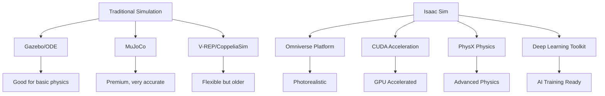

# Module 3: Isaac Sim Basics - Advanced Physics Simulation for Humanoid Robots

## Introduction to Isaac Sim

Isaac Sim is NVIDIA's advanced simulation environment designed specifically for robotics, autonomous vehicles, and AI development. Built on the Omniverse platform, Isaac Sim provides photorealistic rendering, accurate physics simulation, and seamless integration with NVIDIA's deep learning and AI tools. For humanoid robotics, Isaac Sim offers state-of-the-art physics simulation that can accurately model complex interactions between robots and their environment.

### Isaac Sim vs Traditional Simulation Environments

While traditional simulators like Gazebo provide solid physics simulation, Isaac Sim adds:

1. **Photorealistic rendering** using Physically-Based Rendering (PBR)
2. **Accurate material properties** with realistic light transport
3. **Advanced contact and friction models** for better humanoid interaction
4. **Deep learning integration** for perception and control training
5. **Synthetic data generation** capabilities
6. **Multi-GPU rendering** for complex scenes



## Installing and Setting Up Isaac Sim

### System Requirements

Before installing Isaac Sim, ensure your system meets these requirements:

- **OS**: Ubuntu 18.04/20.04/22.04 or Windows 10/11 
- **GPU**: NVIDIA RTX series with CUDA capability (recommended: RTX 3080 or higher)
- **RAM**: 32GB minimum, 64GB recommended
- **CPU**: Multi-core processor (Intel i7/Xeon or AMD Ryzen/Threadripper)
- **Storage**: 50GB+ available space
- **CUDA**: 11.8 or higher with compatible drivers

### Installation Process

1. **Download Isaac Sim** from NVIDIA Developer website
2. **Install Omniverse Launcher** to manage Isaac Sim
3. **Configure GPU drivers** and CUDA runtime
4. **Install additional extensions** needed for robotics

### Initial Configuration

After installation, configure Isaac Sim for humanoid robotics:

```python
# Example: Isaac Sim startup configuration
import omni
import carb
import omni.kit.app as app

# Set up environment variables for humanoid simulation
carb.settings.get_settings().set("/app/window/dpi_scaling", 1.0)
carb.settings.get_settings().set("/app/viewport/display_options/grid", True)
carb.settings.get_settings().set("/app/viewport/display_options/ghost_prims", False)

# Physics settings for humanoid simulation
carb.settings.get_settings().set("/physics/solverType", 0)  # TGS solver
carb.settings.get_settings().set("/physics/defaultMaterial/staticFriction", 0.7)
carb.settings.get_settings().set("/physics/defaultMaterial/dynamicFriction", 0.5)
carb.settings.get_settings().set("/physics/defaultMaterial/restitution", 0.1)
```

## Core Concepts in Isaac Sim

### Stages and Scenes

In Isaac Sim, everything exists within a "stage," which is composed of "scenes":

```python
# Example: Creating and manipulating stages
import omni.usd
from pxr import Usd, UsdGeom, Gf, Sdf

# Create a new stage
stage = omni.usd.get_context().get_stage()
if not stage:
    stage = Usd.Stage.CreateNew("humanoid_stage.usd")

# Create scene prim
scene_prim = stage.DefinePrim("/World", "Xform")
scene_prim.GetAttribute("xformOp:translate").Set(Gf.Vec3f(0, 0, 0))

# Set up physics scene
physics_scene = UsdPhysics.Scene.Define(stage, Sdf.Path("/World/physicsScene"))
physics_scene.CreateGravityDirectionAttr().Set(Gf.Vec3f(0.0, 0.0, -1.0))
physics_scene.CreateGravityMagnitudeAttr().Set(9.81)

stage.Save()
```

### Physics Simulation

Isaac Sim uses NVIDIA's PhysX engine, which provides highly accurate physics simulation:

```python
# Example: Physics setup for humanoid robot
import omni.physics.core as physics_core
from omni.physx.scripts import physicsUtils
import omni.kit.commands

def setup_humanoid_physics(stage, robot_path):
    """
    Setup physics properties for a humanoid robot
    """
    # Create rigid bodies for each link
    robot_prim = stage.GetPrimAtPath(robot_path)
    
    # Configure root body (torso)
    torso_path = robot_path + "/torso"
    torso_prim = stage.GetPrimAtPath(torso_path)
    
    # Set up rigid body properties
    physicsUtils.add_rigid_body(torso_prim, "torso_collision", density=200.0)
    
    # Configure mass and center of mass
    mass_api = UsdPhysics.MassAPI.Apply(torso_prim, "physxMass")
    mass_api.CreateMassAttr().Set(6.0)  # 6kg for torso
    mass_api.CreateCenterOfMassAttr().Set(Gf.Vec3f(0.0, 0.0, 0.15))
    
    # Set up joints with realistic constraints
    setup_joint_constraints(stage, robot_path)

def setup_joint_constraints(stage, robot_path):
    """
    Configure joints for humanoid robot with realistic limits
    """
    # Hip joint setup
    hip_joint_path = robot_path + "/left_leg_hip_joint"
    hip_joint_prim = stage.GetPrimAtPath(hip_joint_path)
    
    if hip_joint_prim:
        # Apply spherical joint for 3DOF hip motion
        joint_api = PhysxSchema.JointAPI.Apply(hip_joint_prim)
        joint_api.GetLocalPos0Attr().Set(Gf.Vec3f(0.0, 0.08, -0.08))  # Position relative to parent
        joint_api.GetLocalPos1Attr().Set(Gf.Vec3f(0.0, 0.0, -0.08))   # Position relative to child
        
        # Setup angular limits for realistic hip motion
        limit_attr = joint_api.CreateAngularLimitAttr()
        # Allow specific ranges for each axis
        limit_attr.GetLimitXLowerAttr().Set(-0.5)  # -30 degrees
        limit_attr.GetLimitXUpperAttr().Set(1.0)   # +60 degrees
        limit_attr.GetLimitYLowerAttr().Set(-0.3)  # -15 degrees
        limit_attr.GetLimitYUpperAttr().Set(0.3)   # +15 degrees
        limit_attr.GetLimitZLowerAttr().Set(-0.3)  # -15 degrees
        limit_attr.GetLimitZUpperAttr().Set(0.3)   # +15 degrees
```

### USD (Universal Scene Description)

USD is the core data format for Isaac Sim, allowing complex scene graphs to be defined and manipulated:

```python
# Example: USD prim manipulation for humanoid robot
from pxr import Usd, UsdGeom, UsdPhysics, PhysxSchema, Gf, Sdf

def create_humanoid_robot_usd(stage, robot_name="humanoid_robot"):
    """
    Create a humanoid robot using USD prims
    """
    robot_path = Sdf.Path(f"/World/{robot_name}")
    robot_prim = stage.DefinePrim(robot_path, "Xform")
    
    # Create torso
    torso_path = robot_path.AppendChild("torso")
    torso_prim = stage.DefinePrim(torso_path, "Capsule")
    torso_geom = UsdGeom.Capsule(torso_prim)
    torso_geom.CreateRadiusAttr(0.12)
    torso_geom.CreateHeightAttr(0.3)
    torso_geom.CreateAxisAttr("Z")
    
    # Position torso
    xformable = UsdGeom.Xformable(torso_prim)
    xformable.AddTranslateOp().Set(Gf.Vec3f(0, 0, 0.5))
    
    # Create head
    head_path = robot_path.AppendChild("head")
    head_prim = stage.DefinePrim(head_path, "Sphere")
    head_geom = UsdGeom.Sphere(head_prim)
    head_geom.CreateRadiusAttr(0.08)
    
    # Position head relative to torso
    head_xform = UsdGeom.Xformable(head_prim)
    head_xform.AddTranslateOp().Set(Gf.Vec3f(0, 0, 0.38))  # 38cm above torso center
    
    # Create limbs with appropriate geometry
    create_limbs_usd(stage, robot_path)
    
    return robot_prim

def create_limbs_usd(stage, robot_path):
    """
    Create limb geometry for the humanoid robot
    """
    # Create left leg
    create_leg_usd(stage, robot_path, "left", True)
    create_leg_usd(stage, robot_path, "right", False)
    
    # Create arms
    create_arm_usd(stage, robot_path, "left", True)
    create_arm_usd(stage, robot_path, "right", False)

def create_leg_usd(stage, robot_path, side, is_left):
    """
    Create leg geometry for humanoid (hip -> knee -> ankle -> foot)
    """
    reflect = 1 if is_left else -1
    leg_root = robot_path.AppendChild(f"{side}_leg")
    
    # Hip joint
    hip_path = leg_root.AppendChild("hip")
    hip_prim = stage.DefinePrim(hip_path, "Cylinder")
    hip_geom = UsdGeom.Cylinder(hip_prim)
    hip_geom.CreateRadiusAttr(0.05)
    hip_geom.CreateHeightAttr(0.08)
    hip_xform = UsdGeom.Xformable(hip_prim)
    hip_xform.AddTranslateOp().Set(Gf.Vec3f(0, reflect * 0.08, -0.08))
    
    # Thigh
    thigh_path = leg_root.AppendChild("thigh")
    thigh_prim = stage.DefinePrim(thigh_path, "Capsule")
    thigh_geom = UsdGeom.Capsule(thigh_prim)
    thigh_geom.CreateRadiusAttr(0.05)
    thigh_geom.CreateHeightAttr(0.3)
    thigh_xform = UsdGeom.Xformable(thigh_prim)
    thigh_xform.AddTranslateOp().Set(Gf.Vec3f(0, 0, -0.25))
    
    # Shin
    shin_path = leg_root.AppendChild("shin")
    shin_prim = stage.DefinePrim(shin_path, "Capsule")
    shin_geom = UsdGeom.Capsule(shin_prim)
    shin_geom.CreateRadiusAttr(0.05)
    shin_geom.CreateHeightAttr(0.3)
    shin_xform = UsdGeom.Xformable(shin_prim)
    shin_xform.AddTranslateOp().Set(Gf.Vec3f(0, 0, -0.25))
    
    # Foot
    foot_path = leg_root.AppendChild("foot")
    foot_prim = stage.DefinePrim(foot_path, "Box")
    foot_geom = UsdGeom.Box(foot_prim)
    foot_geom.CreateSizeAttr(0.16, 0.08, 0.04)
    foot_xform = UsdGeom.Xformable(foot_prim)
    foot_xform.AddTranslateOp().Set(Gf.Vec3f(0.05, 0, -0.12))
```

## Advanced Physics Concepts for Humanoids

### Contact and Friction Modeling

Humanoid robots require accurate contact modeling to simulate realistic interactions:

```python
# Example: Advanced contact and friction setup
def setup_advanced_contact_properties(stage):
    """
    Configure advanced contact and friction properties for humanoid simulation
    """
    # Create custom material for robot
    material_path = Sdf.Path("/World/Materials/HumanoidMaterial")
    material = UsdShade.Material.Define(stage, material_path)
    
    # Create surface shader
    shader_path = material_path.AppendChild("Shader")
    shader = UsdShade.Shader.Define(stage, shader_path)
    shader.CreateIdAttr("OmniPBR")
    
    # Set realistic material properties
    shader.CreateInput("diffuse_tint", Sdf.ValueTypeNames.Color3f).Set((0.6, 0.6, 0.6))
    shader.CreateInput("metallic", Sdf.ValueTypeNames.Float).Set(0.3)
    shader.CreateInput("roughness", Sdf.ValueTypeNames.Float).Set(0.7)
    shader.CreateInput("specular_reflection", Sdf.ValueTypeNames.Float).Set(0.5)
    
    # Bind material to prim
    material.GetOutput("out").ConnectToSource(shader, "out")
    
    # Configure PhysX material for contacts
    physx_material_path = Sdf.Path("/World/PhysicsMaterials/HumanoidContactMaterial")
    physx_material = PhysxSchema.PhysxMaterial.Define(stage, physx_material_path)
    
    physx_material.CreateStaticFrictionAttr().Set(0.7)    # High static friction
    physx_material.CreateDynamicFrictionAttr().Set(0.5)   # Lower dynamic friction
    physx_material.CreateRestitutionAttr().Set(0.1)       # Low bounce

def apply_material_to_robot_links(stage, robot_path):
    """
    Apply contact materials to all robot links for realistic physics interactions
    """
    # List of robot links to apply materials to
    robot_links = [
        f"{robot_path}/torso",
        f"{robot_path}/head",
        f"{robot_path}/left_leg/thigh",
        f"{robot_path}/left_leg/shin",
        f"{robot_path}/left_leg/foot",
        f"{robot_path}/right_leg/thigh",
        f"{robot_path}/right_leg/shin",
        f"{robot_path}/right_leg/foot",
        # Add arms as needed
    ]
    
    for link_path in robot_links:
        link_prim = stage.GetPrimAtPath(link_path)
        if link_prim.IsValid():
            # Bind the contact material
            PhysxSchema.PhysxCollisionAPI.Apply(link_prim)
            collision_api = PhysxSchema.PhysxCollisionAPI.Get(stage, link_path)
            collision_api.CreateContactOffsetAttr(0.02)  # 2cm contact offset
            collision_api.CreateRestOffsetAttr(0.0)      # No rest offset for tight contacts
```

### Soft Body and Deformable Objects

For advanced humanoid simulation, soft body physics may be required:

```python
# Example: Soft body configuration (when needed for soft tissue simulation)
def setup_soft_body_physics(stage, soft_body_path):
    """
    Setup soft body physics for deformable parts (e.g., soft tissue simulation)
    """
    soft_body_prim = stage.GetPrimAtPath(soft_body_path)
    
    # Apply soft body API
    try:
        soft_body_api = PhysxSchema.PhysxSoftBodyAPI.Apply(soft_body_prim)
        
        # Configure soft body properties
        soft_body_api.CreateMassDensityAttr(100.0)  # Density for soft tissue
        soft_body_api.CreateVertexVelocityScaleAttr(0.9)  # Velocity damping
        soft_body_api.CreateDampingCoefficientAttr(0.5)   # Internal damping
        soft_body_api.CreateDragCoefficientAttr(0.1)      # Air resistance
        soft_body_api.CreateLiftCoefficientAttr(0.05)     # Lift forces
        
        # Configure collision properties
        collision_api = PhysxSchema.PhysxCollisionAPI.Get(stage, soft_body_path)
        collision_api.CreateContactOffsetAttr(0.05)  # Larger contact offset for soft bodies
        collision_api.CreateRestOffsetAttr(-0.01)    # Negative rest offset for softer contacts
    except Exception as e:
        print(f"Soft body physics not available: {e}. Using rigid body approximation.")
```

## Sensor Simulation in Isaac Sim

### Camera and Vision Sensors

Isaac Sim provides high-quality camera simulation for robotics perception:

```python
# Example: Camera setup for humanoid robot
from omni.isaac.sensor import Camera

def setup_head_camera(robot_stage, camera_path="/World/humanoid_robot/head_camera", resolution=(640, 480)):
    """
    Setup a camera in the head of the humanoid robot
    """
    # Create camera prim
    camera_prim = UsdGeom.Camera.Define(robot_stage, Sdf.Path(camera_path))
    
    # Configure camera properties
    cam = camera_prim.GetCamera()
    cam.focalLength = 24.0  # 24mm focal length
    cam.horizontalAperture = 20.955  # 35mm equivalent
    cam.verticalAperture = 15.2907  # 35mm equivalent
    cam.focusDistance = 10.0
    cam.fStop = 16.0
    
    # Position camera in head
    cam_xform = UsdGeom.Xformable(camera_prim)
    cam_xform.AddTranslateOp().Set(Gf.Vec3f(0.0, 0.0, 0.45))  # In head
    cam_xform.AddRotateXYZOp().Set(Gf.Vec3f(0.0, 0.0, 0.0))  # Facing forward
    
    # Create Isaac Sim camera interface
    camera = Camera(
        prim_path=camera_path,
        frequency=30,  # 30 Hz
        resolution=resolution
    )
    
    return camera

def setup_perception_pipeline(camera):
    """
    Setup perception pipeline for the camera
    """
    # Enable rgb output
    camera.get_rgb()
    
    # Enable depth output
    camera.get_depth()
    
    # Enable segmentation output
    camera.get_semantic_segmentation()
    
    # Enable instance segmentation
    camera.get_instance_segmentation()
```

### Force/Torque Sensors

For humanoid balance and interaction, accurate force/torque sensing is critical:

```python
# Example: Force/Torque sensor simulation
def setup_force_torque_sensors(robot_stage, robot_path):
    """
    Setup force/torque sensors in robot feet for balance control
    """
    # In Isaac Sim, force/torque sensors are simulated through contact reporting
    # We attach contact sensors to feet links
    
    foot_paths = [
        f"{robot_path}/left_leg/foot",
        f"{robot_path}/right_leg/foot"
    ]
    
    for foot_path in foot_paths:
        foot_prim = robot_stage.GetPrimAtPath(foot_path)
        if foot_prim:
            # Enable contact reporting for the foot
            contact_report_api = PhysxSchema.PhysxContactReportAPI.Apply(foot_prim)
            contact_report_api.CreateContactReportThresholdAttr(0.1)  # 0.1N threshold
            
            # Set up collision properties for accurate force sensing
            collision_api = PhysxSchema.PhysxCollisionAPI.Get(robot_stage, foot_path)
            collision_api.CreateContactOffsetAttr(0.01)
```

## Robotics Extensions and Tools

### Isaac Sim Robotics Extension

The Isaac Sim Robotics Extension provides utilities for robot simulation:

```python
# Example: Using Isaac Sim robotics utilities
from omni.isaac.core import World
from omni.isaac.core.utils.stage import add_reference_to_stage
from omni.isaac.core.utils.nucleus import get_assets_root_path
from omni.isaac.core.robots import Robot
from omni.isaac.core.articulations import ArticulationView

class HumanoidRobotSim:
    def __init__(self, world: World, robot_path: str, usd_path: str = None):
        """
        Initialize humanoid robot in simulation
        """
        self.world = world
        self.robot_path = robot_path
        
        # Add robot to stage
        if usd_path:
            add_reference_to_stage(usd_path=usd_path, prim_path=robot_path)
        else:
            self._create_basic_robot()
        
        # Create articulation view
        self.humanoid = self.world.scene.add(
            ArticulationView(prim_path=robot_path, name="humanoid_view")
        )
        
        # Initialize state
        self.initial_positions = None
        self.joint_names = []
        
    def initialize(self):
        """
        Initialize robot configuration
        """
        # Get joint information
        self.joint_names = self.humanoid.dof_names
        self.initial_positions = self.humanoid.get_joint_positions()
        
        # Set initial configuration
        self.reset_to_initial_position()
        
    def reset_to_initial_position(self):
        """
        Reset robot to initial configuration
        """
        if self.initial_positions is not None:
            self.humanoid.set_joint_positions(self.initial_positions)
            
    def get_observations(self):
        """
        Get sensor observations from the robot
        """
        # Get joint states
        joint_positions = self.humanoid.get_joint_positions()
        joint_velocities = self.humanoid.get_joint_velocities()
        
        # Get base information
        root_positions, root_orientations = self.humanoid.get_world_poses()
        root_linear_velocities = self.humanoid.get_linear_velocities()
        root_angular_velocities = self.humanoid.get_angular_velocities()
        
        observations = {
            'joint_positions': joint_positions,
            'joint_velocities': joint_velocities,
            'root_positions': root_positions,
            'root_orientations': root_orientations,
            'root_linear_velocities': root_linear_velocities,
            'root_angular_velocities': root_angular_velocities
        }
        
        return observations
    
    def apply_actions(self, joint_commands):
        """
        Apply actions to the robot joints
        """
        # Set joint commands (positions, velocities, or efforts depending on control mode)
        dof_pos_targets = []
        dof_vel_targets = []
        dof_eff_targets = []
        
        for i, cmd in enumerate(joint_commands):
            # Command interpretation depends on control mode
            # For position control:
            dof_pos_targets.append(cmd)
        
        self.humanoid.set_joint_position_targets(dof_pos_targets)

def create_humanoid_simulation():
    """
    Create and run a complete humanoid simulation environment
    """
    # Create the world
    world = World(stage_units_in_meters=1.0)
    
    # Set up physics parameters
    world.scene.enable_gravity(True)
    gravity = world.scene.get_gravity()
    print(f"Gravity set to: {gravity}")
    
    # Create robot
    robot_path = "/World/HumanoidRobot"
    humanoid_robot = HumanoidRobotSim(world, robot_path)
    
    # Add ground plane
    world.scene.add_ground_plane(static_friction=0.7, dynamic_friction=0.5, restitution=0.1)
    
    # Initialize
    world.reset()
    humanoid_robot.initialize()
    
    # Simulation loop
    while simulation_app.is_running():
        # Get observations
        obs = humanoid_robot.get_observations()
        
        # Simple control logic (stand still)
        joint_pos = obs['joint_positions']
        actions = joint_pos  # Simple PD control would go here
        
        # Apply actions
        humanoid_robot.apply_actions(actions)
        
        # Step simulation
        world.step(render=True)
        
        # Check termination conditions
        if world.current_time_step_index % 500 == 0:
            print(f"Simulation step: {world.current_time_step_index}")
        
    world.clear()
```

## Performance Optimization for Humanoid Simulations

### Level of Detail (LOD) Management

For complex humanoid robots, LOD management is essential:

```python
# Example: LOD setup for humanoid robot
def setup_lod_hierarchy(stage, robot_path):
    """
    Create LOD hierarchy for robot model to optimize rendering performance
    """
    # High-detail version (full geometry)
    high_detail_path = Sdf.Path(f"{robot_path}_High")
    
    # Medium-detail version (simplified geometry)
    medium_detail_path = Sdf.Path(f"{robot_path}_Medium")
    
    # Low-detail version (bounding boxes only)
    low_detail_path = Sdf.Path(f"{robot_path}_Low")
    
    # Create LOD switching mechanism
    for link_name in ["torso", "head", "left_arm", "right_arm", "left_leg", "right_leg"]:
        lod_path = Sdf.Path(f"{robot_path}/{link_name}_LOD")
        lod_prim = UsdGeom.LOD.Define(stage, lod_path)
        
        # Set distances for LOD switching
        lod_distances = [0, 10, 20]  # Switch at 0m, 10m, 20m distance
        lod_prim.CreateLODsAttr(lod_distances)
        
        # Associate the different detail levels with different geometry
        # This requires creating separate geometry prims for each detail level
```

### GPU-Accelerated Physics

Take advantage of GPU acceleration for physics simulation:

```python
# Example: GPU physics configuration
def configure_gpu_physics():
    """
    Configure GPU-accelerated physics for optimal humanoid simulation
    """
    import carb
    
    settings = carb.settings.get_settings()
    
    # Enable GPU physics
    settings.set("/physics/cudaDevice", 0)  # Use first GPU
    settings.set("/physics/solverType", 1)  # TGS solver with CUDA
    settings.set("/physics/suppressSPDAfterNIterations", 20)  # Iteration limit
    
    # Configure simulation parameters
    settings.set("/physics/timeStepsPerSecond", 600)  # 600Hz for stable humanoid simulation
    settings.set("/physics/maxSubSteps", 4)  # Allow multiple substeps for stability
    settings.set("/physics/bounceThreshold", 2.0)  # Threshold for bounce
```

## Visualization and Debugging

### Physics Visualization

Enable physics visualization for debugging humanoid behavior:

```python
# Example: Physics visualization for debugging
def enable_physics_debug_visualization():
    """
    Enable physics debug visualization
    """
    import carb
    
    settings = carb.settings.get_settings()
    
    # Enable physics debug drawing
    settings.set("/physics/debugDraw", True)
    settings.set("/physics/debugDrawColliders", True)
    settings.set("/physics/debugDrawJoints", True)
    settings.set("/physics/debugDrawInWorldSpace", True)
    
    # Enable contact point visualization
    settings.set("/physics/debugDrawContacts", True)
    
    # Enable center of mass visualization
    settings.set("/physics/debugDrawCOM", True)

def visualize_robot_state(robot_view):
    """
    Visualize robot state during simulation
    """
    # Get current robot state
    positions = robot_view.get_joint_positions()
    velocities = robot_view.get_joint_velocities()
    
    # Visualize joint torques and forces
    applied_torques = robot_view.get_applied_joint_efforts()
    
    # Plot or log state information
    print(f"Joint positions: {positions[:5]}...")  # Show first 5 joints
    print(f"Joint velocities: {velocities[:5]}...")  # Show first 5 joints
    print(f"Applied torques: {applied_torques[:5]}...")  # Show first 5 joints
```

## Best Practices for Humanoid Simulation

### 1. Realistic Physics Parameters

Ensure your humanoid robot uses realistic physics parameters:

```python
# Example: Physics parameter validation
def validate_physics_parameters(robot_stage, robot_path):
    """
    Validate that robot physics parameters are realistic
    """
    issues = []
    
    # Check mass distribution
    torso_prim = robot_stage.GetPrimAtPath(f"{robot_path}/torso")
    if torso_prim:
        mass_api = UsdPhysics.MassAPI.Get(robot_stage, f"{robot_path}/torso")
        mass = mass_api.GetMassAttr().Get()
        if mass < 2.0 or mass > 20.0:
            issues.append(f"Torso mass ({mass}kg) seems unrealistic for humanoid")
    
    # Check friction values
    foot_prims = [
        robot_stage.GetPrimAtPath(f"{robot_path}/left_leg/foot"),
        robot_stage.GetPrimAtPath(f"{robot_path}/right_leg/foot")
    ]
    
    for foot_prim in foot_prims:
        if foot_prim:
            # Check friction properties
            pass  # Add friction validation logic
    
    return issues
```

### 2. Simulation Stability

Maintain simulation stability with appropriate parameters:

```python
# Example: Stability considerations
def setup_stable_simulation_parameters():
    """
    Configure simulation parameters for stable humanoid behavior
    """
    import carb
    
    settings = carb.settings.get_settings()
    
    # Time step (smaller for more stability)
    settings.set("/physics/timeStepsPerSecond", 1000)  # 1000Hz = 1ms timestep
    
    # Solver iterations (more for stability)
    settings.set("/physics/solverPositionIterationCount", 20)
    settings.set("/physics/solverVelocityIterationCount", 20)
    
    # Contact stabilization
    settings.set("/physics/contactRestitutionThreshold", 1.0)
    settings.set("/physics/contactCorrelationDistance", 0.025)
```

## Integration with ROS2 Ecosystem

### ROS2 Bridge for Isaac Sim

Connect Isaac Sim to ROS2 for full robotics stack integration:

```python
# Example: ROS2 integration (conceptual)
def setup_ros2_bridge():
    """
    Setup ROS2 bridge for communication between Isaac Sim and ROS2 nodes
    """
    # This requires the Isaac ROS Bridge Extension
    # Install: Isaac ROS Bridge Extension in Isaac Sim
    # Use ROS2 topics for sensor data and actuator commands
    pass

def bridge_sensor_data(isaac_sim_robot, ros2_publisher):
    """
    Bridge sensor data from Isaac Sim to ROS2
    """
    # Get sensor data from Isaac Sim
    # Publish to ROS2 topics
    pass
```

## Troubleshooting Common Issues

### 1. Simulation Instability

Common causes and solutions for humanoid simulation instability:

- **Low mass ratios**: Ensure adjacent links have reasonable mass ratios
- **Small collision margins**: Use appropriate contact offsets
- **High joint limits**: Set realistic joint limits based on human anatomy
- **Inadequate solver iterations**: Increase position/velocity iterations

### 2. Performance Issues

For performance problems:

- **Complex geometries**: Simplify collision geometry
- **Large timesteps**: Reduce for more stable physics
- **Insufficient GPU**: Ensure proper GPU configuration
- **Memory limits**: Monitor and optimize asset loading

## Next Steps

With a solid understanding of Isaac Sim basics, the next chapter will focus on Isaac ROS integration, where you'll learn how to connect Isaac Sim with ROS2 for a complete humanoid robotics pipeline.

Use the personalization button to adjust content complexity based on your experience level, or use the translation button to read this in Urdu.