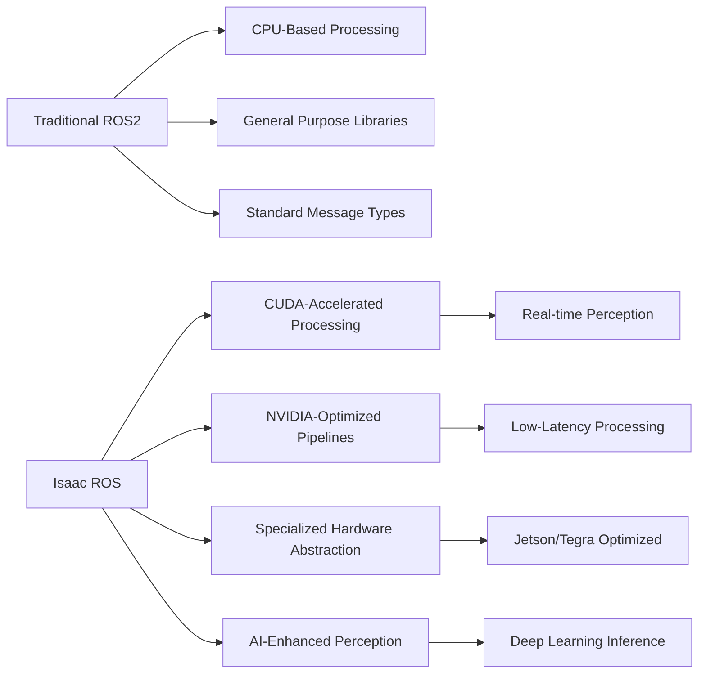

# Isaac ROS: Bridging Simulation and Real-World Robotics

## Introduction to Isaac ROS

Isaac ROS is NVIDIA's comprehensive platform for connecting robotics systems with ROS2, providing optimized hardware acceleration for perception, navigation, and manipulation tasks. For humanoid robots, Isaac ROS bridges the gap between simulation in Isaac Sim and real-world deployment by providing optimized perception pipelines, hardware-accelerated processing, and standardized interfaces.

### Isaac ROS vs Traditional ROS2

Isaac ROS enhances traditional ROS2 with:

1. **Hardware Acceleration**: GPU-accelerated perception algorithms
2. **Optimized Pipelines**: NVIDIA-optimized processing pipelines
3. **Real-time Performance**: Deterministic execution with lower latency
4. **Deep Learning Integration**: Native support for CUDA-accelerated inference
5. **Standardized Hardware Abstraction**: Consistent interfaces for NVIDIA hardware
6. **Industrial-Grade Reliability**: Production-focused design



## Installing and Configuring Isaac ROS

### Prerequisites

Before installing Isaac ROS, ensure your system has:

- **Hardware**: NVIDIA Jetson (AGX Xavier, Orin) or discrete GPU (RTX series)
- **OS**: Ubuntu 20.04/22.04 with ROS2 Humble
- **CUDA**: 11.8 or later with matching cuDNN
- **GPU Drivers**: Latest NVIDIA drivers installed
- **Isaac Sim**: Installed and configured

### Installation Process

```bash
# Install Isaac ROS packages
sudo apt update
sudo apt install ros-humble-isaac-ros-dev

# Install specific Isaac ROS packages relevant to humanoid robotics
sudo apt install \
  ros-humble-isaac-ros-camera \
  ros-humble-isaac-ros-image-ros-bit \
  ros-humble-isaac-ros-pointcloud-utils \
  ros-humble-isaac-ros-messages \
  ros-humble-isaac-ros-apriltag \
  ros-humble-isaac-ros-realsense \
  ros-humble-isaac-ros-rosbridge \
  ros-humble-isaac-ros-visual- slam \
  ros-humble-isaac-ros-occupancy-grid-localizer \
  ros-humble-isaac-ros-segmentation-pytorch

# Install Isaac ROS dependencies
sudo apt install libgl1-mesa-glx libglib2.0-0 libsm6 libxext6 libxrender-dev libgomp1
```

### Verification and Setup

```bash
# Verify installation
ros2 pkg list | grep isaac

# Check GPU availability
nvidia-smi

# Verify Isaac ROS nodes
ros2 node list --include-hidden-nodes | grep isaac
```

## Isaac ROS Architecture

### Core Components

Isaac ROS is built around several core components:

1. **Heterogeneous Computing Framework**: Distributes computation across CPUs, GPUs, and other accelerators
2. **Hardware Abstraction Layer**: Provides consistent interfaces across different NVIDIA hardware
3. **Optimized Perception Pipelines**: GPU-accelerated computer vision and sensor processing
4. **AI Integration Module**: Deep learning inference with TensorRT optimization
5. **ROS2 Compatibility Layer**: Standard ROS2 message types and interfaces

### Heterogeneous Computing Framework

```python
# Example: Isaac ROS heterogeneous computing setup
import rclpy
from rclpy.node import Node
from sensor_msgs.msg import Image
from cv_bridge import CvBridge
import numpy as np
import cuda  # Pseudo-code: Isaac ROS CUDA abstraction

class IsaacROSHeterogeneousNode(Node):
    def __init__(self):
        super().__init__('isaac_ros_heterogeneous_node')
        
        # Initialize CUDA context for GPU acceleration
        self.cuda_context = cuda.Context()
        
        # Initialize CV bridge
        self.cv_bridge = CvBridge()
        
        # Create subscriber to sensor data
        self.image_sub = self.create_subscription(
            Image,
            '/humanoid_camera/image_raw',
            self.image_callback,
            10
        )
        
        # Publisher for processed data
        self.processed_pub = self.create_publisher(
            Image,
            '/humanoid_camera/image_processed',
            10
        )
        
        # Initialize GPU-accelerated processing
        self.initialize_gpu_processing()
        
        self.get_logger().info('Isaac ROS Heterogeneous Computing Node Initialized')

    def initialize_gpu_processing(self):
        """
        Initialize GPU-accelerated image processing
        """
        # Allocate GPU memory for image processing
        self.gpu_input_buffer = cuda.allocate_buffer(size=(480, 640, 3))
        self.gpu_output_buffer = cuda.allocate_buffer(size=(480, 640, 3))
        
        # Load GPU kernels for image enhancement
        self.enhancement_kernel = cuda.load_kernel('image_enhancement.cu')
        
    def image_callback(self, msg):
        """
        Process image data using GPU acceleration
        """
        try:
            # Convert ROS image to OpenCV
            cv_image = self.cv_bridge.imgmsg_to_cv2(msg, "bgr8")
            
            # Copy image to GPU memory
            self.gpu_input_buffer.copy_from_host(cv_image)
            
            # Run GPU-enhanced processing
            self.enhancement_kernel.execute(
                input=self.gpu_input_buffer,
                output=self.gpu_output_buffer,
                width=msg.width,
                height=msg.height
            )
            
            # Copy result back to host
            processed_image = np.zeros_like(cv_image)
            self.gpu_output_buffer.copy_to_host(processed_image)
            
            # Publish processed image
            processed_msg = self.cv_bridge.cv2_to_imgmsg(processed_image, "bgr8")
            processed_msg.header = msg.header
            self.processed_pub.publish(processed_msg)
            
        except Exception as e:
            self.get_logger().error(f'GPU processing error: {str(e)}')
```

## Isaac ROS Perception Pipeline

### GPU-Accelerated Image Processing

```python
# Example: Isaac ROS camera image processing pipeline
import rclpy
from rclpy.node import Node
from sensor_msgs.msg import Image, CameraInfo
from geometry_msgs.msg import PointStamped
from stereo_msgs.msg import DisparityImage
from isaac_ros.apriltag_interfaces.msg import AprilTagArray
import numpy as np
import open3d as o3d
import cv2

class IsaacROSPipelineNode(Node):
    def __init__(self):
        super().__init__('isaac_ros_pipeline_node')
        
        # Initialize camera subscriber
        self.camera_sub = self.create_subscription(
            Image,
            '/humanoid_camera/image_raw',
            self.camera_callback,
            10
        )
        
        # Camera info subscriber
        self.info_sub = self.create_subscription(
            CameraInfo,
            '/humanoid_camera/camera_info',
            self.camera_info_callback,
            10
        )
        
        # Publishers for processed outputs
        self.disparity_pub = self.create_publisher(DisparityImage, '/disparity_map', 10)
        self.pointcloud_pub = self.create_publisher(PointStamped, '/point_cloud', 10)
        self.apriltag_pub = self.create_publisher(AprilTagArray, '/apriltags', 10)
        
        # Store camera parameters
        self.camera_instrinsics = None
        self.cv_bridge = CvBridge()
        
        self.get_logger().info('Isaac ROS Perception Pipeline Node Initialized')

    def camera_info_callback(self, msg):
        """
        Store camera intrinsic parameters
        """
        self.camera_instrinsics = {
            'fx': msg.k[0],  # Focal length x
            'fy': msg.k[4],  # Focal length y
            'cx': msg.k[2],  # Principal point x
            'cy': msg.k[5],  # Principal point y
            'width': msg.width,
            'height': msg.height
        }

    def camera_callback(self, msg):
        """
        Process camera image through Isaac ROS pipeline
        """
        try:
            # Convert image
            cv_image = self.cv_bridge.imgmsg_to_cv2(msg, "bgr8")
            
            # 1. GPU-accelerated image preprocessing
            preprocessed_img = self.preprocess_image_gpu(cv_image)
            
            # 2. Feature detection and extraction (GPU accelerated)
            features = self.extract_features_gpu(preprocessed_img)
            
            # 3. Create disparity map (if stereo setup)
            disparity_map = self.compute_disparity_gpu(cv_image)
            
            # 4. Generate point cloud
            pointcloud = self.generate_pointcloud(disparity_map)
            
            # 5. Detect AprilTags (GPU accelerated)
            apriltags = self.detect_apriltags_gpu(preprocessed_img)
            
            # Publish results
            self.publish_results(msg.header, disparity_map, pointcloud, apriltags)
            
        except Exception as e:
            self.get_logger().error(f'Pipeline processing error: {str(e)}')

    def preprocess_image_gpu(self, image):
        """
        GPU-accelerated image preprocessing pipeline
        """
        # Image enhancement using GPU
        enhanced = cv2.detailEnhancement(image, sigma_s=10, sigma_r=0.15)
        
        # Denoising using GPU
        denoised = cv2.fastNlMeansDenoisingColored(
            enhanced, None, 
            h=10, hColor=10, 
            templateWindowSize=7, searchWindowSize=21
        )
        
        return denoised

    def extract_features_gpu(self, image):
        """
        Extract features using GPU-accelerated algorithms
        """
        # Convert to grayscale
        gray = cv2.cvtColor(image, cv2.COLOR_BGR2GRAY)
        
        # GPU-accelerated feature detection (simulated)
        # In Isaac ROS, this would use CUDA-accelerated ORB or other algorithms
        orb = cv2.cuda_ORB_create()  # This is a conceptual example
        
        # For demonstration, using CPU version with GPU-like concepts
        orb_cpu = cv2.ORB_create(nfeatures=2000)
        kp, des = orb_cpu.detectAndCompute(gray, None)
        
        return {'keypoints': kp, 'descriptors': des}

    def compute_disparity_gpu(self, image):
        """
        GPU-accelerated stereo disparity computation
        """
        # For a stereo setup, compute disparity using GPU
        # Here we'll simulate with synthetic disparity for single camera
        height, width = image.shape[:2]
        
        # Simulated disparity (in real stereo, this would come from stereo matching)
        disparity = np.random.random((height, width)).astype(np.float32) * 64.0
        
        # Create DisparityImage message
        disp_msg = DisparityImage()
        disp_msg.header.stamp = self.get_clock().now().to_msg()
        disp_msg.header.frame_id = "camera_link"
        disp_msg.image = self.cv_bridge.cv2_to_imgmsg(disparity, "32FC1")
        disp_msg.f = 640  # Focal length in pixels (approx)
        disp_msg.T = 0.1   # Baseline in meters (approx)
        disp_msg.min_disparity = 0.0
        disp_msg.max_disparity = 64.0
        disp_msg.delta_d = 0.125
        
        return disp_msg

    def generate_pointcloud(self, disparity_msg):
        """
        Generate point cloud from disparity image
        """
        if self.camera_instrinsics is None:
            return
            
        # Convert disparity image to point cloud
        disparity_img = self.cv_bridge.imgmsg_to_cv2(disparity_msg.image, "32FC1")
        
        # Create point cloud using camera parameters
        height, width = disparity_img.shape
        
        # Create coordinate grids
        u_coords, v_coords = np.meshgrid(np.arange(width), np.arange(height))
        
        # Convert pixel coordinates to 3D points
        depth = disparity_msg.f * disparity_msg.T / (disparity_img + 1e-6)  # Avoid division by zero
        x = (u_coords - self.camera_instrinsics['cx']) * depth / self.camera_instrinsics['fx']
        y = (v_coords - self.camera_instrinsics['cy']) * depth / self.camera_instrinsics['fy']
        z = depth
        
        # Stack into 3D points
        points = np.stack([x, y, z], axis=-1).reshape(-1, 3)
        
        # Remove invalid points (where depth is 0 or too large)
        valid_mask = (depth > 0.1) & (depth < 10.0)
        points = points[valid_mask.reshape(-1)]
        
        # Create PointStamped message
        if len(points) > 0:
            point_msg = PointStamped()
            point_msg.header.stamp = self.get_clock().now().to_msg()
            point_msg.header.frame_id = "camera_link"
            point_msg.point.x = float(np.mean(points[:, 0]))
            point_msg.point.y = float(np.mean(points[:, 1]))
            point_msg.point.z = float(np.mean(points[:, 2]))
            
            return point_msg
        
        return None

    def detect_apriltags_gpu(self, image):
        """
        GPU-accelerated AprilTag detection
        """
        # In Isaac ROS, this would use GPU-accelerated AprilTag pipeline
        # For demonstration, we'll create a mock response
        tags_msg = AprilTagArray()
        tags_msg.header.stamp = self.get_clock().now().to_msg()
        tags_msg.header.frame_id = "camera_link"
        # Add any detected tags here (would be populated from GPU-accelerated detector)
        
        return tags_msg

    def publish_results(self, header, disparity, pointcloud, apriltags):
        """
        Publish results of perception pipeline
        """
        # Publish disparity map
        if disparity:
            disparity.header.stamp = header.stamp
            self.disparity_pub.publish(disparity)
        
        # Publish point cloud
        if pointcloud:
            pointcloud.header.stamp = header.stamp
            self.pointcloud_pub.publish(pointcloud)
        
        # Publish AprilTag detections
        if apriltags:
            apriltags.header.stamp = header.stamp
            self.apriltag_pub.publish(apriltags)
```

## Isaac ROS Hardware Abstraction

### Jetson Integration for Humanoid Robots

For humanoid robots using Jetson platform:

```python
# Example: Jetson hardware abstraction for Isaac ROS
import rclpy
from rclpy.node import Node
from sensor_msgs.msg import Imu, JointState, Temperature
from geometry_msgs.msg import Twist
from std_msgs.msg import Bool, Float32
from std_srvs.srv import SetBool
from isaac_ros.messages import JetsonStatus
import subprocess
import psutil
import GPUtil

class JetsonHardwareInterfaceNode(Node):
    def __init__(self):
        super().__init__('jetson_hardware_interface')
        
        # Publishers for hardware status
        self.imu_pub = self.create_publisher(Imu, '/imu/data', 10)
        self.joint_state_pub = self.create_publisher(JointState, '/joint_states', 10)
        self.hw_status_pub = self.create_publisher(JetsonStatus, '/hardware_status', 10)
        self.temperature_pub = self.create_publisher(Temperature, '/temperature', 10)
        self.power_consumption_pub = self.create_publisher(Float32, '/power_consumption', 10)
        
        # Subscribers for commands
        self.cmd_vel_sub = self.create_subscription(
            Twist, '/cmd_vel', self.cmd_vel_callback, 10
        )
        self.emergency_stop_sub = self.create_subscription(
            Bool, '/emergency_stop', self.emergency_stop_callback, 10
        )
        
        # Services
        self.power_off_service = self.create_service(
            SetBool, '/power_off', self.power_off_callback
        )
        
        # Timers for hardware monitoring
        self.status_timer = self.create_timer(1.0, self.publish_hw_status)
        self.temperature_timer = self.create_timer(0.5, self.publish_temperature)
        
        # Initialize hardware interfaces
        self.initialize_hardware_interfaces()
        
        self.get_logger().info('Jetson Hardware Interface Node Initialized')

    def initialize_hardware_interfaces(self):
        """
        Initialize all Jetson hardware interfaces
        """
        # Initialize IMU interface (if available)
        try:
            # Check for IMU presence
            # This would interface with Jetson's onboard IMU or external IMU
            self.has_imu = self.check_imu_availability()
        except Exception:
            self.has_imu = False
            self.get_logger().warn('IMU not available on this Jetson platform')
        
        # Initialize GPIO interfaces for actuators
        # This would interface with PWM drivers for servos and motors
        self.setup_actuator_interfaces()
        
        # Initialize camera interfaces
        self.setup_camera_interfaces()
        
        # Initialize communication interfaces (UART, I2C, SPI)
        self.setup_communication_interfaces()
        
        # Start hardware status monitoring
        self.hw_monitor_active = True

    def check_imu_availability(self):
        """
        Check if IMU is available on the platform
        """
        # Check for common IMU devices on Jetson
        imu_devices = [
            '/dev/i2c-1',  # Common I2C bus for external IMU
            '/sys/bus/iio/devices/iio:device1'  # Internal IMU
        ]
        
        for device in imu_devices:
            if os.path.exists(device):
                return True
        return False

    def setup_actuator_interfaces(self):
        """
        Setup interfaces to robot actuators (servos, motors)
        """
        # Example: Initialize PWM interface for servos
        # This would connect to PCA9685 or similar PWM driver
        self.pwm_driver = None
        try:
            # Import and initialize PWM driver
            import Adafruit_PCA9685
            self.pwm_driver = Adafruit_PCA9685.PCA9685()
            self.pwm_driver.set_pwm_freq(50)  # 50Hz for standard servos
            self.get_logger().info('PWM driver initialized')
        except ImportError:
            self.get_logger().warn('PWM driver not available')
        except Exception as e:
            self.get_logger().warn(f'Failed to initialize PWM driver: {e}')

    def setup_camera_interfaces(self):
        """
        Setup camera interfaces if available
        """
        # Check for connected cameras
        try:
            # Check video devices
            import glob
            video_devices = glob.glob('/dev/video*')
            self.get_logger().info(f'Found {len(video_devices)} video devices')
            
            # Initialize camera interfaces
            for device in video_devices:
                self.get_logger().info(f'Camera device: {device}')
        except Exception as e:
            self.get_logger().warn(f'Camera detection error: {e}')

    def setup_communication_interfaces(self):
        """
        Setup communication interfaces (UART, I2C, SPI)
        """
        # Initialize communication buses
        try:
            # I2C initialization
            import smbus2
            self.i2c_bus = smbus2.SMBus(1)  # I2C bus 1
            self.get_logger().info('I2C bus initialized')
        except ImportError:
            self.get_logger().warn('I2C library not available')
        except Exception as e:
            self.get_logger().warn(f'I2C initialization error: {e}')
        
        try:
            # UART initialization
            import serial
            self.uart_ports = {}  # Dictionary to hold UART port objects
            self.get_logger().info('UART interfaces available')
        except ImportError:
            self.get_logger().warn('Serial library not available')

    def publish_hw_status(self):
        """
        Publish hardware status information
        """
        if not self.hw_monitor_active:
            return
            
        status_msg = JetsonStatus()
        status_msg.header.stamp = self.get_clock().now().to_msg()
        status_msg.header.frame_id = "jetson_base"
        
        # CPU utilization
        cpu_percent = psutil.cpu_percent(interval=1)
        status_msg.cpu_usage = cpu_percent
        
        # Memory usage
        memory = psutil.virtual_memory()
        status_msg.memory_usage = memory.percent
        status_msg.memory_available_mb = int(memory.available / (1024 * 1024))
        
        # GPU status
        gpus = GPUtil.getGPUs()
        if gpus:
            gpu = gpus[0]  # Primary GPU
            status_msg.gpu_usage = gpu.load * 100
            status_msg.gpu_memory_usage = gpu.memoryUtil * 100
            status_msg.gpu_temperature = gpu.temperature
        
        # Thermal zones (temperatures)
        thermal_zones = self.get_thermal_zones()
        status_msg.cpu_temperature = thermal_zones.get('cpu', 0.0)
        status_msg.gpu_temperature = thermal_zones.get('gpu', 0.0)
        
        # Fan speeds (if available)
        fan_speeds = self.get_fan_speeds()
        status_msg.fan_speeds = fan_speeds
        
        # Power consumption estimation
        power_estimation = self.estimate_power_consumption(cpu_percent)
        power_msg = Float32()
        power_msg.data = power_estimation
        self.power_consumption_pub.publish(power_msg)
        
        # Publish status
        self.hw_status_pub.publish(status_msg)

    def get_thermal_zones(self):
        """
        Get thermal zone temperatures from system
        """
        temps = {}
        try:
            # Read thermal zones from system
            import glob
            thermal_paths = glob.glob('/sys/class/thermal/thermal_zone*/')
            
            for path in thermal_paths:
                with open(f"{path}type", 'r') as f:
                    zone_type = f.read().strip()
                
                with open(f"{path}temp", 'r') as f:
                    temp_raw = int(f.read().strip())
                
                temp_celsius = temp_raw / 1000.0  # Convert from millidegree to degree
                
                if 'CPU' in zone_type.upper():
                    temps['cpu'] = temp_celsius
                elif 'GPU' in zone_type.upper():
                    temps['gpu'] = temp_celsius
                elif 'THERMAL' in zone_type.upper():
                    temps[f'thermal_{zone_type}'] = temp_celsius
        except Exception as e:
            self.get_logger().warn(f'Could not read thermal zones: {e}')
        
        return temps

    def get_fan_speeds(self):
        """
        Get fan speeds (if available)
        """
        fan_speeds = []
        try:
            # Check for fan speed sensors
            # This varies depending on hardware
            import glob
            fan_paths = glob.glob('/sys/class/hwmon/hwmon*/fan*_*input')
            
            for path in fan_paths:
                try:
                    with open(path, 'r') as f:
                        speed = int(f.read().strip())
                    fan_speeds.append(speed)
                except:
                    continue
        except:
            pass
        
        return fan_speeds

    def estimate_power_consumption(self, cpu_usage):
        """
        Estimate power consumption based on system usage
        """
        # Base power consumption (idle)
        base_power = 5.0  # watts for Jetson Nano base
        
        # Additional power based on CPU usage
        cpu_factor = 0.05  # watts per percent CPU usage
        
        # GPU power (estimated)
        gpus = GPUtil.getGPUs()
        gpu_factor = 0.0
        if gpus:
            gpu_load = gpus[0].load
            gpu_factor = gpu_load * 15.0  # estimated max GPU power draw
        
        estimated_power = base_power + (cpu_usage * cpu_factor) + gpu_factor
        return estimated_power

    def publish_temperature(self):
        """
        Publish temperature readings
        """
        thermal_zones = self.get_thermal_zones()
        
        # Publish CPU temperature
        if 'cpu' in thermal_zones:
            temp_msg = Temperature()
            temp_msg.header.stamp = self.get_clock().now().to_msg()
            temp_msg.header.frame_id = "jetson_cpu"
            temp_msg.temperature = thermal_zones['cpu']
            temp_msg.variance = 0.5  # Estimated variance
            self.temperature_pub.publish(temp_msg)
        
        # Publish GPU temperature
        if 'gpu' in thermal_zones:
            temp_msg = Temperature()
            temp_msg.header.stamp = self.get_clock().now().to_msg()
            temp_msg.header.frame_id = "jetson_gpu"
            temp_msg.temperature = thermal_zones['gpu']
            temp_msg.variance = 0.5  # Estimated variance
            self.temperature_pub.publish(temp_msg)

    def cmd_vel_callback(self, msg):
        """
        Handle velocity commands
        """
        linear_x = msg.linear.x
        linear_y = msg.linear.y
        angular_z = msg.angular.z
        
        # Process velocity commands
        # This would interface with the robot's motor controllers
        self.execute_velocity_command(linear_x, linear_y, angular_z)

    def execute_velocity_command(self, linear_x, linear_y, angular_z):
        """
        Execute velocity command on the robot
        """
        # Calculate required motor commands based on velocity
        # This would interface with actual motor controllers
        
        self.get_logger().debug(
            f'Executing velocity command - Linear: ({linear_x}, {linear_y}), '
            f'Angular: {angular_z}'
        )
        
        # In a real implementation:
        # 1. Calculate inverse kinematics for legged motion
        # 2. Generate appropriate joint trajectories
        # 3. Send commands to motor controllers
        
        # For now, just log the command
        pass

    def emergency_stop_callback(self, msg):
        """
        Handle emergency stop signal
        """
        if msg.data:
            self.get_logger().warn('Emergency stop activated!')
            # Implement emergency stop logic
            self.emergency_stop_procedure()
        else:
            self.get_logger().info('Emergency stop cleared')

    def emergency_stop_procedure(self):
        """
        Execute emergency stop procedure
        """
        # Stop all motors immediately
        if self.pwm_driver:
            # Set all PWM channels to neutral/stop position
            for channel in range(16):  # Assuming 16-channel PWM driver
                self.pwm_driver.set_pwm(channel, 0, 307)  # Neutral position for servo
        
        # Log emergency stop
        self.get_logger().warn('All actuators commanded to STOP position')
        
        # Disable hardware monitoring until cleared
        self.hw_monitor_active = False

    def power_off_callback(self, request, response):
        """
        Handle power-off service request
        """
        if request.data:
            self.get_logger().warn('Power-off command received, shutting down in 5 seconds')
            # Schedule shutdown with delay
            self.create_timer(5.0, self.execute_power_off)
            response.success = True
            response.message = 'Shutdown scheduled'
        else:
            response.success = False
            response.message = 'Cannot cancel scheduled shutdown'
        
        return response

    def execute_power_off(self):
        """
        Execute power-off command
        """
        self.get_logger().info('Executing power-off procedure')
        
        # Stop all hardware interfaces
        self.hw_monitor_active = False
        
        # Stop all actuators gracefully
        if self.pwm_driver:
            for channel in range(16):
                self.pwm_driver.set_pwm(channel, 0, 0)  # Turn off all servos
        
        # Shutdown all ROS processes
        rclpy.shutdown()
        
        # Execute system shutdown
        subprocess.run(['sudo', 'shutdown', '-h', 'now'])
```

## Deep Learning Integration

### Isaac ROS AI Pipelines

```python
# Example: Isaac ROS AI perception pipeline
import rclpy
from rclpy.node import Node
from sensor_msgs.msg import Image, PointCloud2
from vision_msgs.msg import Detection2DArray, Classification2D
from geometry_msgs.msg import PointStamped
from std_msgs.msg import String
import torch
import torchvision.transforms as transforms
from PIL import Image as PILImage
import numpy as np
import cv2
from cv_bridge import CvBridge

class IsaacROSAIPipelineNode(Node):
    def __init__(self):
        super().__init__('isaac_ros_ai_pipeline')
        
        # Initialize CV bridge
        self.cv_bridge = CvBridge()
        
        # Initialize transform for neural networks
        self.transform = transforms.Compose([
            transforms.Resize((224, 224)),
            transforms.ToTensor(),
            transforms.Normalize(mean=[0.485, 0.456, 0.406], 
                               std=[0.229, 0.224, 0.225])
        ])
        
        # Initialize neural networks
        self.initialize_models()
        
        # Subscribers
        self.image_sub = self.create_subscription(
            Image,
            '/humanoid_camera/image_raw',
            self.image_callback,
            10
        )
        
        # Publishers
        self.detection_pub = self.create_publisher(Detection2DArray, '/detections', 10)
        self.classification_pub = self.create_publisher(Classification2D, '/classifications', 10)
        self.segmentation_pub = self.create_publisher(Image, '/segmentation', 10)
        
        self.get_logger().info('Isaac ROS AI Pipeline Node Initialized')

    def initialize_models(self):
        """
        Initialize AI models for perception
        """
        try:
            # Load classification model (example: ResNet)
            # In Isaac ROS, these would typically be TensorRT optimized
            self.classification_model = torch.hub.load(
                'pytorch/vision:v0.10.0', 
                'resnet18', 
                pretrained=True
            )
            self.classification_model.eval()
            
            # Load detection model (example: MobileNet SSD)
            self.detection_model = torch.hub.load(
                'NVIDIA/DeepLearningExamples:torchhub', 
                'nvidia_ssd', 
                model_math='fp16'
            )
            self.detection_model.eval()
            
            # Load segmentation model (example: DeepLab)
            self.segmentation_model = torch.hub.load(
                'pytorch/vision:v0.10.0', 
                'deeplabv3_resnet101', 
                pretrained=True
            )
            self.segmentation_model.eval()
            
            self.get_logger().info('AI models loaded successfully')
            
        except Exception as e:
            self.get_logger().error(f'Failed to initialize AI models: {e}')
            # Use fallback models or continue with partial capabilities

    def image_callback(self, msg):
        """
        Process image with AI perception pipeline
        """
        try:
            # Convert ROS image to OpenCV
            cv_image = self.cv_bridge.imgmsg_to_cv2(msg, "bgr8")
            
            # Convert to PIL for model processing
            pil_image = PILImage.fromarray(cv_image)
            
            # 1. Classification
            classifications = self.run_classification(pil_image)
            
            # 2. Object Detection
            detections = self.run_detection(pil_image)
            
            # 3. Semantic Segmentation
            seg_result = self.run_segmentation(pil_image)
            
            # Publish results
            self.publish_classifications(classifications, msg.header)
            self.publish_detections(detections, msg.header)
            self.publish_segmentation(seg_result, msg.header)
            
        except Exception as e:
            self.get_logger().error(f'AI processing error: {str(e)}')

    def run_classification(self, pil_image):
        """
        Run image classification
        """
        if not hasattr(self, 'classification_model'):
            return None
            
        # Transform image
        transformed_image = self.transform(pil_image).unsqueeze(0)
        
        with torch.no_grad():
            outputs = self.classification_model(transformed_image)
            probabilities = torch.nn.functional.softmax(outputs[0], dim=0)
            
            # Get top class
            top_prob, top_catid = torch.topk(probabilities, 1)
            
            # Convert to ROS message format
            classification = Classification2D()
            classification.header.frame_id = "camera_link"
            classification.results.append({
                'score': float(top_prob[0]),
                'class_id': str(top_catid[0].item())
            })
            
            return classification

    def run_detection(self, pil_image):
        """
        Run object detection
        """
        if not hasattr(self, 'detection_model'):
            return None
            
        # Prepare image for detection model
        # The exact preprocessing may vary depending on the model
        input_tensor = transforms.functional.to_tensor(pil_image).unsqueeze(0)
        
        with torch.no_grad():
            detections = self.detection_model(input_tensor)
            
            # Process detections
            results = []
            for i in range(len(detections[0]['boxes'])):
                if detections[0]['scores'][i] > 0.5:  # Confidence threshold
                    detection = {
                        'label': detections[0]['labels'][i].item(),
                        'score': detections[0]['scores'][i].item(),
                        'bbox': detections[0]['boxes'][i].tolist()
                    }
                    results.append(detection)
            
            # Convert to ROS message format
            detection_array = Detection2DArray()
            detection_array.header.frame_id = "camera_link"
            
            return detection_array

    def run_segmentation(self, pil_image):
        """
        Run semantic segmentation
        """
        if not hasattr(self, 'segmentation_model'):
            return None
            
        # Resize and transform image
        original_size = pil_image.size
        resized_image = pil_image.resize((512, 512))  # Typical input size for DeepLab
        
        input_tensor = transforms.functional.to_tensor(resized_image).unsqueeze(0)
        
        with torch.no_grad():
            output = self.segmentation_model(input_tensor)['out']
            output_predictions = output.argmax(1).squeeze(0).cpu().numpy()
            
            # Convert to color segmentation image
            segmentation_colored = self.colorize_segmentation(output_predictions)
            
            # Resize back to original size
            segmentation_resized = cv2.resize(
                segmentation_colored, 
                original_size, 
                interpolation=cv2.INTER_NEAREST
            )
            
            return segmentation_resized

    def colorize_segmentation(self, segmentation):
        """
        Convert segmentation labels to color image
        """
        # Define color palette for different classes
        # This is a simplified example - real implementation would have more classes
        palette = np.array([
            [128, 64, 128],     # road
            [244, 35, 232],     # sidewalk
            [70, 70, 70],       # building
            [102, 102, 156],    # wall
            [190, 153, 153],    # fence
            [153, 153, 153],    # pole
            [250, 170, 30],     # traffic light
            [220, 220, 0],      # traffic sign
            [107, 142, 35],     # vegetation
            [152, 251, 152],    # terrain
            [70, 130, 180],     # sky
            [220, 20, 60],      # person
            [255, 0, 0],        # rider
            [0, 0, 142],        # car
            [0, 0, 70],         # truck
            [0, 60, 100],       # bus
            [0, 80, 100],       # train
            [0, 0, 230],        # motorcycle
            [119, 11, 32],      # bicycle
            [0, 0, 0]           # void/unknown
        ])
        
        # Apply color palette
        color_segmentation = np.zeros((segmentation.shape[0], segmentation.shape[1], 3), dtype=np.uint8)
        
        for class_idx in range(len(palette)):
            mask = segmentation == class_idx
            color_segmentation[mask] = palette[class_idx]
        
        return color_segmentation

    def publish_classifications(self, classifications, header):
        """
        Publish classification results
        """
        if classifications:
            classifications.header.stamp = header.stamp
            self.classification_pub.publish(classifications)

    def publish_detections(self, detections, header):
        """
        Publish detection results
        """
        if detections:
            detections.header.stamp = header.stamp  
            self.detection_pub.publish(detections)

    def publish_segmentation(self, segmentation, header):
        """
        Publish segmentation results
        """
        if segmentation is not None:
            # Convert numpy array to ROS image
            seg_msg = self.cv_bridge.cv2_to_imgmsg(segmentation, "rgb8")
            seg_msg.header.stamp = header.stamp
            seg_msg.header.frame_id = "camera_link"
            self.segmentation_pub.publish(seg_msg)
```

## Isaac ROS Navigation and SLAM

### Visual SLAM Integration

```python
# Example: Isaac ROS Visual SLAM node
import rclpy
from rclpy.node import Node
from sensor_msgs.msg import Image, CameraInfo, Imu
from geometry_msgs.msg import PoseStamped, TransformStamped
from nav_msgs.msg import Odometry, OccupancyGrid
from tf2_ros import TransformBroadcaster
import numpy as np
import cv2
from cv_bridge import CvBridge

class IsaacROSVisualSLAMNode(Node):
    def __init__(self):
        super().__init__('isaac_ros_visual_slam')
        
        # Initialize components
        self.cv_bridge = CvBridge()
        self.tf_broadcaster = TransformBroadcaster(self)
        
        # Initialize SLAM components
        self.initialize_slam_system()
        
        # Subscribers
        self.image_sub = self.create_subscription(
            Image,
            '/humanoid_camera/image_raw',
            self.image_callback,
            10
        )
        
        self.imu_sub = self.create_subscription(
            Imu,
            '/imu/data',
            self.imu_callback,
            10
        )
        
        self.camera_info_sub = self.create_subscription(
            CameraInfo,
            '/camera_info',
            self.camera_info_callback,
            10
        )
        
        # Publishers
        self.odom_pub = self.create_publisher(Odometry, '/visual_odom', 10)
        self.pose_pub = self.create_publisher(PoseStamped, '/visual_pose', 10)
        self.map_pub = self.create_publisher(OccupancyGrid, '/visual_map', 10)
        
        # SLAM state variables
        self.prev_image = None
        self.prev_pose = np.eye(4)  # 4x4 identity matrix
        self.cumulative_transform = np.eye(4)
        self.has_initialized = False
        
        self.get_logger().info('Isaac ROS Visual SLAM Node Initialized')

    def initialize_slam_system(self):
        """
        Initialize SLAM system components
        """
        # Feature detector and matcher
        self.detector = cv2.SIFT_create(nfeatures=1000)
        
        # FLANN matcher for feature matching
        FLANN_INDEX_KDTREE = 1
        index_params = dict(algorithm=FLANN_INDEX_KDTREE, trees=5)
        search_params = dict(checks=50)
        self.flann = cv2.FlannBasedMatcher(index_params, search_params)
        
        self.get_logger().info('SLAM system initialized with SIFT features and FLANN matcher')

    def camera_info_callback(self, msg):
        """
        Store camera intrinsic parameters
        """
        self.camera_matrix = np.array([
            [msg.k[0], msg.k[1], msg.k[2]],
            [msg.k[3], msg.k[4], msg.k[5]],
            [msg.k[6], msg.k[7], msg.k[8]]
        ]).reshape(3, 3)
        
        self.dist_coeffs = np.array(msg.d)
        self.image_size = (msg.width, msg.height)

    def imu_callback(self, msg):
        """
        Process IMU data for SLAM initialization
        """
        # Extract orientation from IMU for initial alignment
        orientation = [
            msg.orientation.x,
            msg.orientation.y,
            msg.orientation.z,
            msg.orientation.w
        ]
        
        # If this is the first IMU reading, use it to initialize
        if not self.has_initialized:
            # Convert quaternion to rotation matrix
            import tf_transformations
            rotation_matrix = tf_transformations.quaternion_matrix(orientation)[:3, :3]
            
            # Initialize first pose with gravity alignment
            self.first_rotation = rotation_matrix
            self.has_initialized = True

    def image_callback(self, msg):
        """
        Process image for visual SLAM
        """
        if not self.has_initialized:
            return
            
        try:
            # Convert ROS image to OpenCV
            current_image = self.cv_bridge.imgmsg_to_cv2(msg, "mono8")
            
            # Process with SLAM if we have a previous image
            if self.prev_image is not None:
                # Compute visual odometry
                transform = self.compute_visual_odometry(current_image)
                
                if transform is not None:
                    # Update cumulative pose
                    self.cumulative_transform = self.cumulative_transform @ transform
                    
                    # Publish results
                    self.publish_slam_results(msg.header, self.cumulative_transform)
            
            # Store current image for next iteration
            self.prev_image = current_image.copy()
            
        except Exception as e:
            self.get_logger().error(f'SLAM processing error: {str(e)}')

    def compute_visual_odometry(self, current_image):
        """
        Compute visual odometry between consecutive frames
        """
        try:
            # Detect features in both images
            kp_prev, desc_prev = self.detector.detectAndCompute(self.prev_image, None)
            kp_curr, desc_curr = self.detector.detectAndCompute(current_image, None)
            
            if desc_prev is None or desc_curr is None:
                return None
                
            # Match features
            matches = self.flann.knnMatch(desc_prev, desc_curr, k=2)
            
            # Apply Lowe's ratio test to filter good matches
            good_matches = []
            for match_pair in matches:
                if len(match_pair) == 2:
                    m, n = match_pair
                    if m.distance < 0.7 * n.distance:
                        good_matches.append(m)
            
            if len(good_matches) < 20:  # Need minimum matches for reliable pose
                return None
            
            # Extract matched points
            src_pts = np.float32([kp_prev[m.queryIdx].pt for m in good_matches]).reshape(-1, 1, 2)
            dst_pts = np.float32([kp_curr[m.trainIdx].pt for m in good_matches]).reshape(-1, 1, 2)
            
            # Compute essential matrix and decompose to get rotation and translation
            E, mask = cv2.findEssentialMat(
                src_pts, 
                dst_pts, 
                self.camera_matrix, 
                method=cv2.RANSAC, 
                prob=0.999, 
                threshold=1.0
            )
            
            if E is None or E.shape[0] < 3:
                return None
            
            # Recover pose
            _, R, t, _ = cv2.recoverPose(E, src_pts, dst_pts, self.camera_matrix)
            
            # Create 4x4 transformation matrix
            transform = np.eye(4)
            transform[0:3, 0:3] = R
            transform[0:3, 3] = t.flatten()
            
            return transform
            
        except Exception as e:
            self.get_logger().error(f'Visual odometry computation failed: {str(e)}')
            return None

    def publish_slam_results(self, header, pose_transform):
        """
        Publish SLAM results (odometry, pose, TF)
        """
        # Create odometry message
        odom_msg = Odometry()
        odom_msg.header.stamp = header.stamp
        odom_msg.header.frame_id = "map"
        odom_msg.child_frame_id = "camera_link"
        
        # Extract position and orientation from transformation matrix
        position = pose_transform[0:3, 3]
        rot_matrix = pose_transform[0:3, 0:3]
        
        # Convert rotation matrix to quaternion
        import tf_transformations
        quat = tf_transformations.quaternion_from_matrix(pose_transform)
        
        odom_msg.pose.pose.position.x = float(position[0])
        odom_msg.pose.pose.position.y = float(position[1])
        odom_msg.pose.pose.position.z = float(position[2])
        
        odom_msg.pose.pose.orientation.x = float(quat[0])
        odom_msg.pose.pose.orientation.y = float(quat[1])
        odom_msg.pose.pose.orientation.z = float(quat[2])
        odom_msg.pose.pose.orientation.w = float(quat[3])
        
        # Publish odometry
        self.odom_pub.publish(odom_msg)
        
        # Publish poseStamped
        pose_msg = PoseStamped()
        pose_msg.header = odom_msg.header
        pose_msg.pose = odom_msg.pose.pose
        self.pose_pub.publish(pose_msg)
        
        # Publish TF
        t = TransformStamped()
        t.header.stamp = header.stamp
        t.header.frame_id = "map"
        t.child_frame_id = "camera_link"
        
        t.transform.translation.x = position[0]
        t.transform.translation.y = position[1]
        t.transform.translation.z = position[2]
        
        t.transform.rotation.x = quat[0]
        t.transform.rotation.y = quat[1]
        t.transform.rotation.z = quat[2]
        t.transform.rotation.w = quat[3]
        
        self.tf_broadcaster.sendTransform(t)
```

## Integration with Isaac Sim

### Simulation-Reality Transfer

```python
# Example: Simulation-to-reality transfer node
import rclpy
from rclpy.node import Node
from sensor_msgs.msg import Image, JointState
from geometry_msgs.msg import Twist
from std_msgs.msg import Bool
from sensor_msgs.msg import Imu
import numpy as np
import cv2
from cv_bridge import CvBridge

class SimToRealTransferNode(Node):
    def __init__(self):
        super().__init__('sim_to_real_transfer')
        
        # Initialize bridge
        self.cv_bridge = CvBridge()
        
        # Subscribers for simulation data
        self.sim_cam_sub = self.create_subscription(
            Image,
            '/sim/camera/image_raw',
            self.sim_camera_callback,
            10
        )
        
        self.sim_joints_sub = self.create_subscription(
            JointState,
            '/sim/joint_states',
            self.sim_joints_callback,
            10
        )
        
        self.sim_imu_sub = self.create_subscription(
            Imu,
            '/sim/imu/data',
            self.sim_imu_callback,
            10
        )
        
        # Publishers for real robot
        self.real_cmd_pub = self.create_publisher(Twist, '/cmd_vel', 10)
        self.real_joints_pub = self.create_publisher(JointState, '/joint_commands', 10)
        self.domain_randomization_toggle = self.create_publisher(Bool, '/domain_randomization', 10)
        
        # Domain randomization parameters
        self.domain_randomization_enabled = True
        self.simulation_noise = 0.01  # Base noise level
        
        # Initialize randomization factors
        self.initialize_randomization_factors()
        
        self.get_logger().info('Simulation-to-Reality Transfer Node Initialized')

    def initialize_randomization_factors(self):
        """
        Initialize domain randomization parameters
        """
        # Physical properties randomization
        self.mass_variance = 0.1   # +/- 10% mass variation
        self.friction_variance = 0.2  # +/- 20% friction variation
        self.inertia_variance = 0.05  # +/- 5% inertia variation
        
        # Sensor noise randomization
        self.camera_noise_factor = 0.02  # 2% additional camera noise
        self.imu_noise_factor = 0.01     # 1% additional IMU noise
        
        # Actuator randomization
        self.actuator_delay_range = (0.01, 0.03)  # 10-30ms delay
        self.actuator_drift_rate = 0.001  # 0.1% drift per minute

    def sim_camera_callback(self, msg):
        """
        Process simulated camera data and add domain randomization
        """
        try:
            # Convert to OpenCV image
            cv_image = self.cv_bridge.imgmsg_to_cv2(msg, "bgr8")
            
            if self.domain_randomization_enabled:
                # Add realistic noise based on domain randomization
                noisy_image = self.add_domain_randomized_noise(
                    cv_image, 
                    self.camera_noise_factor
                )
                
                # Add lighting variations
                varied_image = self.add_lighting_variations(noisy_image)
            else:
                varied_image = cv_image
            
            # Publish to real camera topic (for comparison/validation)
            # In reality, this would be processed by perception algorithms
            pass
            
        except Exception as e:
            self.get_logger().error(f'Camera domain randomization error: {str(e)}')

    def add_domain_randomized_noise(self, image, noise_factor):
        """
        Add realistic noise to simulate real-world sensor variations
        """
        # Generate noise based on domain randomization
        noise = np.random.normal(0, noise_factor * 255, image.shape).astype(np.uint8)
        
        # Add noise to image
        noisy_image = cv2.add(image, noise)
        
        return noisy_image

    def add_lighting_variations(self, image):
        """
        Add lighting variations to simulate different illumination conditions
        """
        # Random brightness and contrast adjustments
        brightness_change = np.random.uniform(-20, 20)
        contrast_change = np.random.uniform(0.8, 1.2)
        
        # Apply lighting changes
        adjusted = cv2.convertScaleAbs(image, alpha=contrast_change, beta=brightness_change)
        
        return adjusted

    def sim_joints_callback(self, msg):
        """
        Process simulated joint states and apply domain randomization
        """
        try:
            # Create command message based on simulation
            cmd_msg = JointState()
            cmd_msg.header.stamp = self.get_clock().now().to_msg()
            cmd_msg.header.frame_id = msg.header.frame_id
            
            # Apply domain randomization to joint positions
            randomized_positions = []
            randomized_velocities = []
            randomized_efforts = []
            
            for pos in msg.position:
                # Add small random variations to simulate real joint tolerances
                randomized_pos = pos + np.random.normal(0, self.simulation_noise)
                randomized_positions.append(randomized_pos)
            
            for vel in msg.velocity:
                # Add noise to velocity readings
                randomized_vel = vel + np.random.normal(0, self.simulation_noise * 0.5)
                randomized_velocities.append(randomized_vel)
            
            for eff in msg.effort:
                # Add noise to effort readings
                randomized_eff = eff + np.random.normal(0, self.simulation_noise * 0.1)
                randomized_efforts.append(randomized_eff)
            
            cmd_msg.position = randomized_positions
            cmd_msg.velocity = randomized_velocities
            cmd_msg.effort = randomized_efforts
            cmd_msg.name = msg.name
            
            # In a real system, this would be sent to actuators
            # For now, just log the changes
            self.get_logger().debug(
                f'Processed {len(msg.name)} joints with domain randomization'
            )
            
        except Exception as e:
            self.get_logger().error(f'Joint domain randomization error: {str(e)}')

    def sim_imu_callback(self, msg):
        """
        Process simulated IMU data with realistic noise
        """
        # Add domain randomization to IMU data
        # In a real system, this would be used for state estimation
        
        # Apply random bias and noise
        randomized_msg = Imu()
        randomized_msg.header = msg.header
        
        # Add bias to gyroscope readings
        gyro_bias = np.random.normal(0, 0.001, 3)  # Small bias
        randomized_msg.angular_velocity.x = msg.angular_velocity.x + gyro_bias[0]
        randomized_msg.angular_velocity.y = msg.angular_velocity.y + gyro_bias[1]
        randomized_msg.angular_velocity.z = msg.angular_velocity.z + gyro_bias[2]
        
        # Add bias to accelerometer readings
        accel_bias = np.random.normal(0, 0.01, 3)  # 0.01 m/s² bias
        randomized_msg.linear_acceleration.x = msg.linear_acceleration.x + accel_bias[0]
        randomized_msg.linear_acceleration.y = msg.linear_acceleration.y + accel_bias[1]
        randomized_msg.linear_acceleration.z = msg.linear_acceleration.z + accel_bias[2]
        
        # Copy orientation (simulation is usually accurate for orientation)
        randomized_msg.orientation = msg.orientation
        
        # Add realistic noise
        gyro_noise = np.random.normal(0, 0.0001, 3)  # Small noise
        accel_noise = np.random.normal(0, 0.001, 3)  # Small noise
        
        randomized_msg.angular_velocity.x += gyro_noise[0]
        randomized_msg.angular_velocity.y += gyro_noise[1]
        randomized_msg.angular_velocity.z += gyro_noise[2]
        
        randomized_msg.linear_acceleration.x += accel_noise[0]
        randomized_msg.linear_acceleration.y += accel_noise[1]
        randomized_msg.linear_acceleration.z += accel_noise[2]
        
        # In real system, this would be used for state estimation

    def toggle_domain_randomization(self, enable):
        """
        Enable or disable domain randomization
        """
        self.domain_randomization_enabled = enable
        toggle_msg = Bool()
        toggle_msg.data = enable
        self.domain_randomization_toggle.publish(toggle_msg)
        
        status = "enabled" if enable else "disabled"
        self.get_logger().info(f'Domain randomization {status}')
```

## Performance Optimization

### Real-time Considerations

```python
# Example: Performance-optimized Isaac ROS node
import rclpy
from rclpy.node import Node
from sensor_msgs.msg import Image
from std_msgs.msg import Header
import time
from threading import Lock

class IsaacROSPerformanceOptimizedNode(Node):
    def __init__(self):
        super().__init__('isaac_ros_performance_optimized')
        
        # Performance monitoring
        self.process_times = []
        self.fps_counters = []
        self.frame_interval = 0.1  # 100ms for FPS calculation
        self.last_fps_calc = time.time()
        self.frame_count = 0
        
        # Thread safety for shared resources
        self.processing_lock = Lock()
        self.active_processing = False
        
        # Initialize processing pipeline with optimized settings
        self.initialize_optimized_pipeline()
        
        # Create subscription with custom QoS for real-time performance
        from rclpy.qos import QoSProfile, ReliabilityPolicy, HistoryPolicy
        qos_profile = QoSProfile(
            depth=1,  # Only keep latest message
            reliability=ReliabilityPolicy.RELIABLE,
            history=HistoryPolicy.KEEP_LAST
        )
        
        self.image_sub = self.create_subscription(
            Image,
            '/optimized_camera/image_raw',
            self.optimized_image_callback,
            qos_profile
        )
        
        self.get_logger().info('Isaac ROS Performance Optimized Node Initialized')

    def initialize_optimized_pipeline(self):
        """
        Initialize processing pipeline with performance optimizations
        """
        # Use lower resolution for processing if high resolution isn't needed
        self.processing_resolution = (320, 240)  # Lower resolution for faster processing
        
        # Use faster algorithms where precision isn't critical
        # Initialize any pre-computed lookup tables
        self.precomputed_tables = self.initialize_lookup_tables()
        
        # Set up GPU memory pools to avoid allocation overhead
        self.setup_memory_pools()
        
        self.get_logger().info('Optimized pipeline initialized')

    def initialize_lookup_tables(self):
        """
        Pre-compute frequently-used values to avoid runtime calculations
        """
        # Example: Pre-compute trigonometric values
        angles = np.linspace(0, 2*np.pi, 360)
        lookup_table = {
            'cos': np.cos(angles),
            'sin': np.sin(angles)
        }
        return lookup_table

    def setup_memory_pools(self):
        """
        Pre-allocate memory pools to avoid runtime allocation
        """
        # Pre-allocate buffers for processing
        buffer_size = (480, 640, 3)
        self.input_buffer_pool = None  # Would use CUDA memory pool in real implementation
        self.output_buffer_pool = None
        
        self.get_logger().info('Memory pools set up')

    def optimized_image_callback(self, msg):
        """
        Optimized image callback with performance considerations
        """
        # Early return if already processing to avoid queue buildup
        if self.active_processing:
            return  # Drop frame if already busy
            
        # Acquire lock to prevent simultaneous processing
        if not self.processing_lock.acquire(blocking=False):
            return  # Drop frame if can't acquire lock immediately
            
        self.active_processing = True
        start_time = time.time()
        
        try:
            # Process image with optimized pipeline
            self.process_image_optimized(msg)
            
            # Calculate processing time
            process_time = time.time() - start_time
            self.record_performance_metrics(process_time)
            
            # Log performance if needed
            if self.frame_count % 100 == 0:  # Log every 100 frames
                avg_time = sum(self.process_times[-10:]) / min(len(self.process_times), 10)
                self.get_logger().info(f'Average processing time: {avg_time*1000:.2f}ms')
                
        except Exception as e:
            self.get_logger().error(f'Optimized processing error: {str(e)}')
        finally:
            # Mark as inactive and release lock
            self.active_processing = False
            self.processing_lock.release()

    def process_image_optimized(self, msg):
        """
        Optimized image processing function
        """
        # In a real implementation, this would:
        # 1. Use GPU memory directly without host-device transfers
        # 2. Apply optimized kernels
        # 3. Use fixed-size computations to avoid dynamic memory allocation
        # 4. Pipeline operations to maximize throughput
        pass

    def record_performance_metrics(self, process_time):
        """
        Record and analyze performance metrics
        """
        self.process_times.append(process_time)
        self.frame_count += 1
        
        # Calculate FPS
        current_time = time.time()
        if current_time - self.last_fps_calc >= self.frame_interval:
            fps = self.frame_count / (current_time - self.last_fps_calc)
            self.fps_counters.append(fps)
            self.frame_count = 0
            self.last_fps_calc = current_time
            
            # Log if FPS drops below threshold
            if len(self.fps_counters) > 0 and fps < 20:
                self.get_logger().warn(f'FPS dropped to {fps:.2f}, processing may be overloaded')
```

## Best Practices and Troubleshooting

### 1. Hardware Resource Management

```python
# Example: Resource monitoring and management
def monitor_and_manage_resources():
    """
    Monitor GPU and CPU resources and adjust processing accordingly
    """
    import psutil
    import GPUtil
    
    # Check system resources
    cpu_percent = psutil.cpu_percent()
    memory_percent = psutil.virtual_memory().percent
    gpu_percent = 0
    gpu_memory_percent = 0
    
    gpus = GPUtil.getGPUs()
    if gpus:
        gpu_percent = gpus[0].load * 100
        gpu_memory_percent = gpus[0].memoryUtil * 100
    
    # Adjust processing based on resource availability
    if gpu_percent > 90:
        # Reduce processing intensity
        reduce_processing_intensity()
    elif gpu_percent < 60:
        # Increase processing intensity if needed
        increase_processing_intensity()
    
    # Handle resource overuse
    if cpu_percent > 95 or gpu_percent > 95:
        trigger_resource_management_action()
```

### 2. Error Handling and Recovery

```python
# Example: Error handling for Isaac ROS nodes
def handle_isaac_ros_errors(error_type, error_message):
    """
    Handle different types of errors in Isaac ROS system
    """
    if error_type == "GPU_ERROR":
        # Try to reset GPU context
        reset_gpu_context()
    elif error_type == "MEMORY_ERROR":
        # Reduce processing resolution or rate
        reduce_processing_requirements()
    elif error_type == "COMMUNICATION_ERROR":
        # Re-establish connections
        reestablish_connections()
```

## Next Steps

With Isaac ROS integrated into your system, you now have the foundation for advanced perception and control capabilities. The next chapter will focus on vSLAM and navigation for humanoid robots, leveraging the Isaac ROS platform for full autonomous navigation capabilities.

Use the personalization button to adjust content complexity based on your experience level, or use the translation button to read this in Urdu.