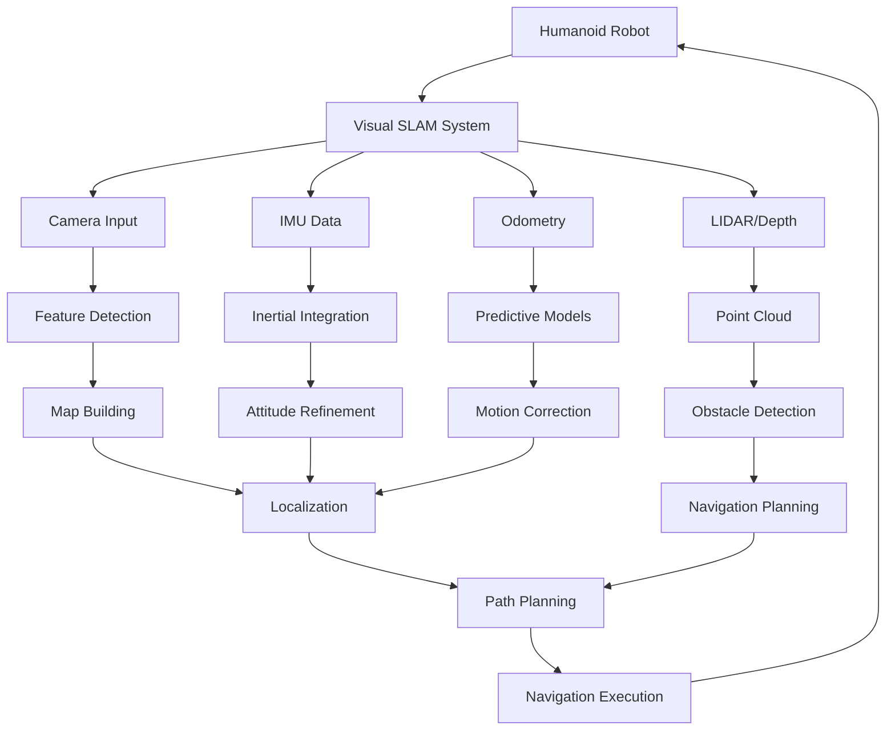

# vSLAM and Navigation: Visual Navigation for Humanoid Robots

## Introduction to vSLAM for Humanoid Robotics

Visual Simultaneous Localization and Mapping (vSLAM) is a critical technology for humanoid robots that operate in unstructured environments without prior knowledge of their surroundings. Unlike wheeled robots that can rely on wheel encoders, humanoid robots require full 3D awareness of their environment for balance, navigation, and interaction.

### Why vSLAM for Humanoids?

Humanoid robots have unique requirements for localization and mapping:

1. **3D Movement**: Can move in 6DOF (position and orientation) unlike ground-based robots
2. **Balance Requirements**: Need accurate perception of terrain and obstacles for stable walking
3. **Human-Level Perspective**: Sensors positioned at human eye level, enabling natural human-robot interaction
4. **Dynamic Environments**: Must handle moving objects and people
5. **Multi-modal Integration**: Combines vision, IMU, and other sensors for robust estimation



## vSLAM Fundamentals for Humanoids

### SLAM vs Localization vs Mapping

```python
# Conceptual overview of SLAM components for humanoid robots

class SLAMConcepts:
    """
    Understanding the fundamental components of SLAM for humanoid robots
    """
    
    def __init__(self):
        self.world_representation = {
            'metric_map': 'precise geometric map',
            'topological_map': 'waypoint and connectivity graph',
            'semantic_map': 'object and room labeling'
        }
        
        self.state_estimation = {
            'position': '3D position (x,y,z)',
            'orientation': '3D orientation (roll,pitch,yaw)',
            'velocity': '3D velocity and angular rates'
        }
    
    def slam_vs_localization_vs_mapping(self):
        """
        Understand the relationship between SLAM, localization, and mapping
        """
        concepts = {
            'LOCALIZATION': {
                'definition': 'Estimating robot pose within a known map',
                'input': 'sensor data, known map',
                'output': 'robot pose estimate',
                'humanoid_focus': 'critical for balance and navigation in known spaces'
            },
            
            'MAPPING': {
                'definition': 'Building a map of the environment',
                'input': 'sensor data, robot pose estimates',
                'output': 'environment representation',
                'humanoid_focus': 'necessary for exploring new environments'
            },
            
            'SLAM': {
                'definition': 'Jointly performing localization and mapping',
                'input': 'sensor data only initially',
                'output': 'robot trajectory + map',
                'humanoid_focus': 'enables autonomous exploration and navigation'
            }
        }
        
        return concepts
```

### Visual SLAM Approaches

There are several approaches to visual SLAM, each with advantages for humanoid robots:

```python
# Example: Different vSLAM algorithm classifications
class VisualSLAMApproaches:
    """
    Overview of visual SLAM approaches suitable for humanoid robots
    """
    
    def __init__(self):
        self.approaches = {
            # Feature-based methods
            'MONOCULAR': {
                'name': 'Monocular Visual SLAM',
                'pros': [
                    'Low cost and compact',
                    'Suitable for lightweight humanoid heads',
                    'Rich feature information'
                ],
                'cons': [
                    'Scale ambiguity',
                    'Requires motion for depth estimation',
                    'Sensitive to textureless environments'
                ],
                'applications': 'Head-mounted cameras for humanoid spatial awareness'
            },
            
            'STEREO': {
                'name': 'Stereo Visual SLAM', 
                'pros': [
                    'Metric scale recovery',
                    'Dense depth information',
                    'Better performance in textureless environments'
                ],
                'cons': [
                    'Computational complexity',
                    'Baseline limitations',
                    'Potential for occlusions'
                ],
                'applications': 'Robust humanoid navigation with depth awareness'
            },
            
            'RGBD': {
                'name': 'RGB-D SLAM',
                'pros': [
                    'Dense 3D information',
                    'Immediate metric scale',
                    'Good for obstacle detection and avoidance'
                ],
                'cons': [
                    'Limited range (typically <5m)',
                    'Susceptible to specular surfaces',
                    'Power consumption considerations'
                ],
                'applications': 'Close-proximity humanoid interaction and manipulation'
            }
        }
    
    def select_approach(self, humanoid_specs):
        """
        Select appropriate vSLAM approach based on humanoid specifications
        
        Args:
            humanoid_specs: Dictionary with robot specs like {'weight_limit': value, 'power_budget': value, etc.}
        """
        # Example selection logic
        if humanoid_specs.get('power_budget', 100) < 50:
            return 'MONOCULAR'  # Lowest power consumption
        elif humanoid_specs.get('accuracy_required', 'medium') == 'high':
            return 'RGBD'  # Dense metric information
        else:
            return 'STEREO'  # Balanced approach

class KeyFrameBasedSLAM:
    """
    Core concepts of keyframe-based visual SLAM
    """
    
    def __init__(self):
        self.keyframe_selection_criteria = [
            'motion_based',      # Sufficient baseline for triangulation
            'viewpoint_based',   # Different viewing angle 
            'appearance_based',  # Sufficient visual difference from recent frames
            'time_based'         # Regular intervals
        ]
        
        self.backend_optimization = {
            'local_bundle_adjustment': 'optimize recent keyframes and landmarks',
            'global_bundle_adjustment': 'optimize entire trajectory',
            'pose_graph_optimization': 'optimize pose constraints'
        }
        
    def keyframe_process(self, current_frame, keyframes, landmarks):
        """
        Process current frame against existing keyframes and landmarks
        """
        # 1. Feature extraction and matching
        current_features = self.extract_features(current_frame)
        matches = self.match_to_keyframes(current_features, keyframes)
        
        # 2. Initial pose estimation
        pose_estimate = self.estimate_initial_pose(matches, keyframes)
        
        # 3. Local refinement
        refined_pose = self.local_bundle_adjustment(
            pose_estimate, 
            matches, 
            keyframes, 
            landmarks
        )
        
        # 4. Keyframe decision
        should_add_keyframe = self.should_add_keyframe(
            current_frame, 
            keyframes, 
            refined_pose
        )
        
        if should_add_keyframe:
            new_keyframe = self.create_keyframe(current_frame, refined_pose, current_features)
            keyframes.append(new_keyframe)
            
            # Update landmark triangulation
            self.triangulate_new_landmarks(new_keyframe, keyframes, landmarks)
        
        return refined_pose, keyframes, landmarks
    
    def extract_features(self, frame):
        """Extract visual features from frame (abstract implementation)"""
        # In practice, this would use ORB, SIFT, SuperPoint, etc.
        return []
    
    def match_to_keyframes(self, features, keyframes):
        """Match features to existing keyframes"""
        # Implement feature matching
        return []
    
    def estimate_initial_pose(self, matches, keyframes):
        """Estimate initial camera pose from matches"""
        # Use PnP, Essential Matrix, etc.
        return [0, 0, 0, 0, 0, 0, 1]  # [x, y, z, qx, qy, qz, qw]
    
    def local_bundle_adjustment(self, pose, matches, keyframes, landmarks):
        """Refine pose using local BA"""
        # Optimize pose and nearby landmarks
        return pose
    
    def should_add_keyframe(self, current_frame, keyframes, pose):
        """Decision logic for keyframe addition"""
        # Check motion, viewpoint, appearance, time criteria
        return True
    
    def create_keyframe(self, frame, pose, features):
        """Create new keyframe from current data"""
        return {'frame': frame, 'pose': pose, 'features': features}
    
    def triangulate_new_landmarks(self, new_keyframe, keyframes, landmarks):
        """Triangulate new landmarks from keyframe pairs"""
        # Identify common features and triangulate 3D points
        pass
```

## Isaac ROS vSLAM Implementation

### Setting up Isaac ROS vSLAM

```python
# Example: Isaac ROS vSLAM node implementation
import rclpy
from rclpy.node import Node
from sensor_msgs.msg import Image, CameraInfo, Imu
from geometry_msgs.msg import PointStamped, PoseStamped, TwistStamped
from nav_msgs.msg import Odometry, Path
from visualization_msgs.msg import MarkerArray
from std_msgs.msg import Header
from tf2_ros import TransformBroadcaster, TransformListener, Buffer
import tf2_geometry_msgs
import numpy as np
import cv2
from cv_bridge import CvBridge
import open3d as o3d
import message_filters

class IsaacROSvSLAMNode(Node):
    def __init__(self):
        super().__init__('isaac_ros_vslam_node')
        
        # Initialize components
        self.cv_bridge = CvBridge()
        self.tf_broadcaster = TransformBroadcaster(self)
        self.tf_buffer = Buffer()
        self.tf_listener = TransformListener(self.tf_buffer, self)
        
        # vSLAM state
        self.last_frame = None
        self.keyframes = []
        self.landmarks = []
        self.trajectory = []
        self.map_points = o3d.geometry.PointCloud()
        self.current_pose = np.eye(4)  # 4x4 homogeneous transformation
        
        # Initialize SLAM backend
        self.initialize_slam_backend()
        
        # Set up synchronized subscribers for stereo (if available)
        self.setup_subscribers()
        
        # Publishers
        self.odom_pub = self.create_publisher(Odometry, 'visual_odom', 10)
        self.pose_pub = self.create_publisher(PoseStamped, 'visual_pose', 10)
        self.path_pub = self.create_publisher(Path, 'visual_path', 10)
        self.map_pub = self.create_publisher(PointStamped, 'point_cloud', 10)
        self.marker_pub = self.create_publisher(MarkerArray, 'slam_markers', 10)
        
        # Parameters
        self.declare_parameters(
            namespace='',
            parameters=[
                ('camera_frame', 'camera_link'),
                ('map_frame', 'map'),
                ('odom_frame', 'odom'),
                ('publish_freq', 30.0),
                ('feature_threshold', 100),
                ('tracking_loss_threshold', 50),
            ]
        )
        
        # Timers
        self.publish_timer = self.create_timer(
            1.0 / self.get_parameter('publish_freq').value,
            self.publish_slam_results
        )
        
        self.get_logger().info('Isaac ROS vSLAM Node Initialized')

    def initialize_slam_backend(self):
        """
        Initialize the visual SLAM backend
        """
        # Feature detector (SIFT, ORB, etc.)
        self.feature_detector = cv2.SIFT_create(nfeatures=1000)
        
        # Descriptor matcher
        FLANN_INDEX_KDTREE = 1
        index_params = dict(algorithm=FLANN_INDEX_KDTREE, trees=5)
        search_params = dict(checks=50)
        self.matcher = cv2.FlannBasedMatcher(index_params, search_params)
        
        # Pose estimator
        self.ransac_reproj_threshold = 5.0
        
        # Keyframe management
        self.keyframe_distance_threshold = 0.5  # meters
        self.keyframe_angle_threshold = 10.0    # degrees
        
        self.get_logger().info('vSLAM backend initialized with SIFT features')

    def setup_subscribers(self):
        """
        Set up subscribers for sensor data
        """
        # Primary camera feed
        self.image_sub = self.create_subscription(
            Image,
            'camera/image_raw',
            self.image_callback,
            10
        )
        
        # Camera info
        self.cam_info_sub = self.create_subscription(
            CameraInfo,
            'camera/camera_info',
            self.camera_info_callback,
            10
        )
        
        # IMU data (for initialization and aiding)
        self.imu_sub = self.create_subscription(
            Imu,
            'imu/data',
            self.imu_callback,
            10
        )
        
        # If stereo is available, set up stereo synchronization
        try:
            image_sub = message_filters.Subscriber(self, Image, 'camera/left/image_raw')
            depth_sub = message_filters.Subscriber(self, Image, 'camera/depth/image_raw')
            
            ts = message_filters.ApproximateTimeSynchronizer(
                [image_sub, depth_sub], 
                queue_size=10, 
                slop=0.1
            )
            ts.registerCallback(self.stereo_callback)
            
            self.get_logger().info('Stereo camera synchronization enabled')
        except Exception as e:
            self.get_logger().info(f'Stereo sync not available: {e}')

    def camera_info_callback(self, msg):
        """
        Store camera intrinsic parameters
        """
        self.camera_matrix = np.array([
            [msg.k[0], msg.k[1], msg.k[2]],
            [msg.k[3], msg.k[4], msg.k[5]],
            [msg.k[6], msg.k[7], msg.k[8]]
        ]).reshape(3, 3)
        
        self.dist_coeffs = np.array(msg.d)
        self.image_size = (msg.width, msg.height)

    def imu_callback(self, msg):
        """
        Process IMU data for initial orientation alignment
        """
        # Store IMU data for initialization and aiding
        self.last_imu = msg
        
        # If this is our first IMU reading, use it to initialize world frame
        if not hasattr(self, 'world_initialized'):
            self.initialize_world_frame_from_imu(msg)
    
    def initialize_world_frame_from_imu(self, imu_msg):
        """
        Initialize world frame using gravity vector from IMU
        """
        # Extract gravity vector from accelerometer (stationary assumption)
        accel_vector = np.array([
            imu_msg.linear_acceleration.x,
            imu_msg.linear_acceleration.y,
            imu_msg.linear_acceleration.z
        ])
        
        # Normalize to get gravity direction
        gravity_dir = accel_vector / np.linalg.norm(accel_vector)
        
        # Align Z-axis of world frame with gravity (negative because gravity pulls down)
        world_z = -gravity_dir
        
        # Create world frame (assumes robot is mostly upright initially)
        z_axis = world_z
        y_axis = np.array([0, 1, 0])  # Assumes Y is up in robot frame initially
        x_axis = np.cross(y_axis, z_axis)
        x_axis = x_axis / np.linalg.norm(x_axis)
        y_axis = np.cross(z_axis, x_axis)  # Recompute Y to be orthogonal
        
        # Create rotation matrix
        R_world_robot = np.column_stack([x_axis, y_axis, z_axis])
        
        # Store as initial transformation
        self.initial_rotation = R_world_robot
        self.world_initialized = True
        
        self.get_logger().info('World frame initialized from IMU gravity alignment')

    def image_callback(self, msg):
        """
        Process single camera image for vSLAM
        """
        try:
            # Convert ROS image to OpenCV
            current_image = self.cv_bridge.imgmsg_to_cv2(msg, "mono8")
            
            # Initialize first frame if needed
            if self.last_frame is None:
                self.initialize_first_frame(current_image, msg.header)
                return
            
            # Perform visual SLAM processing
            success, pose_change = self.process_frame_pair(self.last_frame, current_image)
            
            if success:
                # Update current pose
                self.current_pose = self.current_pose @ pose_change
                
                # Add to trajectory
                self.trajectory.append(self.current_pose)
                
                # Check if we should add this as a keyframe
                if self.should_add_keyframe(self.current_pose):
                    self.add_keyframe(current_image, self.current_pose, msg.header)
                
                # Update map
                self.update_map()
            
            # Store current frame for next iteration
            self.last_frame = current_image.copy()
            
        except Exception as e:
            self.get_logger().error(f'vSLAM processing error: {str(e)}')

    def initialize_first_frame(self, image, header):
        """
        Initialize the first frame for SLAM
        """
        # Process first frame
        kp, desc = self.feature_detector.detectAndCompute(image, None)
        
        # Store as first keyframe
        first_keyframe = {
            'image': image,
            'keypoints': kp,
            'descriptors': desc,
            'pose': np.eye(4),  # Identity pose for first frame
            'timestamp': header.stamp,
            'id': 0
        }
        
        self.keyframes.append(first_keyframe)
        self.last_frame = image.copy()
        
        self.get_logger().info(f'Initialized SLAM with {len(kp) if kp else 0} features')

    def process_frame_pair(self, prev_image, curr_image):
        """
        Process correspondence between previous and current frame
        """
        try:
            # Extract features from current frame
            curr_kp, curr_desc = self.feature_detector.detectAndCompute(curr_image, None)
            
            if curr_kp is None or len(curr_kp) < 50:  # Need minimum features
                return False, None
            
            # Extract features from previous frame
            prev_kp, prev_desc = self.feature_detector.detectAndCompute(prev_image, None)
            
            if prev_desc is None or curr_desc is None:
                return False, None
            
            # Match features using FLANN
            matches = self.matcher.knnMatch(prev_desc, curr_desc, k=2)
            
            # Apply Lowe's ratio test
            good_matches = []
            for match_pair in matches:
                if len(match_pair) == 2:
                    m, n = match_pair
                    if m.distance < 0.75 * n.distance:
                        good_matches.append(m)
            
            if len(good_matches) < 20:  # Need minimum matches for reliable pose
                self.get_logger().warn(f'Insufficient matches: {len(good_matches)}')
                return False, None
            
            # Extract matched points
            prev_pts = np.float32([prev_kp[m.queryIdx].pt for m in good_matches]).reshape(-1, 1, 2)
            curr_pts = np.float32([curr_kp[m.trainIdx].pt for m in good_matches]).reshape(-1, 1, 2)
            
            # Compute essential matrix
            E, mask = cv2.findEssentialMat(
                prev_pts, 
                curr_pts, 
                self.camera_matrix,
                method=cv2.RANSAC,
                prob=0.999,
                threshold=1.0
            )
            
            if E is None or E.size < 9:
                return False, None
            
            # Recover pose
            _, R, t, _ = cv2.recoverPose(E, prev_pts, curr_pts, self.camera_matrix)
            
            # Create transformation matrix
            transform = np.eye(4)
            transform[0:3, 0:3] = R
            transform[0:3, 3] = t.flatten()
            
            # Apply IMU aiding if available
            if hasattr(self, 'last_imu'):
                transform = self.apply_imu_aiding(transform)
            
            return True, transform
            
        except Exception as e:
            self.get_logger().error(f'Frame processing error: {str(e)}')
            return False, None

    def apply_imu_aiding(self, visual_transform):
        """
        Apply IMU data to aid visual odometry
        """
        # This is a simplified IMU aiding approach
        # In practice, a more sophisticated sensor fusion (like Kalman filtering) would be used
        
        if not hasattr(self, 'last_imu') or self.last_imu is None:
            return visual_transform
        
        # Extract rotation from visual transform
        visual_R = visual_transform[0:3, 0:3]
        
        # Get IMU-derived gravity-based orientation
        imu_acc = np.array([
            self.last_imu.linear_acceleration.x,
            self.last_imu.linear_acceleration.y, 
            self.last_imu.linear_acceleration.z
        ])
        gravity_norm = imu_acc / np.linalg.norm(imu_acc)
        
        # Align Z-axis with gravity while preserving X/Y rotation from visual
        # This is a simplified approach - more sophisticated fusion would be better
        z_world = -gravity_norm  # Gravity direction
        x_vision = visual_R[:, 0]  # X-axis from visual
        y_corrected = np.cross(z_world, x_vision)  # Recompute Y-axis orthogonally
        y_corrected = y_corrected / np.linalg.norm(y_corrected)
        x_corrected = np.cross(y_corrected, z_world)  # Recompute X-axis
        
        corrected_R = np.column_stack([x_corrected, y_corrected, z_world])
        
        # Create corrected transformation
        corrected_transform = np.eye(4)
        corrected_transform[0:3, 0:3] = corrected_R
        corrected_transform[0:3, 3] = visual_transform[0:3, 3]  # Keep translation from visual
        
        return corrected_transform

    def should_add_keyframe(self, current_pose):
        """
        Decide whether to add current pose as a keyframe
        """
        if len(self.keyframes) == 0:
            return True
        
        # Get last keyframe pose
        last_kf_pose = self.keyframes[-1]['pose']
        
        # Calculate distance between current and last keyframe
        pos_diff = current_pose[0:3, 3] - last_kf_pose[0:3, 3]
        distance = np.linalg.norm(pos_diff)
        
        # Calculate angular difference
        R_current = current_pose[0:3, 0:3]
        R_last = last_kf_pose[0:3, 0:3]
        
        # Rotation angle from rotation matrix
        trace = np.trace(R_current.T @ R_last)
        angle_rad = np.arccos(np.clip((trace - 1) / 2, -1, 1))
        angle_deg = np.degrees(angle_rad)
        
        # Check thresholds
        distance_threshold = self.keyframe_distance_threshold
        angle_threshold = self.keyframe_angle_threshold
        
        should_add = (distance > distance_threshold) or (angle_deg > angle_threshold)
        
        if should_add:
            self.get_logger().debug(f'Adding keyframe: dist={distance:.2f}m, angle={angle_deg:.2f}°')
        
        return should_add

    def add_keyframe(self, image, pose, header):
        """
        Add current frame as a keyframe
        """
        # Extract features
        kp, desc = self.feature_detector.detectAndCompute(image, None)
        
        # Create keyframe
        keyframe = {
            'image': image,
            'keypoints': kp,
            'descriptors': desc,
            'pose': pose.copy(),
            'timestamp': header.stamp,
            'id': len(self.keyframes)
        }
        
        self.keyframes.append(keyframe)
        
        # Limit keyframes to prevent memory growth
        max_keyframes = 100
        if len(self.keyframes) > max_keyframes:
            # Remove oldest keyframes (keep more recent ones)
            self.keyframes = self.keyframes[-max_keyframes:]
    
    def update_map(self):
        """
        Update the map with new information
        """
        # Add landmark triangulation logic here
        # For now, just update the point cloud from keyframe features
        all_points = []
        
        for kf in self.keyframes[-10:]:  # Use last 10 keyframes for efficiency
            if kf['keypoints'] is not None:
                pts = np.array([kp.pt for kp in kf['keypoints']])
                # Convert image points to 3D using pose - simplified approach
                for pt in pts:
                    # This is a very simplified projection - real triangulation would be more complex
                    homog_pt = np.array([pt[0], pt[1], 1.0])
                    ray = np.linalg.inv(self.camera_matrix) @ homog_pt
                    point_3d = kf['pose'][0:3, 3] + ray * 1.0  # Simplified depth assumption
                    all_points.append(point_3d)
        
        if all_points:
            # Update point cloud
            self.map_points.points = o3d.utility.Vector3dVector(np.array(all_points))
    
    def publish_slam_results(self):
        """
        Publish SLAM results (odometry, pose, path, map)
        """
        if len(self.trajectory) == 0:
            return
        
        current_pose = self.trajectory[-1]
        
        # Create odometry message
        odom_msg = Odometry()
        odom_msg.header.stamp = self.get_clock().now().to_msg()
        odom_msg.header.frame_id = self.get_parameter('map_frame').value
        odom_msg.child_frame_id = self.get_parameter('camera_frame').value
        
        # Extract position and orientation
        position = current_pose[0:3, 3]
        rotation_matrix = current_pose[0:3, 0:3]
        
        # Convert to quaternion
        import tf_transformations
        quat = tf_transformations.quaternion_from_matrix(current_pose)
        
        odom_msg.pose.pose.position.x = float(position[0])
        odom_msg.pose.pose.position.y = float(position[1])
        odom_msg.pose.pose.position.z = float(position[2])
        
        odom_msg.pose.pose.orientation.x = float(quat[0])
        odom_msg.pose.pose.orientation.y = float(quat[1])
        odom_msg.pose.pose.orientation.z = float(quat[2])
        odom_msg.pose.pose.orientation.w = float(quat[3])
        
        # Publish odometry
        self.odom_pub.publish(odom_msg)
        
        # Publish pose stamped
        pose_msg = PoseStamped()
        pose_msg.header = odom_msg.header
        pose_msg.pose = odom_msg.pose.pose
        self.pose_pub.publish(pose_msg)
        
        # Publish path
        if len(self.trajectory) > 1:
            path_msg = Path()
            path_msg.header = odom_msg.header
            
            for pose in self.trajectory[-100:]:  # Last 100 poses to avoid huge messages
                pose_stamped = PoseStamped()
                pos = pose[0:3, 3]
                quat_local = tf_transformations.quaternion_from_matrix(pose)
                
                pose_stamped.pose.position.x = float(pos[0])
                pose_stamped.pose.position.y = float(pos[1])
                pose_stamped.pose.position.z = float(pos[2])
                
                pose_stamped.pose.orientation.x = float(quat_local[0])
                pose_stamped.pose.orientation.y = float(quat_local[1])
                pose_stamped.pose.orientation.z = float(quat_local[2])
                pose_stamped.pose.orientation.w = float(quat_local[3])
                pose_stamped.header = odom_msg.header
                
                path_msg.poses.append(pose_stamped)
            
            self.path_pub.publish(path_msg)
        
        # Publish transform to TF
        from geometry_msgs.msg import TransformStamped
        t = TransformStamped()
        t.header.stamp = odom_msg.header.stamp
        t.header.frame_id = odom_msg.header.frame_id
        t.child_frame_id = odom_msg.child_frame_id
        
        t.transform.translation.x = position[0]
        t.transform.translation.y = position[1]
        t.transform.translation.z = position[2]
        
        t.transform.rotation.x = quat[0]
        t.transform.rotation.y = quat[1]
        t.transform.rotation.z = quat[2]
        t.transform.rotation.w = quat[3]
        
        self.tf_broadcaster.sendTransform(t)
```

## Advanced vSLAM Concepts for Humanoids

### Multi-Sensor Fusion

Humanoid robots benefit from fusing multiple sensors for robust vSLAM:

```python
# Example: Multi-sensor fusion for humanoid vSLAM
import numpy as np
from scipy.spatial.transform import Rotation as R

class MultiSensorFusionSLAM:
    """
    Multi-sensor fusion approach for humanoid vSLAM
    """
    def __init__(self):
        # Initialize different sensor processors
        self.visual_estimator = VisualEstimator()
        self.inertial_estimator = InertialEstimator() 
        self.lidar_estimator = LidarEstimator()
        self.kalman_filter = ExtendedKalmanFilter()
        
        # Sensor fusion weights
        self.sensor_weights = {
            'visual': 0.5,
            'inertial': 0.3,
            'lidar': 0.2
        }
        
    def fuse_sensor_data(self, visual_data, inertial_data, lidar_data):
        """
        Fuse data from multiple sensors for pose estimation
        """
        # Get individual pose estimates
        visual_pose = self.visual_estimator.estimate(visual_data)
        inertial_pose = self.inertial_estimator.estimate(inertial_data)  
        lidar_pose = self.lidar_estimator.estimate(lidar_data)
        
        # Fuse estimates using weighted averaging or Kalman filtering
        fused_pose = self.weighted_fusion(
            visual_pose, inertial_pose, lidar_pose
        )
        
        # Apply Kalman filter for temporal smoothing
        filtered_pose = self.kalman_filter.update(fused_pose)
        
        return filtered_pose
    
    def weighted_fusion(self, visual_pose, inertial_pose, lidar_pose):
        """
        Weighted fusion of pose estimates from different sensors
        """
        weights = self.sensor_weights
        
        # Decompose poses into position and orientation
        pos_visual = visual_pose[:3]
        pos_inertial = inertial_pose[:3] 
        pos_lidar = lidar_pose[:3]
        
        rot_visual = visual_pose[3:]
        rot_inertial = inertial_pose[3:]
        rot_lidar = lidar_pose[3:]
        
        # Weighted average for position
        fused_pos = (
            weights['visual'] * pos_visual +
            weights['inertial'] * pos_inertial + 
            weights['lidar'] * pos_lidar
        )
        
        # For rotation, convert to quaternions first for proper averaging
        q_visual = R.from_quat(rot_visual).as_quat()
        q_inertial = R.from_quat(rot_inertial).as_quat()
        q_lidar = R.from_quat(rot_lidar).as_quat()
        
        # Weighted average of quaternions (simplified approach)
        fused_q = (
            weights['visual'] * q_visual +
            weights['inertial'] * q_inertial +
            weights['lidar'] * q_lidar
        )
        fused_q = fused_q / np.linalg.norm(fused_q)  # Normalize
        
        return np.concatenate([fused_pos, fused_q])

class ExtendedKalmanFilter:
    """
    Extended Kalman Filter for sensor fusion and temporal smoothing
    """
    def __init__(self, state_dim=7):  # [x, y, z, qx, qy, qz, qw]
        self.state_dim = state_dim
        self.state = np.zeros(state_dim)  # Current state estimate
        self.covariance = np.eye(state_dim) * 0.1  # State covariance
        
        # Process noise (how much uncertainty accumulates over time)
        self.Q = np.eye(state_dim) * 0.01
        
        # Measurement noise (uncertainty in sensor readings)
        self.R_visual = np.eye(state_dim) * 0.1
        self.R_inertial = np.eye(state_dim) * 0.05
        self.R_lidar = np.eye(state_dim) * 0.02
        
    def predict(self, control_input, dt):
        """
        Predict next state based on motion model
        """
        # Simple motion model (constant velocity)
        # In practice, this would be more sophisticated for humanoid movement
        self.state = self.state + control_input * dt
        
        # Update covariance
        # F is the Jacobian of the motion model (simplified as identity)
        F = np.eye(self.state_dim)
        self.covariance = F @ self.covariance @ F.T + self.Q
        
    def update(self, measurement):
        """
        Update state estimate with new measurement
        """
        # Measurement residual
        y = measurement - self.state
        
        # Measurement Jacobian (simplified as identity for direct measurements)
        H = np.eye(self.state_dim)
        
        # Innovation covariance
        S = H @ self.covariance @ H.T + self.R_visual  # Use visual R for now
        
        # Kalman gain
        K = self.covariance @ H.T @ np.linalg.inv(S)
        
        # Update state
        self.state = self.state + K @ y
        
        # Update covariance
        I = np.eye(self.state_dim)
        self.covariance = (I - K @ H) @ self.covariance
        
        return self.state
```

### Loop Closure and Global Optimization

For long-term operation, humanoid robots need loop closure detection:

```python
# Example: Loop closure detection for humanoid vSLAM
class LoopClosureDetector:
    """
    Loop closure detection for global correction of vSLAM drift
    """
    def __init__(self, db_size=1000):
        # Initialize place recognition database
        self.place_db = {
            'keyframe_ids': [],
            'descriptors': [],  # Global descriptors for place recognition
            'poses': [],        # Poses when these places were observed
            'timestamps': []
        }
        
        # Bag-of-Words vocabulary for place recognition
        self.vocabulary = self.initialize_vocabulary()
        
        # Place matching parameters
        self.matching_threshold = 0.7
        self.temporal_threshold = 60  # Don't match frames within 60 seconds
        
    def initialize_vocabulary(self):
        """
        Initialize visual vocabulary for place recognition
        """
        # In practice, this would load a pre-trained BoW vocabulary
        # For simplicity, we'll simulate with a basic approach
        return np.random.random((1000, 128))  # 1000 visual words of 128-dim each
    
    def detect_loop_closure(self, current_keyframe):
        """
        Detect if current view matches previously seen view (loop closure)
        """
        # Compute global descriptor for current keyframe
        current_descriptor = self.compute_global_descriptor(
            current_keyframe['descriptors']
        )
        
        # Find potential matches in database
        potential_matches = self.find_place_matches(current_descriptor)
        
        # Validate matches geometrically
        validated_matches = self.validate_geometric_consistency(
            current_keyframe, potential_matches
        )
        
        if len(validated_matches) > 0:
            # Return the best match for loop closure
            return validated_matches[0]
        
        return None
    
    def compute_global_descriptor(self, local_descriptors):
        """
        Compute global descriptor from local features for place recognition
        """
        if local_descriptors is None or len(local_descriptors) == 0:
            return np.zeros(128)
        
        # Use bag-of-words approach
        # Find nearest vocabulary words for each descriptor
        descriptor_words = []
        for desc in local_descriptors[:100]:  # Use first 100 descriptors for efficiency
            if len(desc) > 0:
                # Find nearest vocabulary word (simplified approach)
                distances = np.sum((self.vocabulary - desc[:128]) ** 2, axis=1)
                nearest_word = np.argmin(distances)
                descriptor_words.append(nearest_word)
        
        # Create histogram of visual words
        hist, _ = np.histogram(descriptor_words, bins=len(self.vocabulary))
        return hist.astype(np.float32)
    
    def find_place_matches(self, query_descriptor):
        """
        Find potential place matches in database
        """
        if len(self.place_db['descriptors']) == 0:
            return []
        
        matches = []
        query_normalized = query_descriptor / (np.linalg.norm(query_descriptor) + 1e-8)
        
        for i, db_descriptor in enumerate(self.place_db['descriptors']):
            if len(db_descriptor) > 0:
                db_normalized = db_descriptor / (np.linalg.norm(db_descriptor) + 1e-8)
                
                # Compute similarity (cosine similarity)
                similarity = np.dot(query_normalized, db_normalized)
                
                if similarity > self.matching_threshold:
                    time_diff = abs(
                        self.get_current_timestamp() - self.place_db['timestamps'][i]
                    )
                    
                    # Don't match frames that are too close in time
                    if time_diff > self.temporal_threshold:
                        matches.append({
                            'id': self.place_db['keyframe_ids'][i],
                            'similarity': similarity,
                            'pose': self.place_db['poses'][i]
                        })
        
        # Sort by similarity
        matches.sort(key=lambda x: x['similarity'], reverse=True)
        return matches[:10]  # Return top 10 matches
    
    def validate_geometric_consistency(self, current_kf, potential_matches):
        """
        Validate potential matches using geometric consistency
        """
        validated = []
        
        for match in potential_matches:
            # Get corresponding features
            current_kp = current_kf['keypoints']
            current_desc = current_kf['descriptors']
            
            candidate_kf_id = match['id']
            candidate_kf = self.get_keyframe_by_id(candidate_kf_id)
            
            if candidate_kf is None:
                continue
                
            candidate_kp = candidate_kf['keypoints']
            candidate_desc = candidate_kf['descriptors']
            
            if (candidate_desc is None or current_desc is None or 
                len(candidate_desc) == 0 or len(current_desc) == 0):
                continue
            
            # Match features between current and candidate
            matches_geo = self.geometric_feature_match(
                current_desc, candidate_desc, current_kp, candidate_kp
            )
            
            # Check if enough consistent matches exist
            if len(matches_geo) > 20:  # Minimum inliers for validity
                validated.append(match)
        
        return validated
    
    def geometric_feature_match(self, desc1, desc2, kp1, kp2):
        """
        Perform geometric feature matching using fundamental/essential matrix
        """
        # Use FLANN matcher
        FLANN_INDEX_KDTREE = 1
        index_params = dict(algorithm=FLANN_INDEX_KDTREE, trees=5)
        search_params = dict(checks=50)
        matcher = cv2.FlannBasedMatcher(index_params, search_params)
        
        matches = matcher.knnMatch(desc1, desc2, k=2)
        
        # Apply Lowe's ratio test
        good_matches = []
        for match_pair in matches:
            if len(match_pair) == 2:
                m, n = match_pair
                if m.distance < 0.8 * n.distance:
                    good_matches.append(m)
        
        # Apply geometric validation using RANSAC
        if len(good_matches) >= 8:  # Minimum for fundamental matrix
            src_pts = np.float32([kp1[m.queryIdx].pt for m in good_matches]).reshape(-1, 1, 2)
            dst_pts = np.float32([kp2[m.trainIdx].pt for m in good_matches]).reshape(-1, 1, 2)
            
            # Compute fundamental matrix and mask inliers
            F, mask = cv2.findFundamentalMat(
                src_pts, dst_pts, 
                cv2.RANSAC, 4, 0.999
            )
            
            # Count inliers
            inliers = np.sum(mask.ravel() == 1) if mask is not None else 0
            
            if inliers >= 20:  # Require sufficient inliers
                return good_matches[:inliers]
        
        return []
    
    def get_keyframe_by_id(self, kf_id):
        """
        Retrieve keyframe by its ID
        """
        for kf in self.place_db['keyframes']:
            if kf['id'] == kf_id:
                return kf
        return None
    
    def get_current_timestamp(self):
        """
        Get current timestamp for temporal validation
        """
        import time
        return time.time()

class GraphOptimizationBackend:
    """
    Graph optimization for global SLAM refinement
    """
    def __init__(self):
        # Use a graph optimization library like g2o or TORO
        # For this example, we'll simulate the concept
        self.poses = {}  # {node_id: [x, y, z, qx, qy, qz, qw]}
        self.constraints = []  # [(node1_id, node2_id, relative_pose, information_matrix)]
        
    def add_pose_node(self, node_id, pose):
        """
        Add a pose node to the optimization graph
        """
        self.poses[node_id] = pose.copy()
        
    def add_constraint(self, node1_id, node2_id, relative_pose, information_matrix=None):
        """
        Add a relative pose constraint between two nodes
        """
        if information_matrix is None:
            # Default information matrix (identity)
            information_matrix = np.eye(6)  # 6 DOF uncertainty
        
        constraint = {
            'node1': node1_id,
            'node2': node2_id, 
            'relative_pose': relative_pose,
            'information': information_matrix
        }
        
        self.constraints.append(constraint)
        
    def optimize(self):
        """
        Perform global optimization of the pose graph
        """
        # In practice, this would call an optimizer like g2o
        # For simulation, we'll just return the current poses
        optimized_poses = self.poses.copy()
        
        # Simulate optimization improvement
        # (In real implementation, this would use iterative nonlinear optimization)
        
        return optimized_poses
```

## Navigation Planning for Humanoids

### 3D Path Planning

Humanoid robots require 3D path planning considering their height and balance:

```python
# Example: 3D path planning for humanoid navigation
import numpy as np
import heapq
from scipy.spatial import KDTree
import open3d as o3d

class Humanoid3DPathPlanner:
    """
    3D path planner for humanoid robots considering height and balance constraints
    """
    def __init__(self, map_resolution=0.1, robot_height=1.6, robot_radius=0.4):
        self.map_resolution = map_resolution
        self.robot_height = robot_height
        self.robot_radius = robot_radius
        
        # 3D occupancy grid
        self.occupancy_grid = None
        self.grid_origin = np.array([0, 0, 0])
        self.grid_shape = (100, 100, 50)  # x, y, z
        
        # Path planning algorithms
        self.planning_algorithms = {
            'astar': self.plan_astar_3d,
            'rrt': self.plan_rrt_3d,
            'hybrid': self.plan_hybrid_3d
        }
        
    def plan_path(self, start_pos, goal_pos, algorithm='astar'):
        """
        Plan a 3D path from start to goal position
        """
        if self.occupancy_grid is None:
            raise ValueError("Occupancy grid not initialized")
        
        # Call appropriate planning algorithm
        planner = self.planning_algorithms.get(algorithm)
        if planner is None:
            raise ValueError(f"Unknown planning algorithm: {algorithm}")
        
        return planner(start_pos, goal_pos)
    
    def plan_astar_3d(self, start_pos, goal_pos):
        """
        3D A* path planning for humanoid robot
        """
        # Convert positions to grid coordinates
        start_grid = self.world_to_grid(start_pos)
        goal_grid = self.world_to_grid(goal_pos)
        
        # Priority queue for A* algorithm
        open_set = [(0, tuple(start_grid), [])]  # (cost, position, path)
        closed_set = set()
        
        while open_set:
            cost, current_pos, current_path = heapq.heappop(open_set)
            
            # Convert back to tuple for hashing in closed_set
            current_tuple = tuple(current_pos)
            if current_tuple in closed_set:
                continue
                
            closed_set.add(current_tuple)
            
            # Check if goal reached
            if np.array_equal(current_pos, goal_grid):
                return self.smooth_path(current_path + [self.grid_to_world(current_pos)])
            
            # Get neighbors (6-connectivity for 3D)
            neighbors = self.get_valid_neighbors(current_pos)
            
            for neighbor in neighbors:
                neighbor_tuple = tuple(neighbor)
                if neighbor_tuple not in closed_set:
                    new_cost = cost + self.calculate_move_cost(current_pos, neighbor)
                    new_path = current_path + [self.grid_to_world(current_pos)]
                    
                    heapq.heappush(
                        open_set, 
                        (new_cost + self.heuristic(neighbor, goal_grid), neighbor, new_path)
                    )
        
        # No path found
        return []
    
    def get_valid_neighbors(self, pos):
        """
        Get valid 3D neighbors for the robot position
        """
        neighbors = []
        
        # Define 6-connectivity (forward, backward, left, right, up, down)
        directions = [
            [1, 0, 0],   # x+
            [-1, 0, 0],  # x-
            [0, 1, 0],   # y+
            [0, -1, 0],  # y-
            [0, 0, 1],   # z+ (up)
            [0, 0, -1]   # z- (down)
        ]
        
        for dx, dy, dz in directions:
            new_pos = pos + np.array([dx, dy, dz])
            
            # Check bounds
            if (0 <= new_pos[0] < self.grid_shape[0] and
                0 <= new_pos[1] < self.grid_shape[1] and
                0 <= new_pos[2] < self.grid_shape[2]):
                
                # Check if position is free (considering robot size)
                if self.is_position_free(new_pos):
                    neighbors.append(new_pos)
        
        return neighbors
    
    def is_position_free(self, grid_pos):
        """
        Check if a grid position is free for the humanoid robot
        """
        # For humanoid, check not just the center point but also the space
        # occupied by the robot's body
        x, y, z = grid_pos
        
        # Check a cylindrical region around the point
        robot_radius_grid = int(self.robot_radius / self.map_resolution)
        robot_height_grid = int(self.robot_height / self.map_resolution)
        
        # Check vertical column of the robot's body
        for z_check in range(max(0, z), min(self.grid_shape[2], z + robot_height_grid)):
            for y_check in range(max(0, y - robot_radius_grid), min(self.grid_shape[1], y + robot_radius_grid + 1)):
                for x_check in range(max(0, x - robot_radius_grid), min(self.grid_shape[0], x + robot_radius_grid + 1)):
                    if self.is_in_cylindrical_region([x_check, y_check, z_check], [x, y, z], robot_radius_grid):
                        if self.occupancy_grid[z_check, y_check, x_check] > 0.5:  # Occupied
                            return False
        
        return True
    
    def is_in_cylindrical_region(self, point, center, radius):
        """
        Check if a point is within a cylindrical region
        """
        dx = point[0] - center[0]
        dy = point[1] - center[1]
        dz = point[2] - center[2]
        
        # Check radial distance (ignore height for cylinder check)
        radial_dist_sq = dx*dx + dy*dy
        
        return radial_dist_sq <= radius*radius
    
    def calculate_move_cost(self, pos1, pos2):
        """
        Calculate the cost of moving from pos1 to pos2
        """
        # Euclidean distance
        diff = pos2 - pos1
        cost = np.sqrt(np.sum(diff * diff))
        
        # Add penalty for upward movements (energy cost for humanoid)
        if pos2[2] > pos1[2]:
            cost *= 1.5  # More costly to go up
        
        return cost
    
    def heuristic(self, pos, goal):
        """
        Heuristic function for A* (Euclidean distance)
        """
        diff = goal - pos
        return np.sqrt(np.sum(diff * diff))
    
    def world_to_grid(self, world_pos):
        """
        Convert world coordinates to grid coordinates
        """
        grid_pos = (np.array(world_pos) - self.grid_origin) / self.map_resolution
        return np.round(grid_pos).astype(int)
    
    def grid_to_world(self, grid_pos):
        """
        Convert grid coordinates to world coordinates
        """
        return self.grid_origin + np.array(grid_pos) * self.map_resolution
    
    def smooth_path(self, path):
        """
        Smooth the planned path
        """
        if len(path) < 3:
            return path
        
        # Simple path smoothing by removing redundant waypoints
        smoothed = [path[0]]
        
        i = 0
        while i < len(path) - 2:
            # Check if intermediate point is redundant
            start = np.array(path[i])
            middle = np.array(path[i + 1])
            end = np.array(path[i + 2])
            
            # Calculate distance from middle point to line formed by start and end
            line_vec = end - start
            point_vec = middle - start
            line_len = np.linalg.norm(line_vec)
            
            if line_len > 0:
                # Project point_vec onto line_vec
                projection_length = np.dot(point_vec, line_vec) / line_len
                projection = start + (projection_length / line_len) * line_vec
                
                # Distance from point to line
                dist_to_line = np.linalg.norm(middle - projection)
                
                # If distance is below threshold, skip middle point
                if dist_to_line < 0.5:  # 0.5m threshold
                    # Skip middle point
                    i += 2
                    continue
            
            # Add current point and move to next
            smoothed.append(path[i + 1])
            i += 1
        
        smoothed.append(path[-1])
        return smoothed

class NavigationController:
    """
    Navigation controller that follows planned paths
    """
    def __init__(self, robot_radius=0.4, lookahead_distance=1.0):
        self.robot_radius = robot_radius
        self.lookahead_distance = lookahead_distance
        
        # Current robot state
        self.current_pose = np.array([0, 0, 0, 0, 0, 0])  # [x, y, z, roll, pitch, yaw]
        self.current_velocity = np.array([0, 0, 0])
        
        # Navigation state
        self.current_path = []
        self.path_index = 0
        self.navigation_active = False
        
        # PID controllers for different motions
        self.xy_pid = PIDController(kp=2.0, ki=0.1, kd=0.05)
        self.z_pid = PIDController(kp=1.5, ki=0.05, kd=0.02)
        self.yaw_pid = PIDController(kp=1.0, ki=0.02, kd=0.01)
        
    def follow_path(self, path):
        """
        Follow a given path with humanoid robot
        """
        if len(path) == 0:
            return  # No path to follow
        
        self.current_path = path
        self.path_index = 0
        self.navigation_active = True
        
        # Follow the path
        while self.navigation_active and self.path_index < len(self.current_path) - 1:
            # Get next waypoint based on lookahead
            target_waypoint = self.get_lookahead_waypoint()
            
            # Calculate control commands
            control_cmd = self.calculate_navigation_control(target_waypoint)
            
            # Execute control command (interface with robot actuators)
            self.execute_control_command(control_cmd)
            
            # Check if reached waypoint
            if self.reached_waypoint(target_waypoint):
                self.path_index += 1
            
            # Check for replanning needs (obstacle detection, etc.)
            if self.replan_needed():
                break
    
    def get_lookahead_waypoint(self):
        """
        Get waypoint at lookahead distance along path
        """
        if self.path_index >= len(self.current_path):
            return self.current_path[-1]
        
        current_pos = self.current_pose[:3]
        
        # Search for waypoint at appropriate lookahead distance
        for i in range(self.path_index, len(self.current_path)):
            path_point = np.array(self.current_path[i][:3])
            distance = np.linalg.norm(path_point - current_pos)
            
            if distance >= self.lookahead_distance:
                return self.current_path[i]
        
        # If no point is far enough, return the last point
        return self.current_path[-1]
    
    def calculate_navigation_control(self, target_waypoint):
        """
        Calculate navigation control commands to reach target waypoint
        """
        current_pos = self.current_pose[:3]
        target_pos = np.array(target_waypoint[:3])
        
        # Calculate position error
        error = target_pos - current_pos
        
        # Calculate desired heading to target
        desired_yaw = np.arctan2(error[1], error[0])
        current_yaw = self.current_pose[5]  # yaw is the 6th element
        
        # Calculate yaw error
        yaw_error = self.normalize_angle(desired_yaw - current_yaw)
        
        # Use PID controllers to calculate control outputs
        xy_control = self.xy_pid.update(np.linalg.norm(error[:2]))
        z_control = self.z_pid.update(error[2])
        yaw_control = self.yaw_pid.update(yaw_error)
        
        # Combine controls into navigation command
        nav_command = {
            'linear_x': xy_control,      # Forward/backward
            'linear_y': 0,               # Strafe (may not be supported by humanoid)
            'linear_z': z_control,       # Vertical (limited for humanoid)
            'angular_z': yaw_control     # Turning
        }
        
        return nav_command
    
    def normalize_angle(self, angle):
        """
        Normalize angle to [-pi, pi] range
        """
        while angle > np.pi:
            angle -= 2 * np.pi
        while angle < -np.pi:
            angle += 2 * np.pi
        return angle

# PID controller helper class
class PIDController:
    def __init__(self, kp=1.0, ki=0.0, kd=0.0):
        self.kp = kp
        self.ki = ki
        self.kd = kd
        
        self.prev_error = 0
        self.integral = 0
        
    def update(self, error, dt=0.1):
        """
        Update PID controller with new error
        """
        self.integral += error * dt
        derivative = (error - self.prev_error) / dt
        
        output = (self.kp * error + 
                 self.ki * self.integral + 
                 self.kd * derivative)
        
        self.prev_error = error
        return output
```

## Humanoid-Specific Navigation Considerations

### Balance-Aware Navigation

```python
# Example: Balance-aware navigation for humanoid robots
class BalanceAwareNavigator:
    """
    Navigation system that considers humanoid balance constraints
    """
    def __init__(self, com_height=0.8, step_height=0.05, step_length=0.2):
        self.com_height = com_height  # Center of mass height
        self.step_height = step_height  # Maximum step height
        self.step_length = step_length  # Nominal step length
        
        # Balance constraints
        self.max_com_displacement = 0.1  # Max CoM displacement from base support
        self.ankle_torque_limit = 30.0   # Maximum ankle torque (Nm)
        
        # Walking gait parameters
        self.gait_params = {
            'double_support_percent': 0.2,
            'step_duration': 1.0,
            'com_height_oscillation': 0.02
        }
    
    def plan_balance_constrained_path(self, start_pos, goal_pos, map_3d):
        """
        Plan path that considers balance and stepping constraints
        """
        # First, do standard planning
        basic_path = self.plan_standard_path(start_pos, goal_pos)
        
        # Then validate and adjust for balance constraints
        balance_safe_path = self.validate_balance_constraints(basic_path, map_3d)
        
        return balance_safe_path
    
    def validate_balance_constraints(self, path, map_3d):
        """
        Validate and adjust path for humanoid balance constraints
        """
        validated_path = []
        
        for i, waypoint in enumerate(path):
            # Check if this position is balance-safe
            if self.is_balance_safe(waypoint, map_3d):
                validated_path.append(waypoint)
            else:
                # Find alternative nearby position that is balance-safe
                alt_waypoint = self.find_balance_safe_alternative(waypoint, map_3d)
                if alt_waypoint is not None:
                    validated_path.append(alt_waypoint)
        
        return validated_path
    
    def is_balance_safe(self, position, map_3d):
        """
        Check if position is safe considering balance constraints
        """
        x, y, z = position
        
        # Check that surface is flat enough (slope < max allowed)
        surface_normal = self.estimate_surface_normal(x, y, map_3d)
        
        # Check inclination (angle from vertical)
        ground_angle = np.arccos(surface_normal[2])  # Angle from z-axis
        
        max_incline = np.radians(15)  # 15 degree max incline
        if ground_angle > max_incline:
            return False
        
        # Check for sufficient support area nearby
        support_area = self.calculate_support_area(x, y, map_3d)
        min_support_area = 0.01  # 10x10 cm minimum support
        
        if support_area < min_support_area:
            return False
        
        return True
    
    def find_balance_safe_alternative(self, original_pos, map_3d):
        """
        Find a balance-safe position near the original
        """
        # Search in expanding circular area around original position
        search_radius = self.robot_radius * 2  # Start with twice robot radius
        num_angles = 8  # Check 8 directions
        
        for r in [search_radius, search_radius*1.5, search_radius*2.0]:
            for angle in np.linspace(0, 2*np.pi, num_angles, endpoint=False):
                x = original_pos[0] + r * np.cos(angle)
                y = original_pos[1] + r * np.sin(angle)
                z = original_pos[2]  # Keep same height initially
                
                # Find ground height at (x, y)
                ground_z = self.find_ground_height(x, y, map_3d)
                
                if ground_z is not None:
                    new_pos = [x, y, ground_z]
                    
                    if self.is_balance_safe(new_pos, map_3d):
                        return new_pos
        
        return None  # No safe alternative found
    
    def calculate_support_polygon(self, feet_positions):
        """
        Calculate support polygon from feet positions for balance checking
        """
        # For bipedal humanoid, support polygon is convex hull of feet
        # feet_positions: [[x1, y1, z1], [x2, y2, z2]] for left and right foot
        
        if len(feet_positions) < 2:
            return None
        
        from scipy.spatial import ConvexHull
        xy_positions = [[pos[0], pos[1]] for pos in feet_positions]
        
        try:
            hull = ConvexHull(xy_positions)
            return hull
        except:
            return None
```

## Integration with Isaac ROS Navigation Stack

```python
# Example: Integration with Isaac ROS navigation
import rclpy
from rclpy.node import Node
from nav_msgs.msg import Path, OccupancyGrid
from geometry_msgs.msg import PoseStamped, PointStamped
from sensor_msgs.msg import PointCloud2
import tf2_ros

class IsaacROSNavigationIntegrator(Node):
    def __init__(self):
        super().__init__('isaac_ros_nav_integrator')
        
        # Initialize TF
        self.tf_buffer = tf2_ros.Buffer()
        self.tf_listener = tf2_ros.TransformListener(self.tf_buffer, self)
        
        # Subscribers
        self.vslam_pose_sub = self.create_subscription(
            PoseStamped,
            'visual_pose',
            self.vslam_pose_callback,
            10
        )
        
        self.pointcloud_sub = self.create_subscription(
            PointCloud2,
            'point_cloud',
            self.pointcloud_callback,
            10
        )
        
        # Publishers for navigation stack
        self.global_plan_pub = self.create_publisher(Path, '/plan', 10)
        self.local_plan_pub = self.create_publisher(Path, '/local_plan', 10)
        self.costmap_pub = self.create_publisher(OccupancyGrid, '/global_costmap/costmap', 10)
        
        # Navigation state
        self.current_pose = None
        self.map_occupied = []
        
        # Initialize planners
        self.path_planner = Humanoid3DPathPlanner()
        self.balance_navigator = BalanceAwareNavigator()
        
        self.get_logger().info('Isaac ROS Navigation Integrator Initialized')

    def vslam_pose_callback(self, msg):
        """
        Handle pose updates from vSLAM
        """
        self.current_pose = [
            msg.pose.position.x,
            msg.pose.position.y,
            msg.pose.position.z,
            msg.pose.orientation.x, 
            msg.pose.orientation.y,
            msg.pose.orientation.z,
            msg.pose.orientation.w
        ]
        
        # Trigger navigation if needed
        if self.navigation_goal_active():
            self.execute_navigation_cycle()

    def pointcloud_callback(self, msg):
        """
        Process point cloud data to update occupancy map
        """
        # Convert PointCloud2 to usable format and update occupancy map
        # This would involve processing the point cloud and populating a 3D occupancy grid
        pass

    def execute_navigation_cycle(self):
        """
        Execute one navigation cycle
        """
        if self.current_pose is None:
            return
        
        # Get navigation goal
        goal = self.get_current_goal()
        
        if goal is None:
            return
        
        # Plan path
        path = self.path_planner.plan_path(
            self.current_pose[:3],  # Position only
            [goal.x, goal.y, goal.z]
        )
        
        # Make path balance-safe
        balance_safe_path = self.balance_navigator.validate_balance_constraints(path, self.map_occupied)
        
        # Execute navigation
        nav_controller = NavigationController()
        nav_controller.follow_path(balance_safe_path)
```

## Performance Optimization and Real-time Considerations

### Efficient Data Structures for Real-time SLAM

```python
# Example: Efficient data structures for real-time performance
class EfficientSLAMStructures:
    """
    Optimized data structures for real-time SLAM performance
    """
    def __init__(self):
        # Use numpy arrays for efficient computation
        self.keyframes_dict = {}  # {kf_id: kf_data}
        self.landmarks_dict = {}  # {lm_id: lm_data}
        
        # Pre-allocated arrays to avoid memory allocation during runtime
        self.feature_pool = np.empty((2000, 128), dtype=np.float32)  # Pre-allocated feature storage
        self.match_pool = np.empty((1000, 2), dtype=np.int32)  # Match indices storage
        
        # Spatial hash for fast nearest neighbor search
        self.spatial_hash = {}
        self.hash_resolution = 0.5  # 50cm resolution for hash
    
    def spatial_hash_insert(self, position, data):
        """
        Insert data into spatial hash for fast retrieval
        """
        # Discretize position
        grid_pos = (position / self.hash_resolution).astype(int)
        hash_key = tuple(grid_pos)
        
        if hash_key not in self.spatial_hash:
            self.spatial_hash[hash_key] = []
        
        self.spatial_hash[hash_key].append(data)
    
    def spatial_hash_query(self, position, radius=1.0):
        """
        Query nearby items from spatial hash
        """
        # Get grid cells within radius
        grid_pos = (position / self.hash_resolution).astype(int)
        radius_cells = int(radius / self.hash_resolution)
        
        nearby_items = []
        for dx in range(-radius_cells, radius_cells + 1):
            for dy in range(-radius_cells, radius_cells + 1):
                for dz in range(-radius_cells, radius_cells + 1):
                    hash_key = tuple(grid_pos + [dx, dy, dz])
                    if hash_key in self.spatial_hash:
                        nearby_items.extend(self.spatial_hash[hash_key])
        
        return nearby_items
```

## Best Practices and Troubleshooting

### 1. Robust Feature Tracking

```python
def robust_feature_tracking(prev_frame, curr_frame, prev_features):
    """
    Robust feature tracking to prevent drift in vSLAM
    """
    # Forward-backward tracking validation
    forward_matches = track_features(prev_frame, curr_frame, prev_features)
    
    if len(forward_matches) < 20:
        return None, False  # Not enough features tracked
    
    # Track backwards to verify consistency
    backward_matches = track_features(curr_frame, prev_frame, forward_matches[:, 1])
    
    # Calculate tracking consistency
    consistent_matches = validate_backward_tracking(prev_features, backward_matches)
    
    # Only accept if consistency is high
    consistency_ratio = len(consistent_matches) / len(prev_features)
    
    if consistency_ratio < 0.7:  # 70% consistency required
        return None, False
    
    return consistent_matches, True
```

### 2. Scale Drift Prevention

```python
def prevent_scale_drift(absolute_scale_measurements, relative_poses):
    """
    Use absolute measurements to prevent scale drift
    """
    # For monocular SLAM, use known object sizes or IMU data to constrain scale
    corrected_poses = []
    
    for i, pose in enumerate(relative_poses):
        if i < len(absolute_scale_measurements):
            scale_corr = absolute_scale_measurements[i]
            # Apply scale correction to pose
            corrected_poses.append(apply_scale_correction(pose, scale_corr))
        else:
            corrected_poses.append(pose)
    
    return corrected_poses
```

## Next Steps

With robust vSLAM and navigation capabilities established, the next chapter will focus on reinforcement learning for humanoid robots, where you'll learn how to train humanoid robots to perform complex tasks using AI-based learning approaches.

Use the personalization button to adjust content complexity based on your experience level, or use the translation button to read this in Urdu.