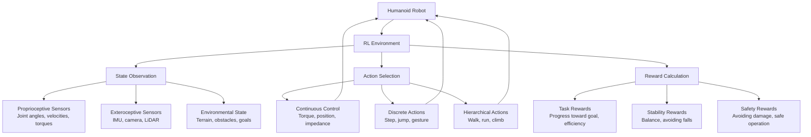

# Reinforcement Learning: Training Humanoid Robots for Complex Behaviors

## Introduction to Reinforcement Learning for Humanoids

Reinforcement Learning (RL) is a critical technology for training humanoid robots to perform complex, adaptive behaviors that would be difficult to program explicitly. Unlike traditional control approaches that rely on pre-programmed behaviors, RL enables humanoid robots to learn complex motor skills, locomotion patterns, manipulation strategies, and adaptive behaviors through trial and error.

### Why RL for Humanoids?

Humanoid robots have unique characteristics that make RL particularly valuable:

1. **High-Dimensional Action Space**: 20+ joints with continuous action spaces
2. **Dynamic Environments**: Need to adapt to changing conditions
3. **Complex Motor Skills**: Walking, running, jumping, dancing, etc.
4. **Balance Requirements**: Constant balance adjustment in dynamic situations
5. **Humanoid-Specific Challenges**: Bipedal locomotion, manipulation, interaction



## RL Fundamentals for Humanoid Robotics

### Core RL Concepts Applied to Humanoids

```python
# Example: Core RL concepts for humanoid robots
import numpy as np
import gym
from gym import spaces
import torch
import torch.nn as nn
import torch.nn.functional as F
import torch.optim as optim

class HumanoidRLBasics:
    """
    Fundamental RL concepts specifically relevant to humanoid robotics
    """
    
    def __init__(self):
        # Humanoid-specific state space
        self.state_space = {
            'joint_positions': (20,),      # 20 joint angles
            'joint_velocities': (20,),     # 20 joint velocities
            'joint_torques': (20,),        # 20 joint torques
            'body_orientation': (4,),      # IMU: quaternion
            'body_angular_velocity': (3,), # IMU: gyro
            'body_linear_velocity': (3,),  # Estimated from IMU/kinematics
            'gravity_vector': (3,),        # Gravity direction in body frame
            'com_position': (3,),          # Center of mass position
            'com_velocity': (3,),          # Center of mass velocity
            'floor_contacts': (2,)         # Left and right foot contact flags
        }
        
        # Humanoid-specific action space
        self.action_space = {
            'desired_joint_positions': (20,),   # Desired joint angles
            'desired_joint_velocities': (20,),  # Desired joint velocities (if impedance control)
            'desired_torques': (20,)            # Direct torque commands
        }
        
        # Reward function components for humanoid behaviors
        self.reward_components = [
            'tracking_reward',      # Following desired trajectory
            'stability_reward',     # Maintaining balance
            'energy_efficiency',    # Minimizing effort
            'safety_reward',        # Avoiding dangerous states
            'task_completion'       # Achieving specific goals
        ]
    
    def humanoid_state_representation(self, robot_state):
        """
        Convert raw robot state to RL-friendly state representation
        """
        # Normalize joint positions to [-1, 1]
        normalized_positions = self.normalize_joint_angles(robot_state['joint_positions'])
        
        # Normalize velocities
        normalized_velocities = np.clip(
            robot_state['joint_velocities'] / self.max_velocities, 
            -1, 1
        )
        
        # Use current vs desired positions for error-based state
        position_errors = robot_state['desired_positions'] - robot_state['joint_positions']
        normalized_errors = np.clip(position_errors / self.max_position_errors, -1, 1)
        
        # Combine state elements
        state = np.concatenate([
            normalized_positions,
            normalized_velocities,
            normalized_errors,
            robot_state['imu_orientation'],  # Already normalized as quaternion
            robot_state['imu_angular_velocity'] / self.max_ang_vel,
            robot_state['com_state'][:3] / self.max_com_deviation,  # Position only
            robot_state['contact_states'].astype(np.float32)
        ])
        
        return state
    
    def normalize_joint_angles(self, angles):
        """
        Normalize joint angles to [-1, 1] range
        """
        # Assuming joint limits are available
        normalized = np.zeros_like(angles)
        for i, angle in enumerate(angles):
            min_limit = self.joint_limits[i][0]
            max_limit = self.joint_limits[i][1]
            
            # Normalize to [-1, 1]
            normalized[i] = 2 * (angle - min_limit) / (max_limit - min_limit) - 1
            normalized[i] = np.clip(normalized[i], -1.0, 1.0)
        
        return normalized

class HumanoidRewardFunction:
    """
    Advanced reward function for humanoid robot training
    """
    
    def __init__(self, robot_config):
        self.robot_config = robot_config
        self.weights = {
            'survival': 1.0,
            'forward_progress': 10.0,
            'energy_efficiency': -0.1,
            'balance': 5.0,
            'smoothness': -0.5,
            'joint_limits': -2.0,
            'collision_penalty': -20.0
        }
    
    def compute_reward(self, state, action, next_state, done, info):
        """
        Compute comprehensive reward for humanoid training
        """
        reward = 0.0
        
        # Survival reward (staying upright)
        if not self.is_fallen(next_state):
            reward += self.weights['survival']
        
        # Forward progress reward
        forward_prog = self.compute_forward_progress(state, next_state)
        reward += self.weights['forward_progress'] * forward_prog
        
        # Energy efficiency (negative reward for high torques)
        energy_cost = np.sum(np.abs(action))  # Sum of absolute torques
        reward += self.weights['energy_efficiency'] * energy_cost
        
        # Balance reward (keeping COM within support polygon)
        balance_score = self.compute_balance_score(next_state)
        reward += self.weights['balance'] * balance_score
        
        # Smoothness penalty (discourage jerky motions)
        smoothness_penalty = self.compute_smoothness_penalty(action)
        reward += self.weights['smoothness'] * smoothness_penalty
        
        # Joint limits penalty
        joint_limits_penalty = self.compute_joint_limits_penalty(next_state)
        reward += self.weights['joint_limits'] * joint_limits_penalty
        
        # Collision penalty
        collision_penalty = self.compute_collision_penalty(next_state, info)
        reward += self.weights['collision_penalty'] * collision_penalty
        
        return reward, self.get_reward_breakdown()
    
    def is_fallen(self, state):
        """
        Determine if humanoid has fallen based on state
        """
        pelvis_pos = state['pelvis_position']
        pelvis_quat = state['pelvis_orientation']
        
        # Check if pelvis is too low (below safe threshold)
        if pelvis_pos[2] < self.robot_config['min_safe_height']:
            return True
        
        # Check if body is tilted beyond safe angle
        upright_vec = np.array([0, 0, 1])
        body_z_axis = self.quaternion_rotate_vector(pelvis_quat, upright_vec)
        tilt_angle = np.arccos(np.clip(body_z_axis[2], -1, 1))
        
        if tilt_angle > self.robot_config['max_safe_tilt']:
            return True
        
        return False
    
    def compute_forward_progress(self, state, next_state):
        """
        Compute reward based on forward progress
        """
        # Compare x-coordinate change (assuming forward is +x)
        prev_x = state['root_position'][0]
        curr_x = next_state['root_position'][0]
        
        progress = max(0, curr_x - prev_x)  # Only reward forward movement
        return progress
    
    def compute_balance_score(self, state):
        """
        Compute score based on balance maintenance
        """
        com_pos = state['com_position']
        left_foot_pos = state['left_foot_position']
        right_foot_pos = state['right_foot_position']
        
        # Calculate support polygon (simplified as segment between feet)
        support_min = min(left_foot_pos[0], right_foot_pos[0])
        support_max = max(left_foot_pos[0], right_foot_pos[0])
        support_width = support_max - support_min
        
        # Calculate margin (how far CoM is from edges)
        com_margin = min(abs(com_pos[0] - support_min), abs(com_pos[0] - support_max))
        
        # Normalize to [0, 1] based on support width
        normalized_margin = min(1.0, com_margin / (support_width / 2)) if support_width > 0 else 0.0
        
        return normalized_margin
    
    def compute_smoothness_penalty(self, action):
        """
        Penalize jerky or unstable control actions
        """
        # Variance in action torques indicates jerky motion
        torque_variance = np.var(action)
        return torque_variance
    
    def compute_joint_limits_penalty(self, state):
        """
        Compute penalty for approaching joint limits
        """
        penalties = 0
        for i, pos in enumerate(state['joint_positions']):
            lower_limit = self.robot_config['joint_limits'][i][0]
            upper_limit = self.robot_config['joint_limits'][i][1] 
            
            # Calculate normalized distance to limits (0 = at limit, 1 = far from limit)
            range_size = upper_limit - lower_limit
            if range_size == 0:
                continue
                
            # Distance from limit as fraction of total range
            if pos < lower_limit:
                dist_to_limit = 0
            elif pos > upper_limit:
                dist_to_limit = 0
            else:
                # Distance to nearest limit as fraction of range
                dist_to_lower = abs(pos - lower_limit)
                dist_to_upper = abs(upper_limit - pos)
                dist_to_limit = min(dist_to_lower, dist_to_upper) / range_size
            
            # High penalty when close to limits
            if dist_to_limit < 0.1:  # Within 10% of range from limit
                penalties += (0.1 - dist_to_limit) * 10  # Quadratic penalty
        
        return penalties
    
    def compute_collision_penalty(self, state, info):
        """
        Compute penalty for collisions
        """
        if 'collisions' in info and len(info['collisions']) > 0:
            # Collision detected
            return 1.0
        return 0.0
```

## Humanoid-Specific RL Algorithms

### Deep Deterministic Policy Gradient (DDPG) for Humanoid Control

DDPG is excellent for continuous control of humanoid robots:

```python
import torch
import torch.nn as nn
import torch.nn.functional as F
import numpy as np
import random
from collections import deque, namedtuple
import copy

class Actor(nn.Module):
    """
    Actor network for humanoid control (continuous action space)
    """
    def __init__(self, state_dim, action_dim, max_action, hidden_dims=[400, 300]):
        super(Actor, self).__init__()
        
        self.l1 = nn.Linear(state_dim, hidden_dims[0])
        self.l2 = nn.Linear(hidden_dims[0], hidden_dims[1])
        self.l3 = nn.Linear(hidden_dims[1], action_dim)
        
        self.max_action = max_action
        
    def forward(self, state):
        a = F.relu(self.l1(state))
        a = F.relu(self.l2(a))
        return self.max_action * torch.tanh(self.l3(a))

class Critic(nn.Module):
    """
    Critic network for humanoid state-action value estimation
    """
    def __init__(self, state_dim, action_dim, hidden_dims=[400, 300]):
        super(Critic, self).__init__()
        
        # Q1 architecture
        self.l1 = nn.Linear(state_dim + action_dim, hidden_dims[0])
        self.l2 = nn.Linear(hidden_dims[0], hidden_dims[1])
        self.l3 = nn.Linear(hidden_dims[1], 1)
        
        # Q2 architecture
        self.l4 = nn.Linear(state_dim + action_dim, hidden_dims[0])
        self.l5 = nn.Linear(hidden_dims[0], hidden_dims[1])
        self.l6 = nn.Linear(hidden_dims[1], 1)
        
    def forward(self, state, action):
        sa = torch.cat([state, action], 1)
        
        q1 = F.relu(self.l1(sa))
        q1 = F.relu(self.l2(q1))
        q1 = self.l3(q1)
        
        q2 = F.relu(self.l4(sa))
        q2 = F.relu(self.l5(q2))
        q2 = self.l6(q2)
        
        return q1, q2
    
    def Q1(self, state, action):
        sa = torch.cat([state, action], 1)
        
        q1 = F.relu(self.l1(sa))
        q1 = F.relu(self.l2(q1))
        q1 = self.l3(q1)
        
        return q1

class HumanoidDDPGAgent:
    """
    DDPG-based agent optimized for humanoid robot control
    """
    def __init__(
        self, 
        state_dim, 
        action_dim, 
        max_action,
        lr_actor=1e-4,
        lr_critic=1e-3,
        gamma=0.99,
        tau=0.005,
        buffer_size=int(1e6),
        batch_size=100,
        noise_std=0.2,
        noise_clip=0.5
    ):
        self.device = torch.device("cuda" if torch.cuda.is_available() else "cpu")
        
        # Networks
        self.actor = Actor(state_dim, action_dim, max_action).to(self.device)
        self.actor_target = Actor(state_dim, action_dim, max_action).to(self.device)
        self.actor_optimizer = torch.optim.Adam(self.actor.parameters(), lr=lr_actor)
        
        self.critic = Critic(state_dim, action_dim).to(self.device)
        self.critic_target = Critic(state_dim, action_dim).to(self.device)
        self.critic_optimizer = torch.optim.Adam(self.critic.parameters(), lr=lr_critic)
        
        # Copy weights to target networks
        self.actor_target.load_state_dict(self.actor.state_dict())
        self.critic_target.load_state_dict(self.critic.state_dict())
        
        # Hyperparameters
        self.gamma = gamma  # discount factor
        self.tau = tau      # target network update rate
        self.noise_std = noise_std
        self.noise_clip = noise_clip
        self.batch_size = batch_size
        
        # Replay buffer
        self.replay_buffer = ReplayBuffer(buffer_size)
        
        # Training state
        self.total_it = 0
        
    def select_action(self, state, add_noise=True):
        """
        Select action using the actor network with optional exploration noise
        """
        state = torch.FloatTensor(state).to(self.device).unsqueeze(0)
        action = self.actor(state).cpu().data.numpy().flatten()
        
        if add_noise:
            noise = np.random.normal(0, self.noise_std, size=action.shape)
            action = action + noise
            action = np.clip(action, -self.max_action, self.max_action)
        
        return action
    
    def train(self, batch_size=100):
        """
        Train the agent using a batch from the replay buffer
        """
        self.total_it += 1
        
        # Sample replay buffer
        state, action, next_state, reward, not_done = self.replay_buffer.sample(batch_size)
        
        state = torch.FloatTensor(state).to(self.device)
        action = torch.FloatTensor(action).to(self.device)
        next_state = torch.FloatTensor(next_state).to(self.device)
        reward = torch.FloatTensor(reward).to(self.device).unsqueeze(1)
        not_done = torch.FloatTensor(not_done).to(self.device).unsqueeze(1)
        
        # Compute target Q-value
        with torch.no_grad():
            next_action = self.actor_target(next_state)
            
            # Add clipped noise for target computation (TD3-style)
            noise = (torch.randn_like(next_action) * self.noise_std).clamp(-self.noise_clip, self.noise_clip)
            next_action = (next_action + noise).clamp(-self.max_action, self.max_action)
            
            target_Q1, target_Q2 = self.critic_target(next_state, next_action)
            target_Q = reward + not_done * self.gamma * torch.min(target_Q1, target_Q2)
        
        # Get current Q estimates
        current_Q1, current_Q2 = self.critic(state, action)
        
        # Compute critic loss
        critic_loss = F.mse_loss(current_Q1, target_Q) + F.mse_loss(current_Q2, target_Q)
        
        # Optimize critic
        self.critic_optimizer.zero_grad()
        critic_loss.backward()
        self.critic_optimizer.step()
        
        # Compute actor loss (we want to maximize Q, so minimize -Q)
        actor_loss = -self.critic.Q1(state, self.actor(state)).mean()
        
        # Optimize actor
        self.actor_optimizer.zero_grad()
        actor_loss.backward()
        self.actor_optimizer.step()
        
        # Update target networks
        for param, target_param in zip(self.critic.parameters(), self.critic_target.parameters()):
            target_param.data.copy_(self.tau * param.data + (1 - self.tau) * target_param.data)
        
        for param, target_param in zip(self.actor.parameters(), self.actor_target.parameters()):
            target_param.data.copy_(self.tau * param.data + (1 - self.tau) * target_param.data)

class ReplayBuffer:
    """
    Experience replay buffer for training stability
    """
    def __init__(self, max_size=int(1e6)):
        self.max_size = max_size
        self.ptr = 0
        self.size = 0
        
        self.state = None
        self.action = None
        self.next_state = None 
        self.reward = None
        self.not_done = None
        
    def add(self, state, action, next_state, reward, done):
        dim_state = len(state)
        dim_action = len(action)
        
        if self.state is None:
            self.state = np.zeros((self.max_size, dim_state))
            self.action = np.zeros((self.max_size, dim_action))
            self.next_state = np.zeros((self.max_size, dim_state))
            self.reward = np.zeros((self.max_size, 1))
            self.not_done = np.zeros((self.max_size, 1))
        
        # Store experience
        self.state[self.ptr] = state
        self.action[self.ptr] = action
        self.next_state[self.ptr] = next_state
        self.reward[self.ptr] = reward
        self.not_done[self.ptr] = 1. - done
        
        # Update pointers
        self.ptr = (self.ptr + 1) % self.max_size
        self.size = min(self.size + 1, self.max_size)
    
    def sample(self, batch_size):
        ind = np.random.randint(0, self.size, size=batch_size)
        
        return (
            self.state[ind],
            self.action[ind],
            self.next_state[ind],
            self.reward[ind],
            self.not_done[ind]
        )
```

### Soft Actor-Critic (SAC) for Sample-Efficient Learning

SAC provides better sample efficiency for humanoid learning:

```python
class GaussianPolicy(nn.Module):
    """
    Gaussian policy network (mean + log_std) for humanoid control
    """
    def __init__(self, num_inputs, num_actions, hidden_dim=256, action_space=None):
        super(GaussianPolicy, self).__init__()
        
        self.linear1 = nn.Linear(num_inputs, hidden_dim)
        self.linear2 = nn.Linear(hidden_dim, hidden_dim)

        self.mean_linear = nn.Linear(hidden_dim, num_actions)
        self.log_std_linear = nn.Linear(hidden_dim, num_actions)

        self.apply(weights_init_)

        # Action rescaling
        if action_space is None:
            self.action_scale = torch.tensor(1.)
            self.action_bias = torch.tensor(0.)
        else:
            self.action_scale = torch.FloatTensor(
                (action_space.high - action_space.low) / 2.)
            self.action_bias = torch.FloatTensor(
                (action_space.high + action_space.low) / 2.)

    def forward(self, state):
        x = F.relu(self.linear1(state))
        x = F.relu(self.linear2(x))
        
        mean = self.mean_linear(x)
        log_std = self.log_std_linear(x)
        log_std = torch.clamp(log_std, min=-20, max=2)
        
        return mean, log_std

    def sample(self, state):
        mean, log_std = self.forward(state)
        std = log_std.exp()
        normal = torch.distributions.Normal(mean, std)
        x_t = normal.rsample()  # for reparameterization trick (mean + std * N(0,1))
        y_t = torch.tanh(x_t)
        action = y_t * self.action_scale + self.action_bias
        log_prob = normal.log_prob(x_t)
        # Enforcing Action Bound
        log_prob -= torch.log(self.action_scale * (1 - y_t.pow(2)) + 1e-6)
        log_prob = log_prob.sum(1, keepdim=True)
        mean = torch.tanh(mean) * self.action_scale + self.action_bias
        return action, log_prob, mean

    def to(self, device):
        self.action_scale = self.action_scale.to(device)
        self.action_bias = self.action_bias.to(device)
        return super(GaussianPolicy, self).to(device)

class HumanoidSACAgent:
    """
    SAC-based agent for efficient humanoid learning
    """
    def __init__(
        self,
        num_inputs,
        action_space,
        lr=0.0003,
        gamma=0.99,
        tau=0.005,
        alpha=0.2,
        policy='Gaussian',
        target_update_interval=1,
        automatic_entropy_tuning=True,
        hidden_size=256,
        target_entropy=None
    ):
        self.device = torch.device("cuda" if torch.cuda.is_available() else "cpu")
        
        self.gamma = gamma
        self.tau = tau
        self.alpha = alpha

        self.target_update_interval = target_update_interval
        self.automatic_entropy_tuning = automatic_entropy_tuning
        
        # Policy network
        self.policy = GaussianPolicy(num_inputs, action_space.shape[0], hidden_size, action_space).to(self.device)
        self.policy_optimizer = optim.Adam(self.policy.parameters(), lr=lr)

        # Q-Networks
        self.critic = QNetwork(num_inputs, action_space.shape[0], hidden_size).to(self.device)
        self.critic_optim = optim.Adam(self.critic.parameters(), lr=lr)
        
        self.critic_target = QNetwork(num_inputs, action_space.shape[0], hidden_size).to(self.device)
        hard_update(self.critic_target, self.critic)

        if self.automatic_entropy_tuning:
            if target_entropy is None:
                self.target_entropy = -torch.prod(torch.Tensor(action_space.shape).to(self.device)).item()
            else:
                self.target_entropy = target_entropy
            self.log_alpha = torch.zeros(1, requires_grad=True, device=self.device)
            self.alpha_optim = optim.Adam([self.log_alpha], lr=lr)

    def select_action(self, state, evaluate=False):
        """
        Select action from policy
        """
        state = torch.FloatTensor(state).to(self.device).unsqueeze(0)
        if evaluate is False:
            action, _, _ = self.policy.sample(state)
        else:
            _, _, action = self.policy.sample(state)
        return action.detach().cpu().numpy()[0]

    def update_parameters(self, batch_size):
        """
        Update parameters of the network
        """
        # Sample a batch from memory
        state_batch, action_batch, next_state_batch, reward_batch, mask_batch = self.memory.sample(batch_size=batch_size)

        state_batch = torch.FloatTensor(state_batch).to(self.device)
        next_state_batch = torch.FloatTensor(next_state_batch).to(self.device)
        action_batch = torch.FloatTensor(action_batch).to(self.device)
        reward_batch = torch.FloatTensor(reward_batch).to(self.device).unsqueeze(1)
        mask_batch = torch.FloatTensor(mask_batch).to(self.device).unsqueeze(1)

        with torch.no_grad():
            next_state_action, next_state_log_pi, _ = self.policy.sample(next_state_batch)
            qf1_next_target, qf2_next_target = self.critic_target(next_state_batch, next_state_action)
            min_qf_next_target = torch.min(qf1_next_target, qf2_next_target) - self.alpha * next_state_log_pi
            next_q_value = reward_batch + mask_batch * self.gamma * (min_qf_next_target)

        # Two Q-functions to mitigate positive bias in the policy improvement step
        qf1, qf2 = self.critic(state_batch, action_batch)

        qf1_loss = F.mse_loss(qf1, next_q_value) # JQ = 𝔼(st,at)~D[0.5(Q1(st,at) - r(st) + γ(𝔼st+1~p[V(st+1)]))^2]
        qf2_loss = F.mse_loss(qf2, next_q_value) # JQ = 𝔼(st,at)~D[0.5(Q1(st,at) - r(st) + γ(𝔼st+1~p[V(st+1)]))^2]
        
        qf_loss = qf1_loss + qf2_loss

        self.critic_optim.zero_grad()
        qf_loss.backward()
        self.critic_optim.step()

        pi, log_pi, _ = self.policy.sample(state_batch)

        qf1_pi, qf2_pi = self.critic(state_batch, pi)
        min_qf_pi = torch.min(qf1_pi, qf2_pi)

        policy_loss = ((self.alpha * log_pi) - min_qf_pi).mean() # Jπ = 𝔼st~D,εt~N[α * logπ(f(εt;st)|st) − Q(st,f(εt;st))]

        self.policy_optimizer.zero_grad()
        policy_loss.backward()
        self.policy_optimizer.step()

        if self.automatic_entropy_tuning:
            alpha_loss = -(self.log_alpha * (log_pi + self.target_entropy).detach()).mean()

            self.alpha_optim.zero_grad()
            alpha_loss.backward()
            self.alpha_optim.step()

            self.alpha = self.log_alpha.exp()
            alpha_tlogs = self.alpha.clone() # For TensorboardX logs
        else:
            alpha_loss = torch.tensor(0.).to(self.device)
            alpha_tlogs = torch.tensor(self.alpha) # For TensorboardX logs


        if updates % self.target_update_interval == 0:
            soft_update(self.critic_target, self.critic, self.tau)

        return qf1_loss.item(), qf2_loss.item(), policy_loss.item(), alpha_loss.item(), alpha_tlogs.item()
```

## Humanoid Locomotion Learning

### Walking Gaits with RL

```python
# Example: Learning humanoid walking with RL
import numpy as np
import torch
import torch.nn as nn
import torch.nn.functional as F
import gym
from gym import spaces
import pybullet as p
import pybullet_data
import time

class HumanoidWalkingEnv(gym.Env):
    """
    Gym environment for humanoid walking learning
    """
    def __init__(self):
        super(HumanoidWalkingEnv, self).__init__()
        
        # Robot configuration
        self.robot_urdf = "humanoid.urdf"
        self.physics_client = p.connect(p.DIRECT)  # Use DIRECT for training, GUI for viz
        p.setAdditionalSearchPath(pybullet_data.getDataPath())
        p.setGravity(0, 0, -9.81)
        p.setRealTimeSimulation(0)
        
        # Load robot
        self.robot_id = p.loadURDF(
            self.robot_urdf,
            [0, 0, 1.5],  # Start above ground
            globalScaling=1,
            useFixedBase=False
        )
        
        # Define action space (torque control for all joints)
        num_actuated_joints = 20  # Assuming 20 actuated joints
        self.action_space = spaces.Box(
            low=-100.0,  # Torque limits (Nm)
            high=100.0,
            shape=(num_actuated_joints,),
            dtype=np.float32
        )
        
        # Define observation space
        obs_dim = 18 + 20 + 20 + 3 + 3 + 4  # [com_pos, joint_pos, joint_vel, lin_vel, ang_vel, imu_quat]
        self.observation_space = spaces.Box(
            low=-np.inf,
            high=np.inf,
            shape=(obs_dim,),
            dtype=np.float32
        )
        
        # Walking parameters
        self.target_velocity = 1.0  # m/s target walking speed
        self.max_episode_steps = 1000
        self.current_step = 0
        self.initial_pos = [0, 0, 1.5]
        
        # Joint information
        self.joint_indices = []
        for i in range(p.getNumJoints(self.robot_id)):
            joint_info = p.getJointInfo(self.robot_id, i)
            joint_type = joint_info[2]
            if joint_type == p.JOINT_REVOLUTE or joint_type == p.JOINT_PRISMATIC:
                self.joint_indices.append(i)
    
    def reset(self):
        """
        Reset the environment to initial state
        """
        # Reset robot to initial position and orientation
        p.resetBasePositionAndOrientation(
            self.robot_id, 
            self.initial_pos, 
            [0, 0, 0, 1]  # Default upright orientation
        )
        
        # Reset joint positions to neutral
        for idx in self.joint_indices:
            p.resetJointState(self.robot_id, idx, 0.0, 0.0)
        
        # Reset physics simulation
        p.setRealTimeSimulation(0)
        
        self.current_step = 0
        
        return self.get_observation()
    
    def step(self, action):
        """
        Execute one step of the simulation
        """
        # Apply action (torques to joints)
        p.setJointMotorControlArray(
            self.robot_id,
            self.joint_indices,
            p.TORQUE_CONTROL,
            forces=action
        )
        
        # Step simulation
        p.stepSimulation()
        
        # Get next observation
        obs = self.get_observation()
        
        # Calculate reward
        reward = self.calculate_reward(obs, action)
        
        # Check termination conditions
        done = self.check_termination(obs)
        
        # Update step count
        self.current_step += 1
        if self.current_step >= self.max_episode_steps:
            done = True
        
        # Info for debugging
        info = {
            'progress': self.get_progress(),
            'com_height': obs[2],  # Third element should be CoM height
            'fallen': not self.is_upright(obs)
        }
        
        return obs, reward, done, info
    
    def get_observation(self):
        """
        Get current observation from the robot
        """
        # Get base information (CoM position and velocity)
        base_pos, base_orn = p.getBasePositionAndOrientation(self.robot_id)
        
        # Calculate center of mass
        com_pos = self.calculate_com_position()
        com_vel = self.calculate_com_velocity()
        
        # Get IMU-like readings (orientation and angular velocity)
        angular_vel = p.getBaseVelocity(self.robot_id)[1]
        
        # Get joint states
        joint_pos = []
        joint_vel = []
        for idx in self.joint_indices:
            pos, vel, _, _ = p.getJointState(self.robot_id, idx)
            joint_pos.append(pos)
            joint_vel.append(vel)
        
        # Normalize observations
        obs = np.concatenate([
            com_pos[:2] - np.array(base_pos[:2]),  # Relative CoM x,y position
            [com_pos[2]],                          # Absolute CoM z position (height)
            joint_pos,                             # Joint positions
            joint_vel,                             # Joint velocities
            com_vel[:2],                           # CoM x,y velocity
            [com_vel[2]],                         # CoM z velocity
            list(angular_vel),                     # Angular velocities
            base_orn                                # Base orientation (quaternion)
        ])
        
        return obs.astype(np.float32)
    
    def calculate_reward(self, obs, action):
        """
        Calculate reward for the current state/action
        """
        reward = 0.0
        
        # Progress reward (moving forward)
        com_vel_x = obs[18 + 20 + 20]  # Assuming this is CoM x velocity
        progress_reward = com_vel_x * 0.1  # Weight for forward velocity
        reward += max(0, progress_reward)  # Only reward positive progress
        
        # Stability reward (maintaining upright posture)
        base_orn = obs[-4:]  # Last 4 values are orientation quaternion
        upright_reward = self.calculate_upright_reward(base_orn)
        reward += upright_reward
        
        # Energy efficiency (penalize high torques)
        energy_penalty = -0.001 * np.sum(np.square(action))
        reward += energy_penalty
        
        # Height reward (maintain reasonable height)
        com_height = obs[2]  # Third element after relative pos
        height_reward = max(0, 1.0 - abs(com_height - 0.9))  # Target height ~0.9m
        reward += height_reward
        
        # Smoothness reward (penalize sudden changes)
        if hasattr(self, '_prev_action'):
            smoothness_penalty = -0.01 * np.sum(np.square(action - self._prev_action))
            reward += smoothness_penalty
        
        self._prev_action = action.copy()
        
        return reward
    
    def calculate_upright_reward(self, quaternion):
        """
        Calculate reward based on upright posture
        """
        # Convert quaternion to z-axis direction in world
        # For an upright humanoid, z-axis should point up [0, 0, 1]
        z_axis_world = self.quat_rotate_vector(quaternion, np.array([0, 0, 1]))
        
        # Dot product with desired up direction ([0, 0, 1])
        upright_alignment = z_axis_world[2]  # z-component of the z-axis
        
        # Reward proportional to how upright the robot is (between -1 and 1)
        return upright_alignment
    
    def quat_rotate_vector(self, quat, vec):
        """
        Rotate vector by quaternion
        """
        # Convert quaternion wxyz to xyzw for pybullet compatibility
        quat_xyzw = [quat[1], quat[2], quat[3], quat[0]]  # [x,y,z,w] -> [w,x,y,z]
        
        # Use pybullet's rotation function
        rotated = p.multiplyTransforms([0,0,0], quat_xyzw, vec, [0,0,0,1])[1]
        return np.array(rotated)
    
    def calculate_com_position(self):
        """
        Calculate center of mass position
        """
        # For simplicity, approximate CoM as pelvis position
        # In a real implementation, compute weighted average of all links
        base_pos, _ = p.getBasePositionAndOrientation(self.robot_id)
        return np.array(base_pos)
    
    def calculate_com_velocity(self):
        """
        Calculate center of mass velocity
        """
        # Approximate CoM velocity as pelvis velocity
        base_vel, _ = p.getBaseVelocity(self.robot_id)
        return np.array(base_vel)
    
    def check_termination(self, obs):
        """
        Check if episode should terminate
        """
        # Check if fallen (CoM too low or body tilted too much)
        com_height = obs[2]
        if com_height < 0.6:  # Fell down
            return True
        
        # Check upright orientation
        base_orn = obs[-4:]
        is_upright = self.is_upright(base_orn)
        if not is_upright:
            return True
        
        return False
    
    def is_upright(self, quaternion):
        """
        Check if robot is in roughly upright position
        """
        z_axis_world = self.quat_rotate_vector(quaternion, np.array([0, 0, 1]))
        upright_threshold = 0.3  # Cosine of 72 degrees
        return z_axis_world[2] > upright_threshold
    
    def get_progress(self):
        """
        Get current progress measure
        """
        base_pos, _ = p.getBasePositionAndOrientation(self.robot_id)
        return np.linalg.norm([base_pos[0], base_pos[1]])  # Distance from origin

class HumanoidWalkingTrainer:
    """
    Training framework for humanoid walking
    """
    def __init__(self, env, agent, log_dir='logs'):
        self.env = env
        self.agent = agent
        self.log_dir = log_dir
        self.episode_rewards = []
        self.episode_lengths = []
        
    def train(self, total_timesteps=1e6, eval_freq=5000):
        """
        Train the humanoid walking policy
        """
        obs = self.env.reset()
        done = False
        episode_reward = 0
        episode_timesteps = 0
        total_timesteps = 0
        
        while total_timesteps < total_timesteps:
            # Select action
            action = self.agent.select_action(obs)
            
            # Perform action
            new_obs, reward, done, info = self.env.step(action)
            
            # Store experience
            done_bool = 0 if episode_timesteps + 1 == self.env.max_episode_steps else float(done)
            self.agent.replay_buffer.add(obs, action, new_obs, reward, done_bool)
            
            obs = new_obs
            episode_reward += reward
            episode_timesteps += 1
            total_timesteps += 1
            
            # Train agent
            if total_timesteps >= 10000:  # Start training after sufficient exploration
                self.agent.train(100)  # Train on batch of 100
        
            # Episode finished
            if done:
                print(f"Total T: {total_timesteps} Episode Reward: {episode_reward:.3f} Episode Len: {episode_timesteps}")
                
                # Reset environment
                obs = self.env.reset()
                self.episode_rewards.append(episode_reward)
                self.episode_lengths.append(episode_timesteps)
                
                episode_reward = 0
                episode_timesteps = 0
                
                # Periodically evaluate
                if total_timesteps % eval_freq == 0:
                    self.evaluate_policy(total_timesteps)
    
    def evaluate_policy(self, timesteps):
        """
        Evaluate the current policy
        """
        eval_episodes = 10
        avg_reward = 0
        avg_len = 0
        
        for _ in range(eval_episodes):
            obs = self.env.reset()
            done = False
            episode_reward = 0
            episode_len = 0
            
            while not done:
                # Select action (without exploration noise)
                action = self.agent.select_action(obs, add_noise=False)
                obs, reward, done, info = self.env.step(action)
                episode_reward += reward
                episode_len += 1
            
            avg_reward += episode_reward
            avg_len += episode_len
        
        avg_reward /= eval_episodes
        avg_len /= eval_episodes
        
        print(f"Evaluation: Timesteps {timesteps}, Avg Reward: {avg_reward:.3f}, Avg Length: {avg_len:.1f}")
        
        # Save evaluation results
        self.save_evaluation_results(timesteps, avg_reward, avg_len)
    
    def save_evaluation_results(self, timesteps, avg_reward, avg_len):
        """
        Save evaluation results
        """
        import os
        os.makedirs(self.log_dir, exist_ok=True)
        
        # Save to CSV or tensorboard
        # Implementation depends on logging framework
        pass
```

## Transfer Learning and Sim-to-Real

### Domain Randomization for Robust Humanoid Control

```python
class DomainRandomization:
    """
    Domain randomization techniques for sim-to-real transfer in humanoid RL
    """
    def __init__(self):
        # Physical property randomization ranges
        self.mass_randomization = {
            'enabled': True,
            'range_factor': 0.2,  # ±20% mass variation
            'correlation': 0.8    # How masses of connected links change together
        }
        
        self.friction_randomization = {
            'enabled': True,
            'range': [0.5, 1.5],  # Range for friction coefficient
            'texture_effect': 0.3 # Variation due to surface texture
        }
        
        self.motor_randomization = {
            'enabled': True,
            'delay_range': [0.01, 0.03],    # 10-30ms actuator delays
            'noise_std': 0.05,              # 5% torque noise
            'bias_range': [-0.1, 0.1],      # ±10% torque bias
            'saturation_prob': 0.01         # Probability of saturation
        }
        
        self.sensor_randomization = {
            'enabled': True,
            'camera_noise': 0.02,           # 2% pixel noise
            'imu_bias_range': [-0.01, 0.01], # ±0.01 rad/s/s IMU bias
            'imu_noise_std': 0.001,         # IMU noise standard deviation
            'delay_range': [0.005, 0.02]    # 5-20ms sensor delays
        }
    
    def randomize_environment(self, env):
        """
        Apply domain randomization to an environment
        """
        # Randomize physical properties
        if self.mass_randomization['enabled']:
            self.randomize_masses(env)
        
        if self.friction_randomization['enabled']:
            self.randomize_friction(env)
        
        # Randomize actuator properties
        if self.motor_randomization['enabled']:
            self.randomize_motors(env)
        
        # Randomize sensor properties
        if self.sensor_randomization['enabled']:
            self.randomize_sensors(env)
        
        return env
    
    def randomize_masses(self, env):
        """
        Randomize robot masses for robustness
        """
        if not hasattr(env, 'robot_id'):
            return
        
        robot_id = env.robot_id
        base_mass, inertia = p.getDynamicsInfo(robot_id, -1)[:2]
        
        # Apply randomization factor to base
        random_factor = 1.0 + np.random.uniform(
            -self.mass_randomization['range_factor'], 
            self.mass_randomization['range_factor']
        )
        
        # Apply to robot base
        p.changeDynamics(robot_id, -1, mass=base_mass * random_factor)
        
        # Apply to individual links, maintaining correlation
        for i in range(p.getNumJoints(robot_id)):
            link_mass, link_inertia = p.getDynamicsInfo(robot_id, i)[:2]
            
            # Apply correlated mass variation
            correlation_factor = self.mass_randomization['correlation']
            rand_factor = (random_factor * correlation_factor + 
                          (1 - correlation_factor) * np.random.uniform(
                              -self.mass_randomization['range_factor'],
                              self.mass_randomization['range_factor']))
            
            p.changeDynamics(robot_id, i, mass=link_mass * max(0.1, 1.0 + rand_factor))
    
    def randomize_motors(self, env):
        """
        Randomize actuator properties
        """
        if not hasattr(env, 'robot_id'):
            return
        
        # In simulation, we can't directly randomize physical motors
        # Instead, we simulate these effects in the control loop
        
        # Store randomization parameters that will be applied during control
        env.motor_delays = {}
        env.motor_biases = {}
        env.motor_noises = {}
        
        for i in range(p.getNumJoints(env.robot_id)):
            joint_info = p.getJointInfo(env.robot_id, i)
            joint_type = joint_info[2]
            
            if joint_type in [p.JOINT_REVOLUTE, p.JOINT_PRISMATIC]:
                # Randomize delays
                delay = np.random.uniform(*self.motor_randomization['delay_range'])
                env.motor_delays[i] = delay
                
                # Randomize biases
                bias = np.random.uniform(*self.motor_randomization['bias_range'])
                env.motor_biases[i] = bias
                
                # Randomize noise characteristic
                noise_std = self.motor_randomization['noise_std']
                env.motor_noises[i] = noise_std
    
    def apply_motor_effects(self, env, base_action):
        """
        Apply motor randomization effects to actions
        """
        action_with_effects = base_action.copy()
        
        for i, action in enumerate(action_with_effects):
            # Apply delay simulation (simplified: add noise based on delay)
            if i in env.motor_delays:
                delay_effect = env.motor_delays[i] * np.random.normal(0, 0.1)
                action_with_effects[i] += delay_effect
            
            # Apply bias
            if i in env.motor_biases:
                action_with_effects[i] += env.motor_biases[i]
            
            # Apply noise
            if i in env.motor_noises:
                noise = np.random.normal(0, env.motor_noises[i])
                action_with_effects[i] += noise
        
        return action_with_effects
```

## Hierarchical RL for Complex Humanoid Behaviors

### Task Decomposition and Skill Learning

```python
class HumanoidHierarchicalRL:
    """
    Hierarchical reinforcement learning for complex humanoid behaviors
    """
    def __init__(self, state_dim, action_dim, skill_dim=10, max_skills=50):
        self.state_dim = state_dim
        self.action_dim = action_dim
        self.skill_dim = skill_dim
        self.max_skills = max_skills
        
        # Skill discovery network
        self.skill_encoder = SkillEncoder(state_dim, skill_dim)
        self.skill_decoder = SkillDecoder(skill_dim, state_dim)
        
        # High-level policy (chooses skills)
        self.option_policy = OptionPolicy(state_dim, max_skills)
        
        # Low-level policies (execute skills)
        self.skill_policies = {}
        for skill_id in range(max_skills):
            self.skill_policies[skill_id] = SkillPolicy(state_dim, action_dim)
        
        # Skill termination function
        self.terminations = {}
        for skill_id in range(max_skills):
            self.terminations[skill_id] = TerminationFunction(state_dim)
        
        # Skill library
        self.skill_library = SkillLibrary()
        
        # Training parameters
        self.current_skill = 0
        self.skill_duration = 0
        self.max_skill_duration = 100  # Timesteps
    
    def select_option(self, state):
        """
        Select which skill to execute based on current state
        """
        # Get skill probabilities
        skill_probs = self.option_policy(state)
        skill_id = torch.multinomial(skill_probs, 1).item()
        
        return skill_id
    
    def execute_skill(self, state, skill_id):
        """
        Execute a specific skill
        """
        # Get low-level action from skill policy
        action = self.skill_policies[skill_id](state)
        
        # Check if skill should terminate
        termination_prob = self.terminations[skill_id](state)
        
        # Return action and whether to continue skill
        continue_skill = torch.bernoulli(termination_prob).item() == 0
        
        return action, continue_skill

class SkillEncoder(nn.Module):
    """
    Encodes state sequences into skill representations
    """
    def __init__(self, state_dim, skill_dim):
        super().__init__()
        self.net = nn.Sequential(
            nn.Linear(state_dim * 10, 256),  # 10 timesteps of state history
            nn.ReLU(),
            nn.Linear(256, 256),
            nn.ReLU(),
            nn.Linear(256, skill_dim)
        )
    
    def forward(self, state_history):
        """
        Encode state history to skill representation
        """
        batch_size = state_history.size(0)
        encoded = self.net(state_history.view(batch_size, -1))
        return encoded

class SkillDecoder(nn.Module):
    """
    Decodes skill representation back to expected state transitions
    """
    def __init__(self, skill_dim, state_dim):
        super().__init__()
        self.net = nn.Sequential(
            nn.Linear(skill_dim, 256),
            nn.ReLU(),
            nn.Linear(256, 256),
            nn.ReLU(),
            nn.Linear(256, state_dim)
        )
    
    def forward(self, skill_code):
        """
        Decode skill to expected next state
        """
        predicted_state = self.net(skill_code)
        return predicted_state

class OptionPolicy(nn.Module):
    """
    High-level policy that selects which low-level skill to execute
    """
    def __init__(self, state_dim, num_options):
        super().__init__()
        self.net = nn.Sequential(
            nn.Linear(state_dim, 256),
            nn.ReLU(),
            nn.Linear(256, 256),
            nn.ReLU(),
            nn.Linear(256, num_options)
        )
    
    def forward(self, state):
        """
        Get probabilities for each skill
        """
        logits = self.net(state)
        return F.softmax(logits, dim=-1)

class SkillPolicy(nn.Module):
    """
    Low-level policy for executing a specific skill
    """
    def __init__(self, state_dim, action_dim):
        super().__init__()
        self.net = nn.Sequential(
            nn.Linear(state_dim, 256),
            nn.ReLU(),
            nn.Linear(256, 256),
            nn.ReLU(),
            nn.Linear(256, action_dim)
        )
    
    def forward(self, state):
        """
        Get action for executing this skill
        """
        action = torch.tanh(self.net(state))  # Actions normalized to [-1, 1]
        return action

class TerminationFunction(nn.Module):
    """
    Determines when a skill should terminate
    """
    def __init__(self, state_dim):
        super().__init__()
        self.net = nn.Sequential(
            nn.Linear(state_dim, 128),
            nn.ReLU(),
            nn.Linear(128, 64),
            nn.ReLU(),
            nn.Linear(64, 1),
            nn.Sigmoid()  # Probability of continuing
        )
    
    def forward(self, state):
        """
        Get probability of continuing current skill
        """
        continue_prob = self.net(state)
        return continue_prob

class SkillLibrary:
    """
    Manages learned skills and enables skill composition
    """
    def __init__(self):
        self.skills = {}
        self.descriptions = {}
        self.prerequisites = {}
        self.compositions = {}
    
    def add_skill(self, skill_id, policy_network, description="", prerequisites=[]):
        """
        Add a learned skill to the library
        """
        self.skills[skill_id] = policy_network
        self.descriptions[skill_id] = description
        self.prerequisites[skill_id] = prerequisites
    
    def compose_skills(self, skill_sequence, composite_name):
        """
        Create a composite skill from a sequence of simpler skills
        """
        self.compositions[composite_name] = skill_sequence
    
    def execute_composite_skill(self, composite_name, state, env):
        """
        Execute a composite skill
        """
        if composite_name not in self.compositions:
            raise ValueError(f"Composite skill {composite_name} not found")
        
        skill_sequence = self.compositions[composite_name]
        
        for skill_id in skill_sequence:
            # Execute each skill in sequence
            skill_policy = self.skills[skill_id]
            action = skill_policy(state)
            
            # Apply action and get next state
            next_state, reward, done, info = env.step(action)
            
            if done:
                break
            
            state = next_state
        
        return state, reward, done, info

# Example: Learning a dance routine using hierarchical RL
class DanceRoutineTrainer:
    """
    Train humanoid robot to perform dance routines using hierarchical RL
    """
    def __init__(self, env, hier_rl_agent):
        self.env = env
        self.agent = hier_rl_agent
        
        # Define dance moves as skills
        self.dance_skills = {
            'step_left': 0,
            'step_right': 1, 
            'raise_arms': 2,
            'spin': 3,
            'jump': 4,
            'wave': 5
        }
        
        # Define dance sequences
        self.dance_sequences = {
            'waltz': ['step_left', 'step_right', 'raise_arms'],
            'twist': ['spin', 'step_left', 'wave'],
            'jazz_square': ['step_left', 'step_right', 'step_left', 'raise_arms']
        }
    
    def train_individual_skills(self):
        """
        Train each dance move as a separate skill
        """
        for skill_name, skill_id in self.dance_skills.items():
            print(f"Training skill: {skill_name} (ID: {skill_id})")
            
            # Modify environment to reward this specific skill
            self.setup_skill_training_env(skill_name)
            
            # Train the skill-specific policy
            self.train_specific_skill(skill_id, skill_name)
    
    def setup_skill_training_env(self, skill_name):
        """
        Set up environment rewards for specific skill learning
        """
        # This would modify the reward function to emphasize skill-specific objectives
        # For example, for 'spin' skill, reward angular momentum around vertical axis
        pass
    
    def train_specific_skill(self, skill_id, skill_name):
        """
        Train a specific skill using RL
        """
        # Temporarily assign skill-specific reward function
        original_reward_func = self.env.calculate_reward
        
        def skill_reward(obs, action):
            # Skill-specific reward computation
            if skill_name == 'spin':
                return self.calculate_spin_reward(obs)
            elif skill_name == 'jump':
                return self.calculate_jump_reward(obs)
            elif skill_name == 'wave':
                return self.calculate_wave_reward(obs, action)
            else:
                return 0.0  # Default reward
        
        self.env.calculate_reward = skill_reward
        
        # Train the skill-specific policy
        # (Training code would go here - using PPO, SAC, etc.)
        
        # Restore original reward function
        self.env.calculate_reward = original_reward_func
    
    def train_composite_behavior(self, sequence_name):
        """
        Train a sequence of skills to form a composite behavior
        """
        if sequence_name not in self.dance_sequences:
            raise ValueError(f"Sequence {sequence_name} not defined")
        
        sequence = self.dance_sequences[sequence_name]
        
        # Train the high-level policy to sequence skills appropriately
        for skill_name in sequence:
            skill_id = self.dance_skills[skill_name]
            # The agent learns when to switch between skills
            pass
        
        print(f"Trained composite behavior: {sequence_name}")
```

## Safety-Conscious RL for Humanoids

### Safe Exploration and Learning

```python
class SafeRLFramework:
    """
    Framework for safe RL in humanoid robotics
    """
    def __init__(self, env, agent):
        self.env = env
        self.agent = agent
        
        # Safety constraints
        self.safety_constraints = {
            'torque_limits': True,
            'joint_position_limits': True,
            'balance_limits': True,
            'collision_avoidance': True,
            'velocity_limits': True
        }
        
        # Constraint violation penalties
        self.ConstraintPenalties = {
            'torque_violation': -10.0,
            'position_violation': -10.0,
            'balance_violation': -20.0,
            'collision': -50.0,
            'fall': -100.0
        }
    
    def safe_action_selection(self, state):
        """
        Select actions that respect safety constraints
        """
        original_action = self.agent.select_action(state)
        
        # Project action to satisfy constraints
        safe_action = self.project_to_safe_space(state, original_action)
        
        return safe_action
    
    def project_to_safe_space(self, state, action):
        """
        Project action to satisfy safety constraints
        """
        projected_action = action.copy()
        
        # Apply torque limits
        if self.safety_constraints['torque_limits']:
            max_torques = self.get_max_joint_torques()
            projected_action = np.clip(projected_action, -max_torques, max_torques)
        
        # Apply joint position limits indirectly by penalizing unsafe regions
        if self.safety_constraints['joint_position_limits']:
            projected_action = self.avoid_position_limits(state, projected_action)
        
        # Apply balance constraints
        if self.safety_constraints['balance_limits']:
            projected_action = self.maintain_balance(state, projected_action)
        
        return projected_action
    
    def get_max_joint_torques(self):
        """
        Get maximum torques for each joint
        """
        max_torques = []
        for i in range(p.getNumJoints(self.env.robot_id)):
            joint_info = p.getJointInfo(self.env.robot_id, i)
            joint_max_torque = joint_info[10]  # Max effort is at index 10
            max_torques.append(joint_max_torque if joint_max_torque > 0 else 100.0)
        
        return np.array(max_torques)
    
    def avoid_position_limits(self, state, action):
        """
        Modify action to avoid approaching joint position limits
        """
        current_positions = state[self.get_joint_pos_indices()]  # Extract joint positions from state
        
        for i, pos in enumerate(current_positions):
            if i < len(self.env.joint_limits):
                lower_limit, upper_limit = self.env.joint_limits[i]
                
                # Calculate distance to limits (0.1 = 10% of range threshold)
                range_size = upper_limit - lower_limit
                if range_size > 0.001:  # Avoid division by zero
                    dist_to_lower = (pos - lower_limit) / range_size
                    dist_to_upper = (upper_limit - pos) / range_size
                    
                    # Reduce torque in direction toward violated limit
                    if dist_to_lower < 0.1:  # Too close to lower limit
                        if action[i] < 0:
                            action[i] = max(0, action[i] * (dist_to_lower / 0.1))
                    elif dist_to_upper < 0.1:  # Too close to upper limit
                        if action[i] > 0:
                            action[i] = min(0, action[i] * (dist_to_upper / 0.1))
        
        return action
    
    def maintain_balance(self, state, action):
        """
        Modify action to maintain balance
        """
        # Calculate center of mass position and velocity
        com_pos = state[:3]  # Assuming first elements are CoM position
        com_vel = state[15:18]  # Assuming CoM velocity at index 15-17
        
        # Calculate support polygon (simplified as rectangle under feet)
        left_foot_pos = state[6:9]  # Example indices
        right_foot_pos = state[9:12]  # Example indices
        
        # Calculate if CoM is about to leave support area
        support_center_x = (left_foot_pos[0] + right_foot_pos[0]) / 2
        support_width = abs(left_foot_pos[0] - right_foot_pos[0])
        
        com_margin = abs(com_pos[0] - support_center_x) - support_width / 2
        
        # If CoM is close to leaving support, modify action to restore balance
        if com_margin > 0.05:  # Margin threshold (5cm)
            # Calculate corrective torque based on CoM position
            corrective_torque = -np.sign(com_pos[0] - support_center_x) * min(com_margin * 500, 10)  # Proportional control
            
            # Apply corrective torque to hip joints (example indices)
            hip_joints = [3, 4, 5]  # Example hip joint indices
            for joint_idx in hip_joints:
                if joint_idx < len(action):
                    action[joint_idx] += corrective_torque
        
        return action
    
    def evaluate_safety_compliance(self, state, action, next_state):
        """
        Evaluate whether action violated any safety constraints
        """
        violations = []
        
        # Check torque limits
        max_torques = self.get_max_joint_torques()
        for i, torque in enumerate(action):
            if abs(torque) > max_torques[i]:
                violations.append(('torque_violation', i, torque, max_torques[i]))
        
        # Check joint position limits
        joint_positions = next_state[self.get_joint_pos_indices()]
        for i, pos in enumerate(joint_positions):
            if i < len(self.env.joint_limits):
                lower_limit, upper_limit = self.env.joint_limits[i]
                if pos < lower_limit or pos > upper_limit:
                    violations.append(('position_violation', i, pos, (lower_limit, upper_limit)))
        
        # Check balance
        if not self.is_balanced(next_state):
            violations.append(('balance_violation', None, None, None))
        
        # Check for collisions
        if self.has_collision_occurred(next_state):
            violations.append(('collision', None, None, None))
        
        # Check for fall
        if self.has_fallen(next_state):
            violations.append(('fall', None, None, None))
        
        return violations
    
    def is_balanced(self, state):
        """
        Check if humanoid is in balanced state
        """
        com_pos = state[2]  # Example CoM height
        com_x = state[0]    # Example CoM x position
        
        # Check if CoM is above support polygon
        left_foot_x = state[6]   # Example left foot x position
        right_foot_x = state[9]  # Example right foot x position
        
        support_min = min(left_foot_x, right_foot_x)
        support_max = max(left_foot_x, right_foot_x)
        
        # Check if CoM is within support polygon with some margin
        margin = 0.1  # 10cm margin
        return (support_min - margin <= com_x <= support_max + margin and 
                com_pos > 0.5)  # Minimum height to be considered upright
    
    def has_collision_occurred(self, state):
        """
        Check if collision occurred in this step
        """
        # This would check PyBullet's collision information
        # For now, return a placeholder
        return False
    
    def has_fallen(self, state):
        """
        Check if humanoid has fallen
        """
        com_height = state[2]  # Example CoM z position
        return com_height < 0.5  # Fallen if CoM below 0.5m
    
    def get_joint_pos_indices(self):
        """
        Get the indices in the state vector that correspond to joint positions
        """
        # This should return the slice or list of indices where joint positions are stored
        # For this example, we'll assume joint positions start at index 18 and there are 20 joints
        start_idx = 18
        return slice(start_idx, start_idx + 20)
```

## Integration with Isaac Sim and Isaac ROS

### Sim-to-Real Transfer Pipeline

```python
# Example: Integration with Isaac Sim for physics-accurate simulation
import omni
from omni.isaac.core import World
from omni.isaac.core.utils.stage import add_reference_to_stage
from omni.isaac.core.robots import Robot
from omni.isaac.core.articulations import ArticulationView
from omni.isaac.core.objects import DynamicCuboid
from omni.isaac.sensor import Camera
import torch

class IsaacSimHumanoidRL:
    """
    RL training in Isaac Sim for humanoid robots
    """
    def __init__(self):
        # Initialize Isaac Sim world
        self.world = World(stage_units_in_meters=1.0)
        
        # Load humanoid robot
        self.robot_path = "/World/HumanoidRobot"
        self.robot = self.world.scene.add(
            Robot(
                prim_path=self.robot_path,
                name="humanoid_robot",
                usd_path="path/to/humanoid.usd",
                position=[0.0, 0.0, 1.0],
                orientation=[0.0, 0.0, 0.0, 1.0]
            )
        )
        
        # Initialize sensors
        self.setup_sensors()
        
        # Initialize RL agent
        self.rl_agent = HumanoidSACAgent(
            num_inputs=60,  # Example state dimension
            action_space=spaces.Box(low=-1.0, high=1.0, shape=(20,)),  # 20 joints
        )
        
        # Initialize domain randomization
        self.domain_rand = DomainRandomization()
        
        # Training parameters
        self.training_steps = 1000000
        self.eval_freq = 5000
        self.max_episode_length = 1000
        
    def setup_sensors(self):
        """
        Setup robot sensors in Isaac Sim
        """
        # Add IMU to torso
        self.torso_imu = self.world.scene.add_sensor(
            name="torso_imu",
            path=f"{self.robot_path}/torso",
            sensor_type="Imu"
        )
        
        # Add feet contact sensors
        self.left_foot_contact = self.world.scene.add_sensor(
            name="left_foot_contact",
            path=f"{self.robot_path}/left_foot",
            sensor_type="ContactSensor"
        )
        
        self.right_foot_contact = self.world.scene.add_sensor(
            name="right_foot_contact", 
            path=f"{self.robot_path}/right_foot",
            sensor_type="ContactSensor"
        )
        
        # Add camera for visual perception
        self.head_camera = Camera(
            prim_path=f"{self.robot_path}/head_camera",
            frequency=30,
            resolution=(640, 480)
        )
    
    def get_observation(self):
        """
        Get observation from Isaac Sim sensors
        """
        # Get robot state
        positions, velocities = self.robot.get_joints_state()
        imus = self.torso_imu.get_measured_value()
        contacts = {
            'left': self.left_foot_contact.get_measured_value(),
            'right': self.right_foot_contact.get_measured_value()
        }
        
        # Get camera data (if needed)
        camera_rgb = self.head_camera.get_rgb()
        
        # Combine into observation vector
        obs_elements = [
            positions,           # Joint positions
            velocities,          # Joint velocities  
            imus['position'],    # IMU position
            imus['orientation'], # IMU orientation
            contacts['left'],    # Left foot contact
            contacts['right'],   # Right foot contact
        ]
        
        observation = np.concatenate(obs_elements).astype(np.float32)
        return observation
    
    def apply_action(self, action):
        """
        Apply action to Isaac Sim robot
        """
        # Convert action to joint commands (positions, velocities, or torques)
        # depending on control mode
        
        # Example: torque control
        self.robot.apply_torques(action)
    
    def train(self):
        """
        Train humanoid policy in Isaac Sim
        """
        self.world.reset()
        self.robot.initialize()
        
        episode_reward = 0
        episode_steps = 0
        
        for step in range(self.training_steps):
            # Get current observation
            obs = self.get_observation()
            
            # Apply domain randomization
            randomized_env = self.domain_rand.randomize_environment(self.world)
            
            # Select action using RL policy
            action = self.rl_agent.select_action(obs, evaluate=False)
            
            # Apply action to simulation
            self.apply_action(action)
            
            # Step simulation
            self.world.step(render=False)
            
            # Get reward and check termination
            reward = self.compute_reward(obs, action)
            done = self.check_termination()
            
            # Store transition in replay buffer
            if hasattr(self, '_prev_obs'):
                self.rl_agent.replay_buffer.add(
                    self._prev_obs, action, obs, reward, done
                )
            
            self._prev_obs = obs.copy()
            episode_reward += reward
            episode_steps += 1
            
            # Train agent
            if step > 10000:  # Start training after warmup
                self.rl_agent.update_parameters(batch_size=256)
            
            # Check for episode termination
            if done or episode_steps >= self.max_episode_length:
                print(f"Episode finished - Steps: {episode_steps}, Reward: {episode_reward:.2f}")
                
                # Reset for new episode
                self.world.reset()
                episode_reward = 0
                episode_steps = 0
            
            # Evaluation
            if step % self.eval_freq == 0:
                self.evaluate_policy(step)
    
    def compute_reward(self, obs, action):
        """
        Compute reward for Isaac Sim humanoid
        """
        # Implement humanoid-specific reward function
        pelvis_pos = obs[0:3]  # Example: first elements are pelvis position
        pelvis_vel = obs[3:6]  # Example: next elements are pelvis velocity
        
        # Reward forward progress
        forward_reward = pelvis_vel[0] * 1.0  # Move forward
        
        # Reward upright posture
        orientation = obs[6:10]  # Example: quaternion
        upright_reward = orientation[3]  # w component of quaternion (uprightness)
        
        # Penalize excessive torques
        torque_penalty = -0.001 * np.sum(np.square(action))
        
        # Penalize deviation from desired height
        desired_height = 0.9
        height_penalty = -1.0 * abs(pelvis_pos[2] - desired_height)
        
        total_reward = forward_reward + upright_reward + torque_penalty + height_penalty
        return max(0.1, total_reward)  # Ensure positive rewards
    
    def check_termination(self):
        """
        Check if episode should terminate
        """
        # Get current robot state
        root_pos, root_orn = self.robot.get_world_poses()
        
        # Check fall condition
        if root_pos[2] < 0.5:  # Too low (fell down)
            return True
            
        # Check if too tilted
        import tf_transformations
        euler = tf_transformations.euler_from_quaternion(root_orn)
        roll, pitch, yaw = euler
        
        max_tilt = np.radians(30)  # 30 degrees max tilt
        if abs(roll) > max_tilt or abs(pitch) > max_tilt:
            return True
        
        return False
    
    def evaluate_policy(self, step):
        """
        Evaluate current policy
        """
        self.world.reset()
        episode_returns = []
        episode_lengths = []
        
        for eval_ep in range(10):  # Evaluate for 10 episodes
            ep_return = 0
            ep_length = 0
            
            for t in range(self.max_episode_length):
                obs = self.get_observation()
                action = self.rl_agent.select_action(obs, evaluate=True)  # No noise
                self.apply_action(action)
                self.world.step(render=False)
                
                reward = self.compute_reward(obs, action)
                done = self.check_termination()
                
                ep_return += reward
                ep_length += 1
                
                if done:
                    break
            
            episode_returns.append(ep_return)
            episode_lengths.append(ep_length)
        
        mean_return = np.mean(episode_returns)
        mean_length = np.mean(episode_lengths)
        
        print(f"Evaluation at step {step}: Mean return = {mean_return:.2f}, Mean length = {mean_length:.1f}")
```

## Advanced Training Techniques

### Curriculum Learning for Humanoid Skills

```python
class CurriculumLearningFramework:
    """
    Curriculum learning for progressively complex humanoid skills
    """
    def __init__(self, base_env):
        self.base_env = base_env
        self.curriculum_levels = []
        self.current_level = 0
        self.level_thresholds = []  # Performance thresholds to advance
    
    def setup_locomotion_curriculum(self):
        """
        Set up curriculum for learning to walk
        """
        self.curriculum_levels = [
            {
                'name': 'balance_training',
                'description': 'Learn to maintain standing balance',
                'env_modifier': self.modify_for_balance_training,
                'success_threshold': 0.8,  # 80% success rate
                'episode_budget': 50000,
                'eval_metric': 'balance_success_rate'
            },
            {
                'name': 'stepping_training', 
                'description': 'Learn to take individual steps',
                'env_modifier': self.modify_for_stepping_training,
                'success_threshold': 0.7,
                'episode_budget': 100000,
                'eval_metric': 'step_success_rate'
            },
            {
                'name': 'walking_training',
                'description': 'Learn to walk forward',
                'env_modifier': self.modify_for_walking_training,
                'success_threshold': 0.75,
                'episode_budget': 200000,
                'eval_metric': 'walking_speed'
            },
            {
                'name': 'robust_walking',
                'description': 'Walk with perturbations',
                'env_modifier': self.modify_for_robust_walking,
                'success_threshold': 0.85,
                'episode_budget': 300000,
                'eval_metric': 'perturbation_recovery'
            }
        ]
    
    def modify_for_balance_training(self, env):
        """
        Modify environment for balance training
        """
        # Reduce gravity to make balance easier initially
        p.setGravity(0, 0, -2.0)  # Reduced gravity (20% of normal)
        
        # Provide gentle support (virtual springs to upright position)  
        env.balance_support_enabled = True
        env.balance_support_strength = 0.1
        
        # Simplified reward - just staying upright
        def balance_reward(obs, action):
            base_orn = obs[-4:]  # Last 4 elements are orientation quaternion
            upright_alignment = self.calculate_upright_reward(base_orn)
            return upright_alignment
        
        env.calculate_reward = balance_reward
    
    def modify_for_stepping_training(self, env):
        """
        Modify environment for stepping training
        """
        # Resume normal gravity
        p.setGravity(0, 0, -9.81)
        env.balance_support_enabled = False
        
        # Simplified walking task - just learn to move legs
        def stepping_reward(obs, action):
            # Reward coordinated leg movement
            left_leg_joints = [3, 4, 5]  # Example indices
            right_leg_joints = [6, 7, 8]  # Example indices
            
            left_pos = [obs[i] for i in left_leg_joints]
            right_pos = [obs[i] for i in right_leg_joints]
            
            # Encourage alternating leg movement
            coordination_bonus = self.encourage_alternating_movement(left_pos, right_pos, obs)
            
            # Still reward balance
            base_orn = obs[-4:]
            balance_reward = self.calculate_upright_reward(base_orn)
            
            return coordination_bonus + balance_reward * 0.5
        
        env.calculate_reward = stepping_reward
    
    def modify_for_walking_training(self, env):
        """
        Modify environment for walking training
        """
        # Add forward velocity incentive
        def walking_reward(obs, action):
            # Reward forward progress
            com_vel_x = obs[18 + 20 + 20]  # Example CoM x velocity
            forward_reward = max(0, com_vel_x * 0.5)
            
            # Reward efficiency
            energy_penalty = -0.001 * np.sum(np.square(action))
            
            # Reward balance
            base_orn = obs[-4:]
            balance_reward = self.calculate_upright_reward(base_orn)
            
            return forward_reward + energy_penalty + balance_reward
        
        env.calculate_reward = walking_reward
    
    def modify_for_robust_walking(self, env):
        """
        Modify environment for robust walking with perturbations
        """
        env.perturbation_generator = self.create_perturbation_generator()
        
        def robust_walking_reward(obs, action):
            # Same as walking plus recovery from perturbations
            base_result = self.walking_training(None, env)  # Get base walking reward
            
            # Bonus for recovering from perturbations
            recovery_bonus = self.calculate_recovery_bonus(obs)
            
            return base_result + recovery_bonus
        
        env.calculate_reward = robust_walking_reward
    
    def train_curriculum(self):
        """
        Train through the curriculum levels
        """
        for level_idx, level_info in enumerate(self.curriculum_levels):
            print(f"Starting curriculum level: {level_info['name']}")
            
            # Modify environment for this level
            level_info['env_modifier'](self.base_env)
            
            # Train for this level's episode budget
            episodes_trained = 0
            performance_history = []
            
            while episodes_trained < level_info['episode_budget']:
                # Train policy
                episode_result = self.train_single_episode()
                
                # Track performance
                perf_metric = self.evaluate_performance_metric(
                    level_info['eval_metric'], 
                    episode_result
                )
                
                performance_history.append(perf_metric)
                
                # Check if threshold reached
                if len(performance_history) >= 100:  # Check every 100 episodes
                    recent_avg = np.mean(performance_history[-100:])
                    if recent_avg >= level_info['success_threshold']:
                        print(f"Level {level_info['name']} passed with performance {recent_avg:.3f}")
                        break
                
                episodes_trained += 1
            
            # Move to next level
            self.current_level = level_idx + 1
            if self.current_level >= len(self.curriculum_levels):
                print("Curriculum completed!")
                break
```

## Performance Optimization and Best Practices

### Efficient Training Strategies

```python
class EfficientTrainingStrategies:
    """
    Performance optimization techniques for humanoid RL
    """
    
    @staticmethod
    def parallel_training(num_envs=16):
        """
        Set up parallel environments for faster training
        """
        import multiprocessing as mp
        from concurrent.futures import ProcessPoolExecutor
        
        def create_env_process(env_id):
            # Create individual environment with different seed
            env = HumanoidWalkingEnv()
            env.seed(env_id)
            return env_id, env
        
        with ProcessPoolExecutor(max_workers=num_envs) as executor:
            futures = [executor.submit(create_env_process, i) for i in range(num_envs)]
            envs = [future.result()[1] for future in futures]
        
        return envs
    
    @staticmethod
    def adaptive_sampling(replay_buffer, priority_exponent=0.6, importance_sampling=0.4):
        """
        Use prioritized experience replay for more efficient learning
        """
        # This would be implemented in the replay buffer
        # For now, indicating the concept
        pass
    
    @staticmethod
    def action_repeat(action, repeat_times=4):
        """
        Repeat actions to reduce control frequency (can be beneficial for sim-real transfer)
        """
        repeated_actions = []
        for _ in range(repeat_times):
            repeated_actions.append(action)
        return repeated_actions

# Memory optimization techniques
class MemoryEfficientReplayBuffer:
    """
    Memory-efficient replay buffer for humanoid training
    """
    def __init__(self, max_size=int(1e6), obs_shape=(60,), act_shape=(20,)):
        self.max_size = max_size
        self.ptr = 0
        self.size = 0
        
        # Pre-allocate numpy arrays instead of lists to save memory
        self.obs_buf = np.zeros((max_size,) + obs_shape, dtype=np.float32)
        self.act_buf = np.zeros((max_size,) + act_shape, dtype=np.float32)
        self.rew_buf = np.zeros((max_size, 1), dtype=np.float32)
        self.next_obs_buf = np.zeros((max_size,) + obs_shape, dtype=np.float32)
        self.done_buf = np.zeros((max_size, 1), dtype=np.float32)
    
    def add(self, obs, act, rew, next_obs, done):
        """
        Add experience to buffer in a memory-efficient way
        """
        self.obs_buf[self.ptr] = obs
        self.act_buf[self.ptr] = act
        self.rew_buf[self.ptr] = rew
        self.next_obs_buf[self.ptr] = next_obs
        self.done_buf[self.ptr] = done
        
        self.ptr = (self.ptr + 1) % self.max_size
        self.size = min(self.size + 1, self.max_size)
    
    def sample(self, batch_size):
        """
        Sample batch in a memory-efficient way
        """
        idxs = np.random.randint(0, self.size, size=batch_size)
        
        return (
            self.obs_buf[idxs],
            self.act_buf[idxs],
            self.rew_buf[idxs],
            self.next_obs_buf[idxs],
            self.done_buf[idxs]
        )

class BestPractices:
    """
    Best practices for humanoid RL
    """
    
    @staticmethod
    def reward_shaping_guidelines():
        """
        Guidelines for effective reward shaping in humanoid RL
        """
        return {
            'sparse_vs_dense': {
                'guidance': 'Use dense rewards for exploration, sparse for final objectives',
                'example': 'Dense: progress toward goal, Sparse: reaching goal'
            },
            'scaling': {
                'guidance': 'Normalize reward magnitudes to [0, 1] or [-1, 1]',
                'example': 'Divide by expected maximum value'
            },
            'termination': {
                'guidance': 'Provide negative rewards for bad terminations',
                'example': 'Fall penalty to discourage falling'
            },
            'curriculum': {
                'guidance': 'Start with simplified tasks and gradually increase difficulty',
                'example': 'Balance → Stepping → Walking → Running'
            }
        }
    
    @staticmethod
    def hyperparameter_recommendations():
        """
        Recommended hyperparameters for humanoid RL
        """
        return {
            'learning_rates': {
                'actor_lr': 3e-4,
                'critic_lr': 3e-4,
                'alpha_lr': 3e-4  # For entropy coefficient in SAC
            },
            'network_architecture': {
                'hidden_sizes': [256, 256],
                'activation': 'relu',
                'normalization': 'layer_norm'
            },
            'exploration': {
                'initial_noise_std': 0.1,
                'decay_schedule': 'exponential',
                'target_entropy_ratio': 0.99
            }
        }

def main_training_loop():
    """
    Example main training loop incorporating best practices
    """
    # Initialize environment
    env = HumanoidWalkingEnv()
    
    # Initialize agent
    state_dim = env.observation_space.shape[0]
    action_dim = env.action_space.shape[0]
    max_action = float(env.action_space.high[0])
    
    agent = HumanoidSACAgent(
        num_inputs=state_dim,
        action_space=env.action_space,
        lr=3e-4
    )
    
    # Initialize trainer
    trainer = HumanoidWalkingTrainer(env, agent)
    
    # Train
    trainer.train(total_timesteps=1e6)
    
    print("Training completed!")

if __name__ == "__main__":
    main_training_loop()
```

## Next Steps

Reinforcement learning provides powerful methods for training complex humanoid behaviors. The next chapter will focus on the project phase where you'll implement a complete humanoid robot learning system that combines all the concepts covered in Module 3: Isaac Sim physics, Isaac ROS integration, vSLAM and navigation, and reinforcement learning for dynamic behaviors.

Use the personalization button to adjust content complexity based on your experience level, or use the translation button to read this in Urdu.