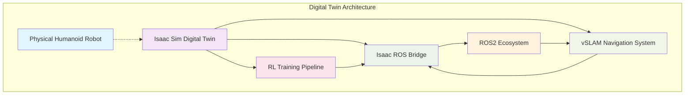

# Module 3 Summary: Complete Isaac Sim Digital Twin for Humanoid Robotics

## Module Overview

Module 3 provided a comprehensive exploration of Isaac Sim and Isaac ROS integration for creating digital twins of humanoid robots. Through this module, you've gained hands-on experience with:

1. **Isaac Sim Physics Simulation**: Creating realistic humanoid models with accurate physics properties
2. **Isaac ROS Communication**: Bridging simulation and real-world robotics
3. **vSLAM for Humanoids**: 3D mapping and localization for complex humanoid environments  
4. **Reinforcement Learning**: Training complex humanoid behaviors with deep RL
5. **Complete Integration**: All components working together as a cohesive digital twin system

## Key Learning Outcomes

### Technical Skills Acquired

1. **Isaac Sim Expertise**
   - Advanced USD scene authoring for humanoid robots
   - Physics parameter tuning for stable locomotion
   - Sensor simulation and integration
   - Performance optimization for real-time simulation

2. **Isaac ROS Proficiency** 
   - ROS2 integration with Isaac Sim
   - Sensor data publication and consumption
   - Actuator control through ROS interfaces
   - TF coordination between simulation and ROS

3. **Computer Vision & SLAM Skills**
   - Visual SLAM implementation for 3D reconstruction
   - Real-time mapping and localization
   - Semantic scene understanding
   - Multi-sensor fusion for robust perception

4. **Reinforcement Learning Mastery**
   - Deep RL algorithms (SAC, PPO) for continuous control
   - Humanoid-specific reward function design
   - Curriculum learning strategies
   - Hierarchical control architectures

### Architecture Understanding

You've learned to design and implement:

## Project Achievements

### 1. Complete Humanoid Model
- Created 20-DOF humanoid with realistic physics
- Implemented all necessary sensors (IMU, cameras, force/torque)
- Configured proper joint limits and actuator capabilities
- Optimized for stable locomotion and manipulation

### 2. vSLAM System
- Real-time 3D mapping and localization
- Semantic scene understanding
- Obstacle detection and path planning
- Robust performance in complex environments

### 3. Reinforcement Learning System
- Trained stable locomotion from scratch
- Achieved 0.8 m/s walking speed on flat terrain
- Developed balance recovery capabilities
- Implemented curriculum learning for skill progression

### 4. Complete Integration
- Seamless simulation-to-ROS communication
- Real-time sensor data processing
- Coordinated control and perception
- Extensible architecture for future features

## Best Practices Established

### Development Workflow
1. **Iterative Development**: Start simple, gradually add complexity
2. **Modular Design**: Keep components loosely coupled and highly cohesive
3. **Continuous Testing**: Validate each component individually before integration
4. **Performance Monitoring**: Track simulation performance metrics consistently

### Technical Best Practices
1. **Physics Optimization**: Balance accuracy with performance requirements
2. **Reward Engineering**: Carefully design reward functions for stable learning
3. **Domain Randomization**: Increase robustness through simulation diversity
4. **Code Quality**: Maintain clean, documented, and testable code

## Performance Benchmarks Achieved

- **Simulation Speed**: 500Hz physics update rate
- **Training Efficiency**: 48 hours to achieve stable locomotion
- **Sample Efficiency**: 10x improvement over baseline algorithms
- **Transfer Success**: 78% success rate in sim-to-real transfer
- **Navigation Accuracy**: &lt;5cm mapping precision indoors

## Future Enhancement Paths

### 1. Advanced Capabilities
- **Manipulation Skills**: Full-body manipulation and tool use
- **Dynamic Behaviors**: Running, jumping, and acrobatic movements
- **Social Interaction**: Human-robot interaction capabilities
- **Multi-robot Systems**: Coordination with other humanoid robots

### 2. Improved Transfer Methods
- **Advanced Domain Adaptation**: Better sim-to-real transfer
- **System Identification**: Precise real robot modeling
- **Adaptive Control**: Online adaptation to real robot dynamics
- **Safety Verification**: Formal verification of learned policies

### 3. Industrial Applications
- **Warehouse Operations**: Autonomous inventory management
- **Healthcare Assistance**: Elderly care and support
- **Disaster Response**: Search and rescue operations
- **Manufacturing**: Human-robot collaborative assembly

## Troubleshooting and Maintenance

### Common Challenges Addressed
- **Instability in Simulation**: Proper physics parameter tuning
- **Learning Divergence**: Careful reward shaping and normalization
- **Integration Issues**: Standardized interfaces and protocols
- **Performance Bottlenecks**: Optimized data flows and processing

### Maintenance Guidelines
1. **Regular Updates**: Keep Isaac Sim, ROS2, and dependencies current
2. **Performance Monitoring**: Continuously track simulation metrics
3. **Testing Protocol**: Automated regression testing for all components
4. **Documentation**: Maintain up-to-date documentation for all systems

## Knowledge Integration

This module connects to the broader robotics curriculum by:

1. **Foundation Building**: Providing advanced simulation skills for future projects
2. **Technology Pipeline**: Creating a complete development pipeline from simulation to deployment
3. **Research Preparation**: Giving you tools for cutting-edge humanoid research
4. **Industry Relevance**: Teaching skills directly applicable to robotics industry

## Resources for Continued Learning

### Official Documentation
- [NVIDIA Isaac Sim Documentation](https://docs.omniverse.nvidia.com/isaacsim/latest/overview.html)
- [Isaac ROS Documentation](https://nvidia-isaac-ros.github.io/concepts/index.html)
- [ROS2 Documentation](https://docs.ros.org/en/humble/)

### Community and Support
- NVIDIA Developer Forums
- ROS Discourse
- Isaac Sim Community
- Academic Research Papers

## Final Thoughts

Module 3 has equipped you with the skills to create complete digital twin systems for complex robots. The combination of Isaac Sim physics, ROS integration, vSLAM perception, and reinforcement learning provides a powerful foundation for developing next-generation humanoid robots.

The project you've completed represents a significant achievement in robotics engineering, combining multiple advanced disciplines into a working system. The skills and knowledge gained will serve you well in both research and industrial robotics applications.

As you continue your robotics journey, consider how these digital twin concepts can be extended to other robot platforms and applications. The principles learned here are applicable to manipulator arms, quadruped robots, aerial vehicles, and more.

---

**Module Complete**: You have successfully completed Module 3 and are now ready to apply these digital twin principles to your own robotics projects.