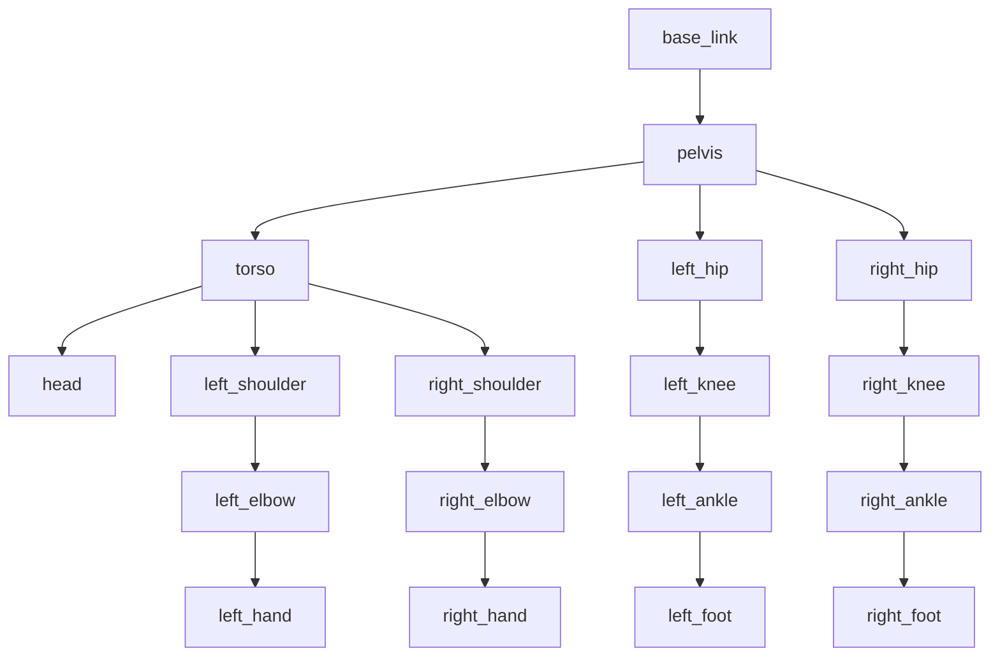

# Module 1: ROS2 - Robot Operating System for Humanoid Robotics

## Introduction to ROS2

The Robot Operating System 2 (ROS2) is the middleware framework that forms the backbone of most humanoid robotics applications. While not technically an operating system, ROS2 provides the communication infrastructure, tooling, and conventions that enable complex robotic systems to be built from modular components.

### Why ROS2 for Humanoid Robots?

Humanoid robots present unique challenges that make ROS2 particularly valuable:

1. **Complex Architecture**: 20+ sensors and actuators require coordinated communication
2. **Multi-Process Coordination**: Balance, perception, planning, and control run in parallel
3. **Real-time Requirements**: Many humanoid control loops run at 100Hz+
4. **Component Reusability**: Sharing controllers, perception, and planning across projects
5. **Debugging and Monitoring**: Visualizing complex state across multiple processes

```mermaid
graph TD
    A[Humanoid Robot] --> B[ROS2 Middleware]
    B --> C[Sensor Processing]
    B --> D[Control Systems]
    B --> E[Planning & Navigation]
    B --> F[Perception Pipeline]

    C --> G[IMU Processing]
    C --> H[Camera Processing]
    C --> I[LIDAR Processing]

    D --> J[Bipedal Control]
    D --> K[Balance Control]
    D --> L[Whole-Body Control]

    E --> M[Motion Planning]
    E --> N[Path Planning]
    E --> O[Trajectory Generation]

    F --> P[Object Detection]
    F --> Q[Human Detection]
    F --> R[Environment Mapping]

## ROS2 Architecture Components

### Nodes
In ROS2, a node is an executable process that participates in the ROS2 computation graph. For humanoid robots, typical nodes include:

- `joint_state_publisher`: Publishes current joint states
- `robot_state_publisher`: Publishes TF transforms for robot kinematics
- `imu_process`: Processes IMU data and publishes orientation/acceleration
- `balance_controller`: Implements balance control algorithms
- `locomotion_controller`: Manages walking and stepping
- `perception_node`: Handles vision and sensor processing
- `motion_planner`: Plans complex body movements

### Topics and Messages
Topics provide asynchronous communication through message passing. Critical topics for humanoid robots include:

- `/joint_states`: Current positions, velocities, and efforts of all joints
- `/tf` and `/tf_static`: Transforms between coordinate frames
- `/imu/data`: Inertial measurement unit readings
- `/cmd_vel`: Velocity commands for base motion
- `/foot_pressure`: Pressure readings from feet sensors
- `/camera/color/image_raw`: Raw camera imagery
- `/balance_state`: Balance control state and targets

### Services and Actions
For synchronous communication, ROS2 uses services and actions:

- `get_joint_position`: Service to request specific joint position
- `set_trajectory`: Action to execute complex multi-joint trajectories
- `navigate_to_pose`: Action for navigation goals
- `manipulate_object`: Action for manipulation tasks

## Critical ROS2 Concepts for Humanoids

### Quality of Service (QoS) Settings
For humanoid robots operating in real-time, appropriate QoS settings are crucial:

```python
# Settings for time-critical control
from rclpy.qos import QoSProfile, ReliabilityPolicy, DurabilityPolicy

# Control commands need reliable delivery with low latency
control_qos = QoSProfile(
    depth=1,  # Only keep latest command
    reliability=ReliabilityPolicy.RELIABLE,
    durability=DurabilityPolicy.VOLATILE,
)

# Sensor data can be best-effort but needs high frequency
sensor_qos = QoSProfile(
    depth=10,  # Keep last 10 readings for potential buffering
    reliability=ReliabilityPolicy.BEST_EFFORT,
    durability=DurabilityPolicy.VOLATILE,
)
```

### Real-time Considerations
Humanoid robots operate with strict timing requirements:

- **Balance Control**: 500Hz+ for stable balance
- **Joint Control**: 500Hz+ for precise joint positioning
- **IMU Processing**: 400Hz+ for accurate orientation
- **Perception**: 30Hz+ for vision-based processing

### TF (Transform) Trees
Managing coordinate frames is critical for humanoid robots with many joints:



The TF tree enables automatic coordinate transformation between any two frames in the robot's kinematic chain.

## ROS2 for Humanoid Control

### Joint State Management
Humanoid robots require precise management of 20+ joint states:

```python
from sensor_msgs.msg import JointState
from std_msgs.msg import Header

class HumanoidJointManager:
    def __init__(self):
        self.joint_names = [
            'left_hip_yaw', 'left_hip_roll', 'left_hip_pitch',
            'left_knee', 'left_ankle_pitch', 'left_ankle_roll',
            'right_hip_yaw', 'right_hip_roll', 'right_hip_pitch',
            'right_knee', 'right_ankle_pitch', 'right_ankle_roll',
            'left_shoulder_pitch', 'left_shoulder_yaw', 'left_elbow',
            'right_shoulder_pitch', 'right_shoulder_yaw', 'right_elbow',
            'neck_yaw', 'neck_pitch'
        ]

    def create_joint_command(self, positions, velocities=None, efforts=None):
        msg = JointState()
        msg.header = Header()
        msg.header.stamp = self.get_clock().now().to_msg()
        msg.name = self.joint_names
        msg.position = positions
        if velocities: msg.velocity = velocities
        if efforts: msg.effort = efforts
        return msg
```

### Control Architecture
Humanoid control typically uses layered architecture:

1. **High-level Planner**: Generates abstract goals (e.g., "walk to position X")
2. **Trajectory Generator**: Creates time-parameterized reference trajectories
3. **Feedback Controller**: Tracks reference trajectories with closed-loop control
4. **Low-level Actuator Interface**: Converts control commands to actual motor commands

### Example: Humanoid Balance Controller

```python
import rclpy
from rclpy.node import Node
from sensor_msgs.msg import JointState
from geometry_msgs.msg import Vector3Stamped, WrenchStamped
from tf2_ros import TransformListener, Buffer
import numpy as np

class HumanoidBalanceController(Node):
    def __init__(self):
        super().__init__('balance_controller')

        # Publishers and subscribers
        self.joint_cmd_pub = self.create_publisher(JointState, '/joint_commands', 10)
        self.imu_sub = self.create_subscription(Vector3Stamped, '/imu/data', self.imu_callback, 10)
        self.ft_sub = self.create_subscription(WrenchStamped, '/left_foot/ft', self.left_ft_callback, 10)
        self.ft_sub = self.create_subscription(WrenchStamped, '/right_foot/ft', self.right_ft_callback, 10)

        # Joint state subscription
        self.joint_state_sub = self.create_subscription(JointState, '/joint_states', self.joint_state_callback, 10)

        # Timer for control loop
        self.control_timer = self.create_timer(0.002, self.balance_control_loop)  # 500Hz control

        # Robot state
        self.joint_positions = {}
        self.joint_velocities = {}
        self.imu_orientation = None
        self.left_foot_force = None
        self.right_foot_force = None

        # Balance control parameters
        self.balance_gains = {
            'kp': 50.0,  # Position gain
            'kd': 10.0,  # Velocity gain
            'torso_stiffness': 200.0,
            'com_height_target': 0.85  # Target center of mass height in meters
        }

        self.get_logger().info('Balance controller initialized')

    def balance_control_loop(self):
        """
        Main balance control loop running at 500Hz
        """
        if (self.imu_orientation is not None and
            self.left_foot_force is not None and
            self.right_foot_force is not None):

            # Calculate necessary control corrections
            balance_corrections = self.compute_balance_corrections()

            # Generate joint commands
            joint_commands = self.generate_joint_commands(balance_corrections)

            # Publish commands
            cmd_msg = self.create_joint_command(joint_commands)
            self.joint_cmd_pub.publish(cmd_msg)

    def compute_balance_corrections(self):
        """
        Compute balance corrections based on sensor data
        """
        # Implement balance control algorithm (e.g., inverted pendulum model)
        # This would use IMU data for orientation, foot force data for support, etc.
        corrections = {}

        # Example: Simple PD controller for torso orientation
        desired_torso_orientation = [0, 0, 0, 1]  # Upright orientation

        if self.imu_orientation:
            current_orientation = self.imu_orientation
            # Calculate orientation error
            orientation_error = self.compute_orientation_error(current_orientation, desired_torso_orientation)

            # PD control
            corrections['torso_orientation'] = {
                'p_term': self.balance_gains['kp'] * orientation_error,
                'd_term': self.balance_gains['kd'] * self.estimate_angular_velocity()
            }

        return corrections

    def compute_orientation_error(self, current_quat, desired_quat):
        """
        Compute orientation error using quaternion difference
        """
        # Convert quaternions to rotation matrices and compute error
        # Simplified implementation
        return np.array([0.0, 0.0, 0.0])  # Placeholder

    def estimate_angular_velocity(self):
        """
        Estimate angular velocity from IMU or joint data
        """
        return np.array([0.0, 0.0, 0.0])  # Placeholder

    def generate_joint_commands(self, corrections):
        """
        Generate joint position/velocity commands based on corrections
        """
        # Map balance corrections to joint commands
        # This involves inverse kinematics or whole-body control
        commands = [0.0] * len(self.joint_names)  # Placeholder

        # Apply corrections to relevant joints (hips, ankles, torso)
        return commands

    def imu_callback(self, msg):
        """
        Process IMU data for balance control
        """
        self.imu_orientation = [msg.vector.x, msg.vector.y, msg.vector.z]  # Simplified

    def left_ft_callback(self, msg):
        """
        Process left foot force/torque data
        """
        self.left_foot_force = [msg.wrench.force.x, msg.wrench.force.y, msg.wrench.force.z]

    def right_ft_callback(self, msg):
        """
        Process right foot force/torque data
        """
        self.right_foot_force = [msg.wrench.force.x, msg.wrench.force.y, msg.wrench.force.z]

    def joint_state_callback(self, msg):
        """
        Update internal joint state
        """
        for i, name in enumerate(msg.name):
            if i < len(msg.position):
                self.joint_positions[name] = msg.position[i]
            if i < len(msg.velocity):
                self.joint_velocities[name] = msg.velocity[i]

    def create_joint_command(self, positions):
        """
        Create JointState message with position commands
        """
        msg = JointState()
        msg.header.stamp = self.get_clock().now().to_msg()
        msg.name = self.joint_names
        msg.position = positions
        return msg
```

## ROS2 Launch Files for Humanoids

Humanoid robots typically require coordinating multiple nodes. ROS2 launch files help manage this:

```python
# launch/humanoid_full_system.launch.py
from launch import LaunchDescription
from launch_ros.actions import Node
from launch.actions import DeclareLaunchArgument
from launch.substitutions import LaunchConfiguration
from ament_index_python.packages import get_package_share_directory
import os

def generate_launch_description():
    # Arguments
    use_sim_time = LaunchConfiguration('use_sim_time', default='false')

    # Nodes
    balance_controller = Node(
        package='humanoid_control',
        executable='balance_controller',
        name='balance_controller',
        parameters=[{'use_sim_time': use_sim_time}],
        output='screen'
    )

    perception_node = Node(
        package='humanoid_perception',
        executable='perception_pipeline',
        name='perception_pipeline',
        parameters=[{'use_sim_time': use_sim_time}],
        output='screen'
    )

    locomotion_node = Node(
        package='humanoid_locomotion',
        executable='locomotion_controller',
        name='locomotion_controller',
        parameters=[
            {'use_sim_time': use_sim_time},
            {'step_height': 0.05},
            {'step_length': 0.20},
            {'step_duration': 0.8}
        ],
        output='screen'
    )

    return LaunchDescription([
        balance_controller,
        perception_node,
        locomotion_node
    ])
```

## Best Practices for Humanoid ROS2 Development

### 1. Performance Optimization
- Use intra-process communication for tightly coupled nodes
- Implement appropriate QoS settings for different data types
- Use multi-threaded executors for parallel processing
- Profile and optimize computational bottlenecks

### 2. Safety Considerations
- Implement emergency stop mechanisms
- Set appropriate joint limits and velocity constraints
- Monitor for dangerous states before commanding movements
- Use watchdog timers to detect unresponsive nodes

### 3. Debugging Strategies
- Use `rqt` and `rviz` for visualization
- Implement comprehensive logging with appropriate levels
- Use `ros2 bag` to record and replay data for debugging
- Create diagnostic nodes to monitor system health

### 4. Parameter Management
- Use parameter files for easy configuration
- Group related parameters logically
- Provide reasonable default values
- Validate parameters at startup

## Next Steps

With a solid foundation in ROS2 concepts for humanoid robots, the next chapter will focus on nodes, topics, services, and actions specifically applied to humanoid robotics. We'll examine how to implement specific behaviors like walking, balance, and manipulation using ROS2 communication patterns.

This overview provides the essential understanding of how ROS2 serves as the communication backbone for complex humanoid systems. The distributed nature of ROS2 is particularly valuable for humanoid robots, where different subsystems (balance, perception, planning) need to communicate efficiently while maintaining real-time performance.